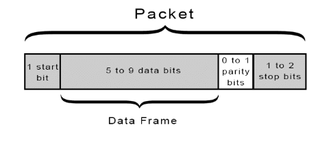
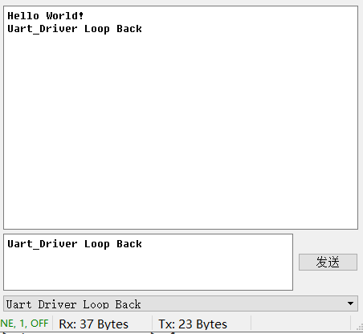
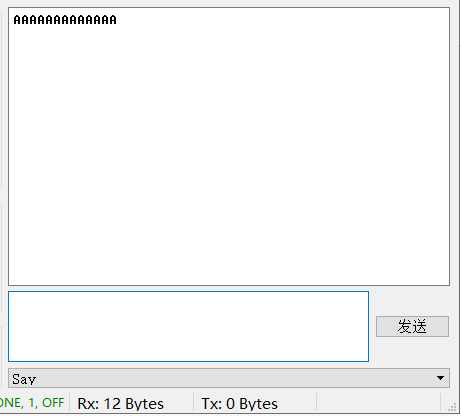
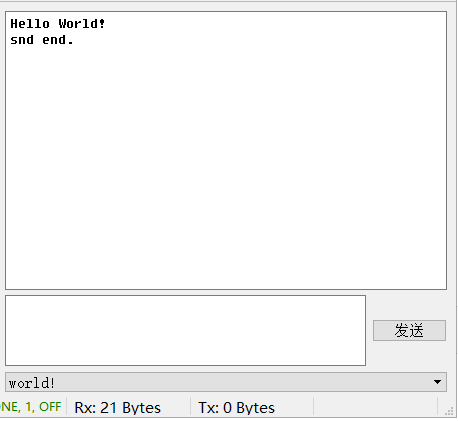

# 《Uart_Driver使用文档》

## 1 本文档目的及简介  
### 1.1 编写本文档的目的  

　　本文档将向用户系统的介绍 ***Uart\_Driver*** 的设计思想、 ***API*** 结构、不同环境中的各种使用方式，旨在从各个角度较为全面的介绍 ***Uart\_Driver*** ，为用户使用 ***Uart\_Driver*** 进行开发扫清障碍。  

### 1.2 本文档解决哪些问题  

**阅读本文档您将获得以下问题的答案：**  

* 如何使用 ***Uart\_Driver*** 配置 ***Uart*** 外设
*  ***Uart\_Driver*** 的文件夹结构是什么
*  ***Uart\_Driver*** 的封装思想是什么
*  ***Uart\_Driver*** 的 ***API*** 参数及返回值是什么
* 如何在 ***VSF*** 的 ***Thread*** 和 ***Pt*** 任务模式下实现：
  * 以阻塞的方式发送单个字节
  * 以阻塞的方式发送一连串数据
  * 异步的发送或接收单个字节，并注册用户的事件处理程序
  * 异步的发送或接收一连串数据，并注册用户事件处理程序
  * 如何配合队列实现发送和接收缓冲

> ***Uart\_Driver*** 的 ***API*** 详细介绍请用户阅读本文档**附录1、附录2**。

## 2 关于阅读本文档的若干约定  
### 2.1 在阅读本文档之前  

　　本文档内关于***Uart\_Driver*** 的使用方式部分包含了很多 ***VSF*** 的内容，但是，这不代表 ***Uart\_Driver*** 必须依赖 ***VSF*** ，用户也可以在裸机中完整便捷的使用 ***Uart\_Driver*** 。  

> * 若用户需要在 ***VSF*** 中使用 ***Uart\_Driver*** ，则需要掌握使用 ***VSF*** 的相关知识。关于 ***VSF*** 的疑问，请用户参考本文档**附录3**。
> * 当用户阅读本文档**5、6、7**章节时，我们默认用户已经掌握其中所依赖的 ***VSF*** 的知识。

### 2.2 阅读本文档用户需要具备的基本知识  

　　本文档所介绍的内容在用户不使用 ***VSF*** 的情况下只依赖 ***C*** **语言**与**嵌入式开发环境**，因此阅读本文档的用户需要熟悉C语言编程以及嵌入式开发环境使用。

> * 若用户需要使用在 ***VSF*** 中使用 ***Uart\_Driver*** ，用户需要熟悉 ***VSF*** 中 ***Thread、Pt***两种任务模式的使用。
> * 若用户需要使用在 ***VSF*** 中使用 ***Uart\_Driver*** ，***VSF*** 支持 ***MDK、IAR、Eclipse+GCC*** 等常见开发环境，用户熟悉其中之一即可。
> * 用户阅读本文档时，我们默认用户已经具备以上知识。

### 2.3 本文档涉及的部分关键名词  

|   名词   | 解释             | 备注 |
| :------: | ---------------- | ---- |
|  event   | Vsf系统事件       |      |
| vsf_trig | Vsf的IPC——触发类 |      |

## 3 Uart_Driver简介
### 3.1 Uart协议

* ***Uart*** 全称是**通用异步收发器** ( *Universal Asynchronous Receiver/Transmitter* )，俗称**串口**，是异步通信协议的一种。
* ***Uart*** 支持**全双工**通信，它也可以向下兼容**半双工**以及**单工**。
* ***Uart*** 有两根数据线：**TXD**、**RXD**(一般额外需要一根**地线**来匹配通信双方的电平)。
* ***Uart*** 通信时序分为**起始位**、**数据位**、**校验位**、**停止位**。其中**数据位**可以由用户自定义为<u>5~9bit</u>；**校验位**可由用户自定义为<u>奇校验</u>、<u>偶校验</u>、<u>不使能</u>；**停止位**可由用户自定义为<u>1bit</u>、<u>1.5bit</u>、<u>2bit</u>，停止位时间越长，***Uart*** 容错能力越强。  
* 一个完整的 ***uart*** 数据帧：  



* [更多Uart协议内容](https://baike.baidu.com/item/UART)

### 3.2 Uart_Driver的硬件配置
#### 3.2.1 Gpio配置

***Uart*** 的 ***IO*** 管脚配置流程与我们常规独立的使用 ***IO*** 管脚时相同，一般分为以下两步：  
1. 使能 ***Uart*** 对应的 ***GPIO*** 外设的时钟。  
2. 将对应 ***Uart*** 的具体 ***IO*** 管脚配置为正确的工作模式。  

***Uart*** 对应的 ***IO*** 管脚工作模式如下：  
1. ***Rxd*** 功能引脚：下拉输入模式  
2. ***Txd*** 功能引脚：复用输出模式  

>配置 ***GPIO*** 外设的详细流程请用户参考《Gpio\_Driver使用文档》。  

#### 3.2.2 Uart配置

　　我们在初始化 ***Uart*** 之前需要定义一个配置结构体( ***vsf\_uart\_cfg\_t*** 类型)，在这个配置结构体内，我们可以配置 ***Uart*** 的波特率，以及通过 ***Uart\_Driver*** 提供的关于 ***Uart*** 工作模式(**数据位、停止位、校验位**)的配置选项配置 ***Uart*** 的工作模式。

>具体 ***Uart*** 的配置方法及代码我们将在第4章节进行介绍。  

### 3.3 Uart_Driver的软件配置  

**<1> 定义对应 *Uart_Driver* 的宏**  

　　用户在使用 ***Uart\_Driver*** 之前需要在 ***Uart\_Driver*** 可以包含到的合适头文件内定义 **芯片厂家、芯片系列、具体芯片型号、具体驱动的名称** 四个宏，以便加入相应的驱动到项目中。例如：  

```
/*厂家*/
#define __ST__

/*芯片系列*/
#define __STM32F103__

/*具体芯片型号*/
#define __STM32F103ZE__

/*驱动名称*/
#define __UART__
```

**<2> 定义 *Uart* 外设数量**  

　　用户需要根据芯片的资源以及项目实际需要使用的外设数量，在 ***Uart\_Driver*** 可以包含到的合适头文件内定义 ***USART\_COUNT***  宏并定义其具体值。例如：  

```
/*只使用一个Uart1*/
#define USART_COUNT    2
```

> ***Uart_Driver*** 默认外设命名从 **0** 开始，因此当芯片的外设命名从 **1** 开始的时候， ***USART_COUNT*** 宏需要在实际使用的外设数量上加 **1** . 

### 3.4 Uart_Driver的文件夹结构

**<1> Uart\_Driver的源码、头文件、寄存器文件**  

```
Uart
 |__i_reg_uart.h  /*Uart寄存器文件*/
 |__uart.c        /*Uart_Driver源码*/
 |__uart.h        /*Uart_Driver头文件*/
```

**<2> Uart\_Driver对于芯片信息的依赖路径**  

　　***Uart\_Driver*** 的芯片信息来自一个芯片文件夹内，这个文件夹放置着这个芯片的相关信息文件。文件夹关系如下：  

```
STM32F103                      /*芯片系列*/
   |__common                   /*系列芯片的共用代码*/
   |     |__uart               /*Uart_Driver源码、头文件、寄存器文件*/
   |     |  ...
   |     |__ __common.c        /*各个驱动共用的源码*/
   |     |__ __common.h        /*各个驱动共用的头文件*/
   |     
   |__STM32F103ZE              /*具体型号的芯片文件夹*/
   |     |__device.h           /*具体芯片信息文件*/
   |     |__driver.c           /*具体芯片启动时需要初始化的源码*/
   |     |__driver.h           /*具体芯片总的驱动头文件*/
   |     |__startup_xxx_xxx.c  /*具体芯片启动文件*/
   |
   |__ __device.h              /*系列芯片的芯片信息文件*/
```

**<3> Uart\_Driver如何加入VSF系统**  

　　***VSF*** 系统的驱动包含是自下向上"汇总式"的，每一层都有一个 ***driver.h*** 头文件，通过在最顶层头文件的宏配置，可以指定使用哪些厂家的哪些驱动，最细致可以指定到某个厂家的某个芯片的某个驱动。  

```
ST             /*厂家文件夹*/
 |__STM32F103  /*芯片系列文件夹*/
 |__driver.h   /*总的厂家的驱动的头文件*/
```

### 3.5 Uart_Driver的封装
#### 3.5.1 时钟使能与中断开关的封装

　　***Uart*** 的外设时钟使能与中断开启是使用 ***Uart*** 进行通信之前必须处理完成的，这两部分的操作我们一并封装在 ***Uart\_Driver*** 的初始化函数( ***vsf\_uart\_init*** )内。所以，这部分对用户完全透明，用户调用初始化函数即可完成对 ***Uart*** 外设及 ***Uart*** 相关中断的全部配置。

#### 3.5.2 普通用户API与专家用户API

　　普通用户 ***API*** 本质上是以专家用户的 ***API*** 为基础进行了一次封装，为用户免去了操作 ***vsf\_uart\_t*** 类型结构体的步骤，让用户提供必要的通信数据相关的参数即可。

>普通用户 ***API*** 是顶层接口，为用户提供使用便利性；专家用户接口 ***API*** 是底层接口，为用户提供使用灵活性及可移植性。

#### 3.5.3 API封装

　　***Uart\_Driver*** 采用"结构体多层嵌套"的封装方式。例如，操作 ***Uart0*** 的 ***API*** 结构如下：  

```
VSF_UART0
   |__Init               /*初始化*/
   ...
   |__ReadByte           /*读取一个字节*/
   |__WriteByte          /*发送一个字节*/
   |__Block              /*块数据操作*/
   |    |__Read
   |    |    |__Request  /*读取块数据*/
   |    |__Write
   |         |__Request  /*发送块数据*/
   |
   ...
```

　　这样封装的好处是用户操作不同的 ***Uart*** 外设(例如： ***Uart0、Uart1、Uart3...*** )的时候只需要切换 ***VSF\_UARTx*** 即可，并且，用户根据 ***API*** 的功能分类就可以一层层直接找到需要的 ***API*** ，而不需要对照驱动的头文件去查找。

### 3.6 event与vsf\_trig
#### 3.6.1 VSF系统的事件(event)

　　***VSF*** 系统是基于事件驱动架构运作的，自然 ***VSF*** 系统内的各种任务形式都是可以通过 ***event*** 进行通信的，在本文档中，我们将在异步收发中使用到 ***VSF*** 系统的事件操作 ***post\_evt*** ，若用户对如何使用 ***post\_evt*** 存有疑问，请参考文档：  
　　《多个Thread任务间如何进行触发和同步》或者《多个Pt任务间如何进行触发和同步》。

#### 3.6.2 VSF的IPC——vsf\_trig类

　　***vsf\_trig类*** 是 ***VSF*** 系统内 ***IPC*** 通信的一个类，在 ***VSF*** 系统内用作任务间的通信。在本文档中，我们将在异步收发中使用到 ***vsf\_trig类*** ，若用户对如何使用 ***vsf\_trig类*** 存有疑问，请参考文档：  
　　《多个Thread任务间如何进行触发和同步》或者《多个Pt任务间如何进行触发和同步》。  

### 3.7 Uart\_Driver的异步运行  

　　***Uart\_Driver*** 的 ***API*** 都是非阻塞的，即发送数据的 ***API*** 的返回值可以指示数据发送状态，用户可以根据 ***API*** 返回的状态决定下一步的操作，用户也可以直接调用用于查询状态的 ***API*** (***VSF\_UARTx\_Status(void)***)获得 ***Uart*** 外设的状态。因此，***Uart\_Driver*** 是支持异步运行的。  
　　在 ***Uart\_Driver*** 异步运行的过程中，需要使用到 ***Uart\_Driver*** 的事件回调函数，即 ***Uart\_Driver*** 在特定的 ***Uart*** 事件(例如，发送一个字符)完成后可以调用用户事先注册的函数完成用户期望的操作。下面我们介绍一下 ***Uart\_Driver*** 事件回调相关的 ***API*** 与其支持的四个回调事件：  

```
/*Uart_Driver内与event相关的API*/
VSF_UARTx_Event_Register()  /*注册事件对应的函数*/
VSF_UARTx_Event_Enable()    /*使能事件，使其支持事件回调*/
VSF_UARTx_Event_Disable()   /*失能事件，使其不支持事件回调*/
VSF_UARTx_Event_Resume()    /*复位支持回调的事件到前一状态*/

/*Uart_Driver的event*/
VSF_USART_EVT_RX            /*成功接收一个字节*/
VSF_USART_EVT_TX            /*成功发送一个字节*/
VSF_USART_EVT_RCV_BLK_CPL   /*成功接收一个数据块*/
VSF_USART_EVT_SND_BLK_CPL   /*成功发送一个数据块*/
```

## 4 Hello World! + Loop Back

　　本章节中，我们将在 ***VSF*** 的 ***Thread*** 模式中实现一个较为基础的 ***Uart\_Driver*** 使用示例，为用户完整的展示 ***Uart\_Driver*** 的使用流程。  

### 4.1 单字节Loop Back  

**<1> 创建配置结构体并配置Uart参数**  

```
static usart_cfg_t __uart0_cfg = {
    .mode = UART_8_BIT_LENGTH  /*8bit数据位*/
           |UART_1_STOPBIT     /*1bit停止位*/
           |UART_NO_PARITY     /*无奇偶校验*/
           |UART_NO_HWCONTROL  /*无硬件流控*/
           |UART_TX_RX_MODE,   /*全双工模式*/
    .baudrate = 115200,        /*波特率115200*/
    .rcv_timeout = 0           /*不使用超时判断*/
};
```

**<2> 定义一个用于收发字符的变量**  

```
static uint8_t __uart_buffer;
```

**<3> 实现一个Uart回显**  

```
void main(void)
{
    ...

    /*初始化Uart0*/
    if(VSF_ERR_NONE != VSF_UART0.Init(&__uart0_cfg)) {
        Led0_On();
        Led1_On();
        while(1);
    }
    
	/*Hello World!*/
	/*若想保证发送的成功，需要判断API发回值为成功后再进行下一步操作*/
	/*此用法没有判断返回值，不能保证发送数据不丢失，即不保证发送一定成功*/
	VSF_USART0.Block.Write.Request((uint8_t *)"Hello World!\r\n", 14);

    while(1) {  
          
        /*接收一个字符*/
        if(VSF_UART0.ReadByte(&__uart_buffer) != false) {  
                
            /*发送一个字符*/
        	while(false == VSF_UART0.WriteByte(__uart_buffer));
        }
    }
}
```

>此 ***main函数*** 为裸机状态。 

**<4> 运行效果**  


### 4.2 多字节Loop Back  

**<1> 创建配置结构体并配置Uart参数**  

```
static usart_cfg_t __uart0_cfg = {
    .mode = UART_8_BIT_LENGTH  /*8bit数据位*/
           |UART_1_STOPBIT     /*1bit停止位*/
           |UART_NO_PARITY     /*无奇偶校验*/
           |UART_NO_HWCONTROL  /*无硬件流控*/
           |UART_TX_RX_MODE,   /*全双工模式*/
    .baudrate = 115200,        /*波特率115200*/
    .rcv_timeout = 0           /*不使用超时判断*/
};
```

**<2> 定义一个用于收发字符串的数组**  

```
static uint8_t __uart_buffer[23];
```

**<3> 实现一个Uart回显**  

```
void main(void)
{
    ...

    /*初始化Uart0*/
    if(VSF_ERR_NONE != VSF_UART0.Init(&__uart0_cfg)) {
        Led0_On();
        Led1_On();
        while(1);
    }
    
	/*Hello World!*/
	VSF_USART0.Block.Write.Request((uint8_t *)"Hello World!\r\n", 14);

    while(1) {   
         
        /*接收一个字符串*/
        if(fsm_rt_cpl == VSF_USART0.Block.Read.Request(__uart_buffer, 23)) {  
                
            /*发送一个字符串*/
        	while(fsm_rt_cpl != VSF_USART0.Block.Write.Request(__uart_buffer, 23));
        }
    }
}
```

>此 ***main函数*** 为裸机状态。  

**<4> 运行效果**  



## 5 如何收发单个字符
### 5.1 如何在Thread任务中实现收发
#### 5.1.1 如何实现阻塞发送

　　非阻塞的接口有利于用户进行异步任务的处理，不过，在某些特定的场景下我们也需要阻塞的发送数据，这里就需要让异步的 ***API*** 以阻塞的方式运行。下面，我们将展示如何在 ***Thread*** 任务中使用非阻塞 ***API*** 阻塞的发送单个字符：  

**<1> 创建配置结构体并配置Uart参数**  

```
static usart_cfg_t __uart0_cfg = {
    .mode = UART_8_BIT_LENGTH  /*8bit数据位*/
           |UART_1_STOPBIT     /*1bit停止位*/
           |UART_NO_PARITY     /*无奇偶校验*/
           |UART_NO_HWCONTROL  /*无硬件流控*/
           |UART_TX_RX_MODE,   /*全双工模式*/
    .baudrate = 115200,        /*波特率115200*/
    .rcv_timeout = 0           /*不使用超时判断*/
};
```

**<2> 实现main实例**  

```
int main(void)
{
    ...

    /*初始化Uart0*/
    if(VSF_ERR_NONE != VSF_UART0.Init(&__uart0_cfg)) {
        Led0_On();
        Led1_On();
        while(1);
    }
    
    while(1) {       
 
        vsf_delay_ms(500);
        
        /*每500ms发送一个字符*/
        while(false == VSF_UART0.WriteByte('A'));
    }
}
```

> * 此 ***main函数*** 被配置为一个 ***Thread*** 任务实例。 
> * 本文档着重于 ***Uart\_Driver*** 使用方法的介绍，关于 ***VSF*** 中 ***Thread*** 任务的详细使用方法请用户参考文档《VSF快速入门指南——使用Thread模式》。

**<3> 运行效果**  



#### 5.1.2 如何实现阻塞接收

**<1> 定义一个变量**  

```
static uint8_t __uart_buffer;
```

**<2> 实现main实例**  

```
int main(void)
{
    ...

    /*初始化Uart0*/
    if(VSF_ERR_NONE != VSF_UART0.Init(&__uart0_cfg)) {
        Led0_On();
        Led1_On();
        while(1);
    }
    
    while(1) {        

        /*阻塞的接收一个字符*/
        while(false == VSF_UART0.ReadByte(&__uart_buffer));

        /*阻塞的发回接收到的字符*/
        while(false == VSF_UART0.WriteByte(__uart_buffer));
    }
}
```

> * 若用户对 ***__uart0\_cfg*** 如何配置存有疑问，请参考本文档 **5.1.1** 章节,这里不做赘述。
> * 此 ***main函数*** 被配置为一个 ***Thread*** 任务实例。 
> * 本文档着重于 ***Uart\_Driver*** 使用方法的介绍，关于 ***VSF*** 中 ***Thread*** 任务的详细使用方法请用户参考文档《VSF快速入门指南——使用Thread模式》。

**<3> 运行效果**  


#### 5.1.3 如何实现异步发送
##### 5.1.3.1 如何使用event实现异步发送

　　如果我们希望一个字节一个字节的发送完一个字符串，我们可以通过 ***VSF*** 事件(***post\_evt***)的方式来处理，方法如下：  

**<1> 定义数组与变量** 　

```
/*定义一个字符串数组*/
static uint8_t __uart_buffer[14] = {"Hello World!\r\n"};

/*定义一个thread任务实例指针*/
static vsf_thread_t __target_thread;
```

**<2> 定义一个用户事件** 　

```
enum{
    VSF_EVT_TX_CPL = VSF_EVT_USER + 1,
}vsf_user_evt_t;
```

>**注意：** 自定义的事件枚举大小必须在 ***VSF\_EVT\_USER*** 的基础上往后取值。

**<3> 定义Thread任务类型并创建启动任务函数** 　

```
declare_vsf_thread(user_thread_a_t)

def_vsf_thread(user_thread_a_t, 1024,

	static_task_instance(
	    features_used(
			mem_sharable()
			mem_nonsharable()
		)
	)

	def_params(
        uint8_t *buffer;
        uint8_t data_size;
        uint8_t write_count;
    )
)

void vsf_kernel_uart_simple_demo(void) 
{
	static NO_INIT user_thread_a_t __user_task_a;          
    __user_task_a.on_terminate = NULL;     

	/*初始化实例的成员变量*/
    __user_task_a.param.buffer      = __uart_buffer;
    __user_task_a.param.data_size   = strlen(__uart_buffer);
    __user_task_a.param.write_count = 0; 
    __target_thread = (vsf_thread_t *)&__user_task_a;
	init_vsf_thread(user_thread_a_t, &__user_task_a, vsf_prio_0); 
}
```

**<4> 创建一个事件回调函数**  

```
static void tx_callback(void *target, vsf_uart_t *uart, uart_status_t status) 
{
    ASSERT((NULL != target) && (NULL != uart));
    
    /*对目标任务发送一个指定事件*/
    vsf_thread_sendevt((vsf_thread_t *)target, VSF_EVT_TX);
}
```
>回调函数类型： ***void callback(void \*, vsf\_uart\_t \*, uart\_status\_t)*** 。

**<5> 创建事件回调结构体**  

```
static vsf_uart_evt_t __tx_evt = {
    .handler_fn = &tx_callback,    /*获取回调函数指针*/
    .target_ptr = __target_thread  /*任务实例指针传给回调函数*/
};
```

**<6> 实现任务实例**  

```
implement_vsf_thread(user_thread_a_t) 
{
    while(1) {
                 
        /*发送一个字符*/
   		if(false != VSF_UART0.WriteByte(this.buffer[this.write_count])) {
            
            /*等待指定事件*/
            vsf_thread_wfe(VSF_EVT_TX);
            
            this.write_count++;

            /*若字符串发送完毕，结束任务*/
            if(this.write_count >= this.data_size) {
	    		return;
            }
        }
    }
}

int main(void)
{
    ...

	/*初始化Uart0*/
    if(VSF_ERR_NONE != VSF_UART0.Init(&__uart0_cfg)) {
        Led0_On();
        Led1_On();
        while(1);
    }
    
    /*将回调函数注册给我们期望的事件*/
    VSF_UART0.Event.Register(VSF_UART_EVT_TX, __tx_evt);

    /*使能被注册的事件支持回调*/
    VSF_UART0.Event.Enable(VSF_UART_EVT_TX);

	/*启动任务*/
    vsf_kernel_uart_simple_demo();

    while(1) {
        ...
        vsf_delay_ms(1000);
    }
}
```
> * 若用户对 ***__uart0\_cfg*** 如何配置存有疑问，请参考本文档 **5.1.1** 章节,这里不做赘述。
> * 此 ***main函数*** 被配置为一个 ***Thread*** 任务实例。
> * 关于 ***VSF*** 系统 ***Thread*** 任务模式的详细使用方法请用户参考文档《VSF快速入门指南——使用Thread模式》。
> * 关于 ***VSF*** 系统 ***post\_evt*** 的详细使用方法请用户参考文档《多个Thread任务间如何进行触发与同步》。

**<7> 运行效果**  


##### 5.1.3.2 如何使用vsf\_trig实现异步发送

　　上面的回显例子我们也可以通过使用 ***vsf\_trig类*** 的方式来处理，方法如下：  

**<1> 定义一个字符串数组** 　

```
static uint8_t __uart_buffer[14] = {"Hello World!\r\n"};
```

**<2> 定义并初始化vsf\_trig类** 　

```
/*定义trig变量__trig_cpl*/
static NO_INIT vsf_trig_t __trig_cpl;     

/*初始化__trig_cpl初始状态为复位、自动复位*/
vsf_trig_init(&__trig_cpl, RESET, AUTO);
```

**<3> 定义Thread任务类型并创建启动任务函数** 　

```
declare_vsf_thread(user_thread_a_t)

def_vsf_thread(user_thread_a_t, 1024,

	static_task_instance(
	    features_used(
			mem_sharable()
			mem_nonsharable()
		)
	)

	def_params(
        uint8_t    *buffer;
        uint8_t    data_size;
        uint8_t    write_count;
        vsf_trig_t *wait_trig;
    )
)

void vsf_kernel_uart_simple_demo(void) 
{
	static NO_INIT user_thread_a_t __user_task_a;          
    __user_task_a.on_terminate = NULL;     

	/*初始化实例的成员变量*/
    __user_task_a.param.buffer      = __uart_buffer; 
    __user_task_a.param.data_size   = strlen(__uart_buffer);
    __user_task_a.param.write_count = 0;
    __user_task_a.param.wait_trig   = &__trig_cpl;
	init_vsf_thread(user_thread_a_t, &__user_task_a, vsf_prio_0);  
}
```

**<4> 创建一个事件回调函数**  

```
static void tx_callback(void *target, vsf_uart_t *uart, uart_status_t status) 
{
    ASSERT((NULL != target) && (NULL != uart));
    
    /*置位trig*/
    vsf_eda_trig_set_irq((vsf_trig_t *)target);
}
```
>回调函数类型： ***void callback(void \*, vsf\_uart\_t \*, uart\_status\_t)*** 。

**<5> 创建事件回调结构体**  

```
static vsf_uart_evt_t __tx_evt = {
    .handler_fn = &tx_callback,  /*获取回调函数指针*/
    .target_ptr = &__trig_cpl    /*vsf_trig类指针传给回调函数*/
};
```

**<6> 实现任务实例**  

```
implement_vsf_thread(user_thread_a_t) 
{
    while(1) {
                                
        /*发送一个字符*/
   		if(false != VSF_UART0.WriteByte(this.buffer[this.write_count])) {

            /*等待trig被置位*/
            vsf_trig_wait(this.wait_trig);

            this.write_count++;

            /*若字符串发送完毕，结束任务*/
            if(this.write_count >= this.data_size) {
                return;
            } 
        }
    }
}

int main(void)
{
    ...

	/*初始化Uart0*/
    if(VSF_ERR_NONE != VSF_UART0.Init(&__uart0_cfg)) {
        Led0_On();
        Led1_On();
        while(1);
    }
    
    /*将回调函数注册给我们期望的事件*/
    VSF_UART0.Event.Register(VSF_UART_EVT_TX, __tx_evt);

    /*使能被注册的事件支持回调*/
    VSF_UART0.Event.Enable(VSF_UART_EVT_TX);

	/*启动任务*/
    vsf_kernel_uart_simple_demo();

    while(1) {
        ...
        vsf_delay_ms(1000);
    }
}
```

> * 若用户对 ***__uart0\_cfg*** 如何配置存有疑问，请参考本文档 **5.1.1** 章节,这里不做赘述。
> * 此 ***main函数*** 被配置为一个 ***Thread*** 任务实例。
> * 关于 ***VSF*** 系统 ***Thread*** 任务模式的详细使用方法请用户参考文档《VSF快速入门指南——使用Thread模式》。
> * 关于 ***VSF*** 系统 ***vsf\_trig类*** 的详细使用方法请用户参考文档《多个Thread任务间如何进行触发与同步》。

**<7> 运行效果**  


#### 5.1.4 如何实现异步接收
##### 5.1.4.1 如何使用event实现异步接收

　　如果我们希望一个字节一个字节的接收字符串，我们可以通过 ***VSF*** 事件(***post\_evt***)的方式来处理，方法如下：  

**<1> 定义数组与结构体** 　

```
/*定义一个数组*/
static uint8_t __uart_buffer[14];

/*定义一个用户回调的结构体类型*/
typedef static user_callback_t user_callback_t；

static user_callback_t {
    vsf_thread_t *target_thread;
    uint8_t      data_size;
    uint8_t      read_count;
}; 

/*定义一个用户回调的结构体实例*/
static user_callback_t __user_callback = {
    .data_size  = 14,
    .read_count = 0
};
```

**<2> 定义一个用户事件** 　

```
enum{
    VSF_EVT_RX_CPL = VSF_EVT_USER + 1,
}vsf_user_evt_t;
```

>**注意：** 自定义的事件枚举大小必须在 ***VSF\_EVT\_USER*** 的基础上往后取值。

**<3> 定义Thread任务类型并创建启动任务函数** 　

```
declare_vsf_thread(user_thread_a_t)

def_vsf_thread(user_thread_a_t, 1024,

	static_task_instance(
	    features_used(
			mem_sharable()
			mem_nonsharable()
		)
	)

	def_params(
        uint8_t *buffer;
    )
)

void vsf_kernel_uart_simple_demo(void) 
{
	static NO_INIT user_thread_a_t __user_task_a;          
    __user_task_a.on_terminate = NULL;     

	/*初始化实例的成员变量*/
    __user_task_a.param.buffer    = __uart_buffer; 

    /*初始化用户回调结构体实例的成员变量*/
    __user_callback.target_thread = (vsf_thread_t *)&__user_task_a;

	init_vsf_thread(user_thread_a_t, &__user_task_a, vsf_prio_0); 
}
```

**<4> 创建一个事件回调函数**  

```
static void rx_callback(void *target, vsf_uart_t *uart, uart_status_t status) 
{
    ASSERT((NULL != target) && (NULL != uart));
    
    if (status.bIsRXErrorDetected) {
        /*检测到I/O错误，用户可以在此处添加对应的处理代码*/
        
        vsf_thread_sendevt((user_callback_t *)target.target_thread, VSF_EVT_RX_CPL);
        return;
    }
    
    /*判断是否接收完成*/
    if ((user_callback_t *)target.read_count < (user_callback_t *)target.data_size) {

    	VSF_UART0.ReadByte(&this.buffer[(user_callback_t *)target.read_count++]);
    	
    	if((user_callback_t *)target.read_count == (user_callback_t *)target.data_size) {

        	/*对目标任务发送一个指定事件*/
            vsf_thread_sendevt((user_callback_t *)target.target_thread, VSF_EVT_RX_CPL);
        } 
    } 
}
```
>回调函数类型： ***void callback(void \*, vsf\_uart\_t \*, uart\_status\_t)*** 。

**<5> 创建事件回调结构体**  

```
static vsf_uart_evt_t __rx_evt = {
    .handler_fn = &rx_callback,     /*获取回调函数指针*/
    .target_ptr = &__user_callback  /*用户回调结构体实例指针传给回调函数*/
};
```

**<6> 实现任务实例**  

```
implement_vsf_thread(user_thread_a_t) 
{
    while(1) {

        /*等待指定事件*/
        vsf_thread_wfe(VSF_EVT_RX_CPL);

		if (VSF_UART0.USART.Status().bIsRXErrorDetected) {

		    /*接收过程中出现了I/O错误*/
            VSF_UART0.Block.Write.Request((uint8_t *)"I/O Error.\r\n", 12)
		} else {

            /*发送任务完成log*/
            VSF_UART0.Block.Write.Request((uint8_t *)"rcv end.\r\n", 10);
        }
        return;
    }
}

int main(void)
{
    ...

	/*初始化Uart0*/
    if(VSF_ERR_NONE != VSF_UART0.Init(&__uart0_cfg)) {
        Led0_On();
        Led1_On();
        while(1);
    }
    
    /*将回调函数注册给我们期望的事件*/
    VSF_UART0.Event.Register(VSF_UART_EVT_RX, __rx_evt);

    /*使能被注册的事件支持回调*/
    VSF_UART0.Event.Enable(VSF_UART_EVT_RX);

	/*启动任务*/
    vsf_kernel_uart_simple_demo();

    while(1) {
		...
		vsf_delay_ms(1000);
    }
}
```
> * 若用户对 ***__uart0\_cfg*** 如何配置存有疑问，请参考本文档 **5.1.1** 章节,这里不作赘述。
> * 此 ***main函数*** 被配置为一个 ***Thread*** 任务实例。
> * 关于 ***VSF*** 系统 ***Thread*** 任务模式的详细使用方法请用户参考文档《VSF快速入门指南——使用Thread模式》。
> * 关于 ***VSF*** 系统 ***post\_evt*** 的详细使用方法请用户参考文档《多个Thread任务间如何进行触发与同步》。

**<7> 运行效果**  


##### 5.1.4.2 如何使用vsf\_trig实现异步接收

　　上面的异步接收例子我们也可以通过使用 ***vsf\_trig类*** 的方式来处理，方法如下：  

**<1> 定义数组与结构体** 　

```
static uint8_t __uart_buffer[14];

/*定义一个用户回调的结构体类型*/
typedef static user_callback_t user_callback_t；

static user_callback_t {
    vsf_trig_t *trig_target;
    uint8_t    data_size;
    uint8_t    read_count;
}; 

/*定义一个用户回调的结构体实例*/
static user_callback_t __user_callback = {
    .data_size  = 14,
    .read_count = 0
};
```

**<2> 定义并初始化vsf\_trig类** 　

```
/*定义trig变量__trig_cpl*/
static NO_INIT vsf_trig_t __trig_cpl;     

/*初始化__trig_cpl初始状态为复位、自动复位*/
vsf_trig_init(&__trig_cpl, RESET, AUTO);

/将__trig_cpl赋值给用户回调结构体实例/
__user_callback.trig_target = &__trig_cpl;
```

**<3> 定义Thread任务类型并创建启动任务函数** 　

```
declare_vsf_thread(user_thread_a_t)

def_vsf_thread(user_thread_a_t, 1024,

	static_task_instance(
	    features_used(
			mem_sharable()
			mem_nonsharable()
		)
	)

	def_params(
        uint8_t    *buffer;
        vsf_trig_t *wait_trig;
    )
)

void vsf_kernel_uart_simple_demo(void) 
{
	static NO_INIT user_thread_a_t __user_task_a;          
    __user_task_a.on_terminate = NULL;     

	/*初始化任务实例的成员变量*/
    __user_task_a.param.buffer     = __uart_buffer; 
    __user_task_a.param.wait_trig  = &__trig_cpl;
	init_vsf_thread(user_thread_a_t, &__user_task_a, vsf_prio_0);
}
```

**<4> 创建一个事件回调函数**  

```
static void rx_callback(void *target, vsf_uart_t *uart, uart_status_t status) 
{
    ASSERT((NULL != target) && (NULL != uart));
    
    if (status.bIsRXErrorDetected) {
        /*检测到I/O错误，用户可以在此处添加对应的处理代码*/
        
        vsf_eda_trig_set_irq((user_callback_t *)target.trig_target);
        return;
    }
    
    /*判断是否接收完成*/
    if ((user_callback_t *)target.read_count < (user_callback_t *)target.data_size) {

    	VSF_UART0.ReadByte(&this.buffer[(user_callback_t *)target.read_count++]);
    	
    	if((user_callback_t *)target.read_count == (user_callback_t *)target.data_size) {

        	/*置位trig*/
            vsf_eda_trig_set_irq((user_callback_t *)target.trig_target);
        } 
    } 
}
```
>回调函数类型： ***void callback(void \*, vsf\_uart\_t \*, uart\_status\_t)*** 。

**<5> 创建事件回调结构体**  

```
static vsf_uart_evt_t __rx_evt = {
    .handler_fn = &rx_callback,     /*获取回调函数指针*/
    .target_ptr = &__user_callback  /*用户回调结构体实例指针传给回调函数*/
};
```

**<6> 实现任务实例**  

```
implement_vsf_thread(user_thread_a_t) 
{
    while(1) {

        /*等待trig被置位*/
        vsf_trig_wait(this.wait_trig);

        if (VSF_UART0.USART.Status().bIsRXErrorDetected) {

		    /*接收过程中出现了I/O错误*/
            VSF_UART0.Block.Write.Request((uint8_t *)"I/O Error.\r\n", 12)
		} else {

            /*发送任务完成log*/
            VSF_UART0.Block.Write.Request((uint8_t *)"rcv end.\r\n", 10);
        }

        return;
    }
}

int main(void)
{
    ...

	/*初始化Uart0*/
    if(VSF_ERR_NONE != VSF_UART0.Init(&__uart0_cfg)) {
        Led0_On();
        Led1_On();
        while(1);
    }
    
    /*将回调函数注册给我们期望的事件*/
    VSF_UART0.Event.Register(VSF_UART_EVT_RX, __rx_evt);

    /*使能被注册的事件支持回调*/
    VSF_UART0.Event.Enable(VSF_UART_EVT_RX);

	/*启动任务*/
    vsf_kernel_uart_simple_demo();

    while(1) {
        ...
        vsf_delay_ms(1000);
    }
}
```

> * 若用户对 ***__uart0\_cfg*** 如何配置存有疑问，请参考本文档 **5.1.1** 章节,这里不作赘述。
> * 此 ***main函数*** 被配置为一个 ***Thread*** 任务实例。
> * 关于 ***VSF*** 系统 ***Thread*** 任务模式的详细使用方法请用户参考文档《VSF快速入门指南——使用Thread模式》。
> * 关于 ***VSF*** 系统 ***vsf\_trig类*** 的详细使用方法请用户参考文档《多个Thread任务间如何进行触发与同步》。

**<7> 运行效果**  


### 5.2 如何在Pt任务中实现收发
#### 5.2.1 如何实现阻塞发送

　　非阻塞的接口有利于用户进行异步任务的处理，不过，在某些特定的场景下我们也需要阻塞的发送数据，这里就需要让异步的 ***API*** 以阻塞的方式运行。下面，我们将展示如何在 ***Pt*** 任务中使用非阻塞 ***API*** 阻塞的发送单个字符： 

**<1> 实现main实例**  

```
void main(void)
{
    ... 

    vsf_pt_begin();

	/*初始化Uart0*/
    if(VSF_ERR_NONE != VSF_UART0.Init(&__uart0_cfg)) {
        Led0_On();
        Led1_On();
        while(1);
    }

    while(1) {

        vsf_pt_wait_for(vsf_delay_ms(500));
        
        /*每500ms发送一个字符*/
        vsf_pt_wait_for(if(false == VSF_UART0.WriteByte('A')));
    }

    vsf_pt_end();
}
```

> * 若用户对 ***__uart0\_cfg*** 如何配置存有疑问，请参考本文档 **5.1.1** 章节,这里不作赘述。
> * 此 ***main函数*** 被配置为一个 ***Pt*** 任务实例。
> * 关于 ***VSF*** 系统 ***Pt*** 任务模式的详细使用方法请用户参考文档《VSF快速入门指南——使用Pt模式》。

**<2> 运行效果**  


#### 5.2.2 如何实现阻塞接收

**<1> 定义一个变量**  

```
static uint8_t __uart_buffer;
```

**<2> 实现main实例**  

```
void main(void)
{
    ...

	vsf_pt_begin();

    /*初始化Uart0*/
    if(VSF_ERR_NONE != VSF_UART0.Init(&__uart0_cfg)) {
        Led0_On();
        Led1_On();
        while(1);
    }
    
    while (1)
    {        
        /*阻塞的接收一个字符*/
        vsf_pt_wait_for(if(false == VSF_UART0.ReadByte(&__uart_buffer)));

        /*阻塞的发回接收到的字符*/
        vsf_pt_wait_for(if(false == VSF_UART0.WriteByte(__uart_buffer)));
    }

	vsf_pt_end();
}
```

> * 若用户对 ***__uart0\_cfg*** 如何配置存有疑问，请参考本文档 **5.1.1** 章节,这里不作赘述。
> * 此 ***main函数*** 被配置为一个 ***Pt*** 任务实例。
> * 关于 ***VSF*** 系统 ***Pt*** 任务模式的详细使用方法请用户参考文档《VSF快速入门指南——使用Pt模式》。

**<3> 运行效果**  


#### 5.2.3 如何实现异步发送
##### 5.2.3.1 如何使用event实现异步发送

　　如果我们希望一个字节一个字节的发送完一个字符串，我们可以通过 ***VSF*** 事件(***post\_evt***)的方式来处理，方法如下：  

**<1> 定义数组与变量** 　

```
/*定义一个字符串数组*/
static uint8_t __uart_buffer[14] = {"Hello World!\r\n"};

/*定义一个pt任务实例指针*/
static vsf_thread_t __target_pt; 
```

**<2> 定义一个用户事件** 　

```
enum{
    VSF_EVT_TX = VSF_EVT_USER + 1,
}vsf_user_evt_t;
```

>**注意：** 自定义的事件枚举大小必须在 ***VSF\_EVT\_USER*** 的基础上往后取值。

**<3> 定义Pt任务类型并创建启动任务函数** 　

```
declare_vsf_pt(user_pt_a_t)

def_vsf_pt(user_pt_a_t,

	static_task_instance(
	    features_used(
			mem_sharable()
			mem_nonsharable()
		)
	)

	def_params(
        uint8_t *buffer;
        uint8_t data_size;
        uint8_t write_count;
    )
)

void vsf_kernel_uart_simple_demo(void) 
{
	static NO_INIT user_pt_a_t __user_task_a;   
    __user_task_a.on_terminate = NULL;    

	/*初始化实例的成员变量*/
    __user_task_a.param.buffer      = __uart_buffer;
    __user_task_a.param.data_size   = strlen(__uart_buffer);
    __user_task_a.param.write_count = 0; 
    __target_pt = (vsf_pt_t *)&__user_task_a;
	init_vsf_pt(user_pt_a_t, &__user_task_a, vsf_prio_0);                                     
}
```

**<4> 创建一个事件回调函数**  

```
static void tx_callback(void *target, vsf_uart_t *uart, uart_status_t status) 
{
    ASSERT((NULL != target) && (NULL != uart));
    
    /*对目标任务发送一个指定事件*/
    vsf_pt_sendevt((vsf_pt_t *)target, VSF_EVT_TX);
}
```
>回调函数类型： ***void callback(void \*, vsf\_uart\_t \*, uart\_status\_t)*** 。

**<5> 创建事件回调结构体**  

```
static vsf_uart_evt_t __tx_evt = {
    .handler_fn = &tx_callback,  /*获取回调函数指针*/
    .target_ptr = __target_pt    /*任务实例指针传给回调函数*/
};
```

**<6> 实现任务实例**  

```
implement_vsf_pt(user_pt_a_t) 
{
	vsf_pt_begin();

    while(1) {

		/*发送一个字符*/
   		if(false != VSF_UART0.WriteByte(this.buffer[this.write_count])) {

            /*等待指定事件*/
            vsf_pt_wait_for_evt(VSF_EVT_TX);

            this.write_count++;

            /*若字符串发送完毕，结束任务*/
            if(this.write_count >= this.data_size) {
	    		break;
            }
        }
    }

	vsf_pt_end();
}

void main(void)
{
	vsf_pt_begin();
    ...

	/*初始化Uart0*/
    if(VSF_ERR_NONE != VSF_UART0.Init(&__uart0_cfg)) {
        Led0_On();
        Led1_On();
        while(1);
    }
    
    /*将回调函数注册给我们期望的事件*/
    VSF_UART0.Event.Register(VSF_UART_EVT_TX, __tx_evt);

    /*使能被注册的事件支持回调*/
    VSF_UART0.Event.Enable(VSF_UART_EVT_TX);

	/*启动任务*/
    vsf_kernel_uart_simple_demo();

    while(1) {
        ...
        vsf_pt_wait_for(vsf_delay_ms(1000));
    }

	vsf_pt_end();
}
```
> * 若用户对 ***__uart0\_cfg*** 如何配置存有疑问，请参考本文档 **5.1.1** 章节,这里不作赘述。
> * 此 ***main函数*** 被配置为一个 ***Pt*** 任务实例。
> * 关于 ***VSF*** 系统 ***Pt*** 任务模式的详细使用方法请用户参考文档《VSF快速入门指南——使用Pt模式》。
> * 关于 ***VSF*** 系统 ***post\_evt*** 的详细使用方法请用户参考文档《多个Pt任务间如何进行触发与同步》。

**<7> 运行效果**  


##### 5.2.3.2 如何使用vsf\_trig实现异步发送

　　上面的回显例子我们也可以通过使用 ***vsf\_trig类*** 的方式来处理，方法如下：  

**<1> 定义一个字符串数组** 　

```
/*定义一个用于收发字符的变量*/
static uint8_t __uart_buffer[14] = {"Hello World!\r\n"};
```

**<2> 定义并初始化vsf\_trig类** 　

```
/*定义trig变量__trig_cpl*/
static NO_INIT vsf_trig_t __trig_cpl;     

/*初始化__trig_cpl初始状态为复位、自动复位*/
vsf_trig_init(&__trig_cpl, RESET, AUTO);
```

**<3> 定义Thread任务类型并创建启动任务函数** 　

```
declare_vsf_pt(user_pt_a_t)

def_vsf_pt(user_pt_a_t,

	static_task_instance(
	    features_used(
			mem_sharable()
			mem_nonsharable()
		)
	)

	def_params(
        uint8_t    *buffer;
        uint8_t    data_size;
        uint8_t    write_count;
        vsf_trig_t *wait_trig;
    )
)

void vsf_kernel_uart_simple_demo(void) 
{
	static NO_INIT user_pt_a_t __user_task_a;         
    __user_task_a.on_terminate = NULL;     

	/*初始化实例的成员变量*/
    __user_task_a.param.buffer      = __uart_buffer; 
    __user_task_a.param.data_size   = strlen(__uart_buffer);
    __user_task_a.param.write_count = 0;
    __user_task_a.param.wait_trig   = &__trig_cpl; 
	init_vsf_pt(user_pt_a_t, &__user_task_a, vsf_prio_0); 
}
```

**<4> 创建一个事件回调函数**  

```
static void tx_callback(void *target, vsf_uart_t *uart, uart_status_t status) 
{
    ASSERT((NULL != target) && (NULL != uart));
    
    /*置位trig*/
    vsf_eda_trig_set_irq((vsf_trig_t *)target);
}
```
>回调函数类型： ***void callback(void \*, vsf\_uart\_t \*, uart\_status\_t)*** 。

**<5> 创建事件回调结构体**  

```
static vsf_uart_evt_t __tx_evt = {
    .handler_fn = &tx_callback,  /*获取回调函数指针*/
    .target_ptr = &__trig_cpl    /*vsf_trig类指针传给回调函数*/
};
```

**<6> 实现任务实例**  

```
implement_vsf_pt(user_pt_a_t) 
{
	vsf_pt_begin();

    while(1) {

		 /*发送一个字符*/
   		if(false != VSF_UART0.WriteByte(this.buffer[this.write_count])) {

            /*等待trig被置位*/
            vsf_pt_wait_for(vsf_trig_wait(this.wait_trig)); 

            this.write_count++;

            /*若字符串发送完毕，结束任务*/
            if(this.write_count >= this.data_size) {
                break;
            }
        }
    }

	vsf_pt_end();
}

void main(void)
{
	vsf_pt_begin();
    ...

	/*初始化Uart0*/
    if(VSF_ERR_NONE != VSF_UART0.Init(&__uart0_cfg)) {
        Led0_On();
        Led1_On();
        while(1);
    }
    
    /*将回调函数注册给我们期望的事件*/
    VSF_UART0.Event.Register(VSF_UART_EVT_TX, __tx_evt);

    /*使能被注册的事件支持回调*/
    VSF_UART0.Event.Enable(VSF_UART_EVT_TX);

	/*启动任务*/
    vsf_kernel_uart_simple_demo();

    while(1) {
        ...
        vsf_pt_wait_for(vsf_delay_ms(1000));
    }

	vsf_pt_end();
}
```

> * 若用户对 ***__uart0\_cfg*** 如何配置存有疑问，请参考本文档 **5.1.1** 章节,这里不作赘述。
> * 此 ***main函数*** 被配置为一个 ***Pt*** 任务实例。
> * 关于 ***VSF*** 系统 ***Pt*** 任务模式的详细使用方法请用户参考文档《VSF快速入门指南——使用Pt模式》。
> * 关于 ***VSF*** 系统 ***vsf\_trig类*** 的详细使用方法请用户参考文档《多个Pt任务间如何进行触发与同步》。

**<7> 运行效果**  


#### 5.2.4 如何实现异步接收
##### 5.2.4.1 如何使用event实现异步接收

　　如果我们希望一个字节一个字节的接收字符串，我们可以通过 ***VSF*** 事件(***post\_evt***)的方式来处理，方法如下：  

**<1> 定义数组与结构体** 　

```
/*定义一个数组*/
static uint8_t __uart_buffer[14];

/*定义一个用户回调的结构体类型*/
typedef static user_callback_t user_callback_t；

static user_callback_t {
    vsf_pt_t *target_pt;
    uint8_t  data_size;
    uint8_t  read_count;
}; 

/*定义一个用户回调的结构体实例*/
static user_callback_t __user_callback = {
    .data_size  = 14,
    .read_count = 0
};
```

**<2> 定义一个用户事件** 　

```
enum{
    VSF_EVT_RX_CPL = VSF_EVT_USER + 1,
}vsf_user_evt_t;
```

>**注意：** 自定义的事件枚举大小必须在 ***VSF\_EVT\_USER*** 的基础上往后取值。

**<3> 定义Pt任务类型并创建启动任务函数** 　

```
declare_vsf_pt(user_pt_a_t)

def_vsf_pt(user_pt_a_t,

    static_task_instance(
	    features_used(
			mem_sharable()
			mem_nonsharable()
		)
	)

	def_params(
        uint8_t *buffer;
    )
)

void vsf_kernel_uart_simple_demo(void) 
{
	static NO_INIT user_pt_a_t __user_task_a;          
    __user_task_a.on_terminate = NULL;     

	/*初始化实例的成员变量*/
    __user_task_a.param.buffer = __uart_buffer; 

    /*初始化用户回调结构体实例的成员变量*/
    __user_callback.target_pt  = (vsf_pt_t *)&__user_task_a;

	init_vsf_pt(user_pt_a_t, &__user_task_a, vsf_prio_0);                                     
}
```

**<4> 创建一个事件回调函数**  

```
static void rx_callback(void *target, vsf_uart_t *uart, uart_status_t status) 
{
    ASSERT((NULL != target) && (NULL != uart));
    
     if (status.bIsRXErrorDetected) {
        /*检测到I/O错误，用户可以在此处添加对应的处理代码*/
        
        vsf_pt_sendevt((user_callback_t *)target.target_pt, VSF_EVT_RX_CPL);
        return;
    }
    
    /*判断是否接收完成*/
    if ((user_callback_t *)target.read_count < (user_callback_t *)target.data_size) {

    	VSF_UART0.ReadByte(&this.buffer[(user_callback_t *)target.read_count++]);
    	
    	if((user_callback_t *)target.read_count == (user_callback_t *)target.data_size) {

        	/*对目标任务发送一个指定事件*/
            vsf_pt_sendevt((user_callback_t *)target.target_pt, VSF_EVT_RX_CPL);
        } 
    } 
}
```
>回调函数类型： ***void callback(void \*, vsf\_uart\_t \*, uart\_status\_t)*** 。

**<5> 创建事件回调结构体**  

```
static vsf_uart_evt_t __rx_evt = {
    .handler_fn = &rx_callback,     /*获取回调函数指针*/
    .target_ptr = &__user_callback  /*用户回调结构体实例指针传给回调函数*/
};
```

**<6> 实现任务实例**  

```
implement_vsf_pt(user_pt_a_t) 
{
	vsf_pt_begin();

    while(1) {

        /*等待指定事件*/
        vsf_pt_wait_for_evt(VSF_EVT_RX_CPL);

        if (VSF_UART0.USART.Status().bIsRXErrorDetected) {

		    /*接收过程中出现了I/O错误*/
            VSF_UART0.Block.Write.Request((uint8_t *)"I/O Error.\r\n", 12)
		} else {

            /*发送任务完成log*/
            VSF_UART0.Block.Write.Request((uint8_t *)"rcv end.\r\n", 10);
        }

        /*结束任务*/
        break;
    }

	vsf_pt_end();
}

void main(void)
{
    ...

	/*初始化Uart0*/
    if(VSF_ERR_NONE != VSF_UART0.Init(&__uart0_cfg)) {
        Led0_On();
        Led1_On();
        while(1);
    }
    
    /*将回调函数注册给我们期望的事件*/
    VSF_UART0.Event.Register(VSF_UART_EVT_RX, __rx_evt);

    /*使能被注册的事件支持回调*/
    VSF_UART0.Event.Enable(VSF_UART_EVT_RX);

	/*启动任务*/
    vsf_kernel_uart_simple_demo();

    while(1) {
        ...
        vsf_pt_wait_for(vsf_delay_ms(1000));
    }

	vsf_pt_end();
}
```
> * 若用户对 ***__uart0\_cfg*** 如何配置存有疑问，请参考本文档 **5.1.1** 章节,这里不作赘述。
> * 此 ***main函数*** 被配置为一个 ***pt*** 任务实例。
> * 关于 ***VSF*** 系统 ***pt*** 任务模式的详细使用方法请用户参考文档《VSF快速入门指南——使用pt模式》。
> * 关于 ***VSF*** 系统 ***post\_evt*** 的详细使用方法请用户参考文档《多个pt任务间如何进行触发与同步》。

**<7> 运行效果**  


##### 5.2.4.2 如何使用vsf\_trig实现异步接收  

　　上面的异步接收例子我们也可以通过使用 ***vsf\_trig类*** 的方式来处理，方法如下：  

**<1> 定义数组与结构体** 　

```
/*定义一个数组*/
static uint8_t __uart_buffer[14];

/*定义一个用户回调的结构体类型*/
typedef static user_callback_t user_callback_t；

static user_callback_t {
    vsf_trig_t *trig_target;
    uint8_t    data_size;
    uint8_t    read_count;
}; 

/*定义一个用户回调的结构体实例*/
static user_callback_t __user_callback = {
    .data_size  = 14,
    .read_count = 0
};
```

**<2> 定义并初始化vsf\_trig类** 　

```
/*定义trig变量__trig_cpl*/
static NO_INIT vsf_trig_t __trig_cpl;     

/*初始化__trig_cpl初始状态为复位、自动复位*/
vsf_trig_init(&__trig_cpl, RESET, AUTO);

/将__trig_cpl赋值给用户回调结构体实例/
__user_callback.trig_target = &__trig_cpl;
```

**<3> 定义pt任务类型并创建启动任务函数** 　

```
declare_vsf_pt(user_pt_a_t)

def_vsf_pt(user_pt_a_t,

	static_task_instance(
	    features_used(
			mem_sharable()
			mem_nonsharable()
		)
	)

	def_params(
        uint8_t    *buffer;
        vsf_trig_t *wait_trig;
    )
)

void vsf_kernel_uart_simple_demo(void) 
{
	static NO_INIT user_pt_a_t __user_task_a;          
    __user_task_a.on_terminate = NULL;     

	/*初始化实例的成员变量*/
    __user_task_a.param.buffer     = __uart_buffer; 
    __user_task_a.param.wait_trig  = &__trig_cpl; 
	init_vsf_pt(user_pt_a_t, &__user_task_a, vsf_prio_0);
}
```

**<4> 创建一个事件回调函数**  

```
static void rx_callback(void *target, vsf_uart_t *uart, uart_status_t status) 
{
    ASSERT((NULL != target) && (NULL != uart));
    
    if (status.bIsRXErrorDetected) {
        /*检测到I/O错误，用户可以在此处添加对应的处理代码*/
        
        vsf_eda_trig_set_irq((user_callback_t *)target.trig_target);
        return;
    }
    
    /*判断是否接收完成*/
    if ((user_callback_t *)target.read_count < (user_callback_t *)target.data_size) {

    	VSF_UART0.ReadByte(&this.buffer[(user_callback_t *)target.read_count++]);
    	
    	if((user_callback_t *)target.read_count == (user_callback_t *)target.data_size) {

        	/*置位trig*/
            vsf_eda_trig_set_irq((user_callback_t *)target.trig_target);
        } 
    } 
}
```
>回调函数类型： ***void callback(void \*, vsf\_uart\_t \*, uart\_status\_t)*** 。

**<5> 创建事件回调结构体**  

```
static vsf_uart_evt_t __rx_evt = {
    .handler_fn = &rx_callback,     /*获取回调函数指针*/
    .target_ptr = &__user_callback  /*用户回调结构体实例指针传给回调函数*/
};
```

**<6> 实现任务实例**  

```
implement_vsf_pt(user_pt_a_t) 
{
	vsf_pt_begin();

    while(1) {

        /*等待trig被置位*/
        vsf_pt_wait_for(vsf_trig_wait(this.wait_trig));

        if (VSF_UART0.USART.Status().bIsRXErrorDetected) {

		    /*接收过程中出现了I/O错误*/
            VSF_UART0.Block.Write.Request((uint8_t *)"I/O Error.\r\n", 12)
		} else {

            /*发送任务完成log*/
            VSF_UART0.Block.Write.Request((uint8_t *)"rcv end.\r\n", 10);
        }

        /*结束任务*/
        break;
    }

	vsf_pt_end();
}

void main(void)
{
	vsf_pt_begin();
    ...

	/*Uart1初始化*/
    if(VSF_ERR_NONE != VSF_UART0.Init(&__uart0_cfg)) {
        Led0_On();
        Led1_On();
        while(1);
    }
    
    /*将回调函数注册给我们期望的事件*/
    VSF_UART0.Event.Register(VSF_UART_EVT_RX, __rx_evt);

    /*使能被注册的事件支持回调*/
    VSF_UART0.Event.Enable(VSF_UART_EVT_RX);

	/*启动任务*/
    vsf_kernel_uart_simple_demo();

    while(1) {

        vsf_pt_wait_for(vsf_delay_ms(1000));
    }

	vsf_pt_end();
}
```

> * 若用户对 ***__uart0\_cfg*** 如何配置存有疑问，请参考本文档 **5.1.1** 章节,这里不作赘述。
> * 此 ***main函数*** 被配置为一个 ***Pt*** 任务实例。
> * 关于 ***VSF*** 系统 ***Pt*** 任务模式的详细使用方法请用户参考文档《VSF快速入门指南——使用Pt模式》。
> * 关于 ***VSF*** 系统 ***vsf\_trig类*** 的详细使用方法请用户参考文档《多个Pt任务间如何进行触发与同步》。

**<7> 运行效果**  


## 6 如何批量的收发数据
### 6.1 如何在Thread任务中实现收发
#### 6.1.1 如何实现阻塞发送

　　非阻塞的接口有利于用户进行异步任务的处理，不过，在某些特定的场景下我们也需要阻塞的发送数据，这里就需要让异步的 ***API*** 以阻塞的方式运行。下面，我们将展示如何在 ***Thread*** 任务中使用非阻塞 ***API*** 阻塞的发送字符串：  

**<1> 创建配置结构体并配置Uart参数**  

```
static uart_cfg_t __uart0_cfg = {
    .mode = UART_8_BIT_LENGTH  /*8bit数据位*/
           |UART_1_STOPBIT     /*1bit停止位*/
           |UART_NO_PARITY     /*无奇偶校验*/
           |UART_NO_HWCONTROL  /*无硬件流控*/
           |UART_TX_RX_MODE,   /*全双工模式*/
    .baudrate = 115200,        /*波特率115200*/
    .rcv_timeout = 0           /*不使用超时判断*/
};
```

**<2> 实现main实例**  

```
int main(void)
{
    ...

    /*初始化Uart0*/
    if(VSF_ERR_NONE != VSF_UART0.Init(&__uart0_cfg)) {
        Led0_On();
        Led1_On();
        while(1);
    }
    
    while(1) {    
    
        vsf_delay_ms(500);
        
        /*每500ms发送一个字符串*/
        while(fsm_rt_cpl != 
              VSF_UART0.Block.Write.Request((uint8_t *)"Hello World!\r\n", 14));
    }
}
```

> * 此 ***main函数*** 被配置为一个 ***Thread*** 任务实例。 
> * 本文档着重于 ***Uart\_Driver*** 使用方法的介绍，关于 ***VSF*** 中 ***Thread*** 任务的详细使用方法请用户参考文档《VSF快速入门指南——使用Thread模式》。

**<3> 运行效果**  


#### 6.1.2 如何实现阻塞接收

**<1> 定义一个用于接收数据的数组**  

```
static uint8_t __uart_buffer[14];
```

**<2> 实现main实例**  

```
int main(void)
{
    ...

    /*初始化Uart0*/
    if(VSF_ERR_NONE != VSF_UART0.Init(&__uart0_cfg)) {
        Led0_On();
        Led1_On();
        while(1);
    }
    
    while(1) {        

        /*阻塞的接收一个字符串*/
        while(fsm_rt_cpl != VSF_UART0.Block.Read.Request(__uart_buffer, 14));

        /*阻塞的发回接收到的字符串*/
        while(fsm_rt_cpl != VSF_UART0.Block.Write.Request(__uart_buffer, 14));
    }
}
```

> * 若用户对 ***__uart0\_cfg*** 如何配置存有疑问，请参考本文档 **6.1.1** 章节,这里不做赘述。
> * 此 ***main函数*** 被配置为一个 ***Thread*** 任务实例。 
> * 本文档着重于 ***Uart\_Driver*** 使用方法的介绍，关于 ***VSF*** 中 ***Thread*** 任务的详细使用方法请用户参考文档《VSF快速入门指南——使用Thread模式》。

**<3> 运行效果**  


#### 6.1.3 如何实现异步发送
##### 6.1.3.1 如何使用event实现异步发送

　　如果我们希望异步的发送两个字符串，我们可以通过 ***VSF*** 事件(***post\_evt***)的方式来处理，方法如下：  

**<1> 定义数组与变量** 　

```
/*定义一个字符串数组*/
static uint8_t __uart_buffer[14] = {"Hello World!\r\n"};

/*定义一个thread任务实例指针*/
static vsf_thread_t __target_thread;
```

**<2> 定义一个用户事件** 　

```
enum{
    VSF_EVT_SND = VSF_EVT_USER + 1,
}vsf_user_evt_t;
```

>**注意：** 自定义的事件枚举大小必须在 ***VSF\_EVT\_USER*** 的基础上往后取值。

**<3> 定义Thread任务类型并创建启动任务函数** 　

```
declare_vsf_thread(user_thread_a_t)

def_vsf_thread(user_thread_a_t, 1024,

	static_task_instance(
	    features_used(
			mem_sharable()
			mem_nonsharable()
		)
	)

	def_params(
        uint8_t *buffer;
    )
)

void vsf_kernel_uart_simple_demo(void) 
{
	static NO_INIT user_thread_a_t __user_task_a;          
    __user_task_a.on_terminate = NULL;     

	/*初始化实例的成员变量*/
    __user_task_a.param.buffer = __uart_buffer;
    __target_thread = (vsf_thread_t *)&__user_task_a;
	init_vsf_thread(user_thread_a_t, &__user_task_a, vsf_prio_0); 
}
```

**<4> 创建一个事件回调函数**  

```
static void blk_snd_callback(void *target, vsf_uart_t *uart, uart_status_t status) 
{
    ASSERT((NULL != target) && (NULL != uart));
    
    /*对目标任务发送一个指定事件*/
    vsf_thread_sendevt((vsf_thread_t *)target, VSF_EVT_SND);
}
```

>回调函数类型： ***void callback(void \*, vsf\_uart\_t \*, uart\_status\_t)*** 。

**<5> 创建事件回调结构体**  

```
static vsf_uart_evt_t __blk_snd_evt = {
    .handler_fn = &blk_snd_callback,  /*获取回调函数指针*/
    .target_ptr = __target_thread     /*任务实例指针传给回调函数*/
};
```

**<6> 实现任务实例**  

```
implement_vsf_thread(user_thread_a_t) 
{
    while(1) {
                 
        /*发送一个字符串*/
        if(fsm_rt_asyn == VSF_UART0.Block.Write.Request(this.buffer, 14)) {

            /*等待指定事件*/
            vsf_thread_wfe(VSF_EVT_SND);
        
            /*发送任务完成log*/
            VSF_UART0.Block.Write.Request((uint8_t *)"snd end.", 8);

            /*结束任务*/
            return;
        }
    }
}

int main(void)
{
    ...

	/*初始化Uart0*/
    if(VSF_ERR_NONE != VSF_UART0.Init(&__uart0_cfg)) {
        Led0_On();
        Led1_On();
        while(1);
    }
    
    /*将回调函数注册给我们期望的事件*/
    VSF_UART0.Event.Register(VSF_USART_EVT_SND_BLK_CPL, __blk_snd_evt);

    /*使能被注册的事件支持回调*/
    VSF_UART0.Event.Enable(VSF_USART_EVT_SND_BLK_CPL);

	/*启动任务*/
    vsf_kernel_uart_simple_demo();

    while(1) {
        ...
        vsf_delay_ms(1000);
    }
}
```

> * 若用户对 ***__uart0\_cfg*** 如何配置存有疑问，请参考本文档 **6.1.1** 章节,这里不做赘述。
> * 此 ***main函数*** 被配置为一个 ***Thread*** 任务实例。
> * 关于 ***VSF*** 系统 ***Thread*** 任务模式的详细使用方法请用户参考文档《VSF快速入门指南——使用Thread模式》。
> * 关于 ***VSF*** 系统 ***post\_evt*** 的详细使用方法请用户参考文档《多个Thread任务间如何进行触发与同步》。

**<7> 运行效果**  



##### 6.1.3.2 如何使用vsf\_trig实现异步发送

　　上面的例子我们也可以通过使用 ***vsf\_trig类*** 的方式来处理，方法如下：  

**<1> 定义一个字符串数组** 　

```
static uint8_t __uart_buffer[14] = {"Hello World!\r\n"};
```

**<2> 定义并初始化vsf\_trig类** 　

```
/*定义trig变量__trig_cpl*/
static NO_INIT vsf_trig_t __trig_cpl;     

/*初始化__trig_cpl初始状态为复位、自动复位*/
vsf_trig_init(&__trig_cpl, RESET, AUTO);
```

**<3> 定义Thread任务类型并创建启动任务函数** 　

```
declare_vsf_thread(user_thread_a_t)

def_vsf_thread(user_thread_a_t, 1024,

	static_task_instance(
	    features_used(
			mem_sharable()
			mem_nonsharable()
		)
	)

	def_params(
        uint8_t    *buffer;
        vsf_trig_t *wait_trig;
    )
)

void vsf_kernel_uart_simple_demo(void) 
{
	static NO_INIT user_thread_a_t __user_task_a;          
    __user_task_a.on_terminate = NULL;     

	/*初始化实例的成员变量*/
    __user_task_a.param.buffer      = __uart_buffer; 
    __user_task_a.param.wait_trig   = &__trig_cpl;
	init_vsf_thread(user_thread_a_t, &__user_task_a, vsf_prio_0);  
}
```

**<4> 创建一个事件回调函数**  

```
static void blk_snd_callback(void *target, vsf_uart_t *uart, uart_status_t status) 
{
    ASSERT((NULL != target) && (NULL != uart));
    
    /*置位trig*/
    vsf_eda_trig_set_irq((vsf_trig_t *)target);
}
```

>回调函数类型： ***void callback(void \*, vsf\_uart\_t \*, uart\_status\_t)*** 。

**<5> 创建事件回调结构体**  

```
static vsf_uart_evt_t __blk_snd_evt = {
    .handler_fn = &blk_snd_callback,  /*获取回调函数指针*/
    .target_ptr = &__trig_cpl         /*vsf_trig类指针传给回调函数*/
};
```

**<6> 实现任务实例**  

```
implement_vsf_thread(user_thread_a_t) 
{
    while(1) {
                                
        /*发送一个字符串*/
   		if(fsm_rt_asyn == VSF_UART0.Block.Write.Request(this.buffer, 14)) {

            /*等待trig被置位*/
            vsf_trig_wait(this.wait_trig); 
        
            /*发送任务完成log*/
            VSF_UART0.Block.Write.Request((uint8_t *)"snd end.", 8);

            /*结束任务*/
            return;
        }
    }
}

int main(void)
{
    ...

	/*初始化Uart0*/
    if(VSF_ERR_NONE != VSF_UART0.Init(&__uart0_cfg)) {
        Led0_On();
        Led1_On();
        while(1);
    }
    
    /*将回调函数注册给我们期望的事件*/
    VSF_UART0.Event.Register(VSF_USART_EVT_SND_BLK_CPL, __blk_snd_evt);

    /*使能被注册的事件支持回调*/
    VSF_UART0.Event.Enable(VSF_USART_EVT_SND_BLK_CPL);

	/*启动任务*/
    vsf_kernel_uart_simple_demo();

    while(1) {
        ...
        vsf_delay_ms(1000);
    }
}
```

> * 若用户对 ***__uart0\_cfg*** 如何配置存有疑问，请参考本文档 **6.1.1** 章节,这里不做赘述。
> * 此 ***main函数*** 被配置为一个 ***Thread*** 任务实例。
> * 关于 ***VSF*** 系统 ***Thread*** 任务模式的详细使用方法请用户参考文档《VSF快速入门指南——使用Thread模式》。
> * 关于 ***VSF*** 系统 ***vsf\_trig类*** 的详细使用方法请用户参考文档《多个Thread任务间如何进行触发与同步》。

**<7> 运行效果**  


#### 6.1.4 如何实现异步接收
##### 6.1.4.1 如何使用超时判断实现异步接收  

　　在我们使用接口进行异步批量通信的时候，我们可以根据接口的返回值判断操作是否执行超时，超时的判断标准是在 ***Uart*** 的配置结构体(***uart\_cfg\_t***)内进行配置的。  

**<1> 配置超时时间**  

```
static uart_cfg_t __uart0_cfg = {
    ...

    .rcv_timeout = 1000  /*单位为tick*/
};
```

> * 以上配置代表异步批量接收接口只有1000个 ***tick*** 的时间处理任务，超过即接收超时。
> * 详细的 ***__uart0_cfg*** 配置示例请参考本文档 **6.1.1** 章节。

**<2> 定义数组与变量** 　

```
/*定义一个数组*/
static uint8_t __uart_buffer[14];

/*定义一个vsf_thread_t类型的变量指针*/
static vsf_thread_t *__target_thread; 
```

**<3> 定义一个用户事件** 　

```
enum{
    VSF_EVT_RCV = VSF_EVT_USER + 1,
}vsf_user_evt_t;
```

>**注意：** 自定义的事件枚举大小必须在 ***VSF\_EVT\_USER*** 的基础上往后取值。

**<4> 定义Thread任务类型并创建启动任务函数** 　

```
declare_vsf_thread(user_thread_a_t)

def_vsf_thread(user_thread_a_t, 1024,

	static_task_instance(
	    features_used(
			mem_sharable()
			mem_nonsharable()
		)
	)

	def_params(
        uint8_t *buffer;
    )
)

void vsf_kernel_uart_simple_demo(void) 
{
	static NO_INIT user_thread_a_t __user_task_a;          
    __user_task_a.on_terminate = NULL;     

	/*初始化实例的成员变量*/
    __user_task_a.param.buffer     = __uart_buffer; 
    __target_thread = (vsf_thread_t *)&__user_task_a;
	init_vsf_thread(user_thread_a_t, &__user_task_a, vsf_prio_0); 
}
```

**<5> 创建一个事件回调函数**  

```
static void blk_rcv_callback(void *target, vsf_uart_t *uart, uart_status_t status) 
{
    ASSERT((NULL != target) && (NULL != uart));
    
    if(status.bIsRXTimeOut) {

        /*用户可添加对应的超时处理代码*/
    }
    
    /*对目标任务发送一个指定事件*/
    vsf_thread_sendevt((vsf_thread_t *)target, VSF_EVT_RCV);
}
```

>回调函数类型： ***void callback(void \*, vsf\_uart\_t \*, uart\_status\_t)*** 。

**<6> 创建事件回调结构体**  

```
static vsf_uart_evt_t __blk_rcv_evt = {
    .handler_fn = &blk_rcv_callback,  /*获取回调函数指针*/
    .target_ptr = __target_thread     /*任务实例指针传给回调函数*/
};
```

**<7> 实现任务实例**  

```
implement_vsf_thread(user_thread_a_t) 
{
    while(1) {
                
        /*接收一个字符串*/        
   		if(fsm_rt_asyn == VSF_UART0.Block.Read.Request(this.buffer, 14)) {

            usart_status_t status;

            /*等待指定事件*/
            vsf_thread_wfe(VSF_EVT_RCV);
            status = VSF_UART0.USART.Status();
        
        	if(status.bIsRXTimeOut) {

                /*发送超时log*/
        	    VSF_UART0.Block.Write.Request((uint8_t *)"Timeout!", 8);
        	} else {

                /*发送任务完成log*/
                VSF_UART0.Block.Write.Request((uint8_t *)"rcv end.", 8);
            }
            /*结束任务*/
            return;
        }
    }
}

int main(void)
{
    ...

	/*初始化Uart0*/
    if(VSF_ERR_NONE != VSF_UART0.Init(&__uart0_cfg)) {
        Led0_On();
        Led1_On();
        while(1);
    }
    
    /*将回调函数注册给我们期望的事件*/
    VSF_UART0.Event.Register(VSF_USART_EVT_RCV_BLK_CPL, __blk_rcv_evt);

    /*使能被注册的事件支持回调*/
    VSF_UART0.Event.Enable(VSF_USART_EVT_RCV_BLK_CPL);

	/*启动任务*/
    vsf_kernel_uart_simple_demo();

    while(1) {
        ...
        vsf_delay_ms(1000);
    }
}
```

> * 若用户对 ***__uart0\_cfg*** 如何配置存有疑问，请参考本文档 **6.1.1** 章节,这里不作赘述。
> * 此 ***main函数*** 被配置为一个 ***Thread*** 任务实例。
> * 关于 ***VSF*** 系统 ***Thread*** 任务模式的详细使用方法请用户参考文档《VSF快速入门指南——使用Thread模式》。
> * 关于 ***VSF*** 系统 ***post\_evt*** 的详细使用方法请用户参考文档《多个Thread任务间如何进行触发与同步》。

**<8> 运行效果**   
**1. 接收超时**  


**2. 正常接收**  


##### 6.1.4.2 如何使用event实现异步接收

　　如果我们希望异步的接收两个字符串，我们可以通过 ***VSF*** 事件(***post\_evt***)的方式来处理，方法如下：  

**<1> 定义数组与变量** 　

```
/*定义一个数组*/
static uint8_t __uart_buffer[14];

/*定义一个vsf_thread_t类型的变量指针*/
static vsf_thread_t *__target_thread; 
```

**<2> 定义一个用户事件** 　

```
enum{
    VSF_EVT_RCV = VSF_EVT_USER + 1,
}vsf_user_evt_t;
```

>**注意：** 自定义的事件枚举大小必须在 ***VSF\_EVT\_USER*** 的基础上往后取值。

**<3> 定义Thread任务类型并创建启动任务函数** 　

```
declare_vsf_thread(user_thread_a_t)

def_vsf_thread(user_thread_a_t, 1024,

	static_task_instance(
	    features_used(
			mem_sharable()
			mem_nonsharable()
		)
	)

	def_params(
        uint8_t *buffer;
    )
)

void vsf_kernel_uart_simple_demo(void) 
{
	static NO_INIT user_thread_a_t __user_task_a;          
    __user_task_a.on_terminate = NULL;     

	/*初始化实例的成员变量*/
    __user_task_a.param.buffer = __uart_buffer; 
    __target_thread = (vsf_thread_t *)&__user_task_a;
	init_vsf_thread(user_thread_a_t, &__user_task_a, vsf_prio_0); 
}
```

**<4> 创建一个事件回调函数**  

```
static void blk_rcv_callback(void *target, vsf_uart_t *uart, uart_status_t status) 
{
    ASSERT((NULL != target) && (NULL != uart));
    
    if(status.bIsRXTimeOut) {

        /*用户可添加对应的超时处理代码*/
    } else (status.bIsRXCancelled) {

        /*当接收被用户取消时，可以在此处添加对应的处理代码*/
    } else (status.bIsRXErrorDetected) {

        /*当检测都I/O错误时，用户可以在此处添加对应的处理代码*/
    }
    
    /*对目标任务发送一个指定事件*/
    vsf_thread_sendevt((vsf_thread_t *)target, VSF_EVT_RCV);
}
```

>回调函数类型： ***void callback(void \*, vsf\_uart\_t \*, uart\_status\_t)*** 。

**<5> 创建事件回调结构体**  

```
static vsf_uart_evt_t __blk_rcv_evt = {
    .handler_fn = &blk_rcv_callback,  /*获取回调函数指针*/
    .target_ptr = __target_thread     /*任务实例指针传给回调函数*/
};
```

**<6> 实现任务实例**  

```
implement_vsf_thread(user_thread_a_t) 
{
    while(1) {
                
        /*接收一个字符串*/        
   		if(fsm_rt_asyn == VSF_UART0.Block.Read.Request(this.buffer, 14)) {

            usart_status_t status;

            /*等待指定事件*/
            vsf_thread_wfe(VSF_EVT_RCV);
            status = VSF_UART0.USART.Status();
        
        	if(status.bIsRXTimeOut) {

                /*发送超时log*/
        	    VSF_UART0.Block.Write.Request((uint8_t *)"Timeout!", 8);
        	} else (status.bIsRXCancelled) {

                /*发送状态log*/
        	    VSF_UART0.Block.Write.Request((uint8_t *)"user cancelled", 14);
        	} else (status.bIsRXErrorDetected) {

                /*发送I/O错误log*/
        	    VSF_UART0.Block.Write.Request((uint8_t *)"I/O Error", 9);
        	} else {

                /*发送任务完成log*/
                VSF_UART0.Block.Write.Request((uint8_t *)"rcv end.", 8);
            }
            /*结束任务*/
            return;
        }
    }
}

int main(void)
{
    ...

	/*初始化Uart0*/
    if(VSF_ERR_NONE != VSF_UART0.Init(&__uart0_cfg)) {
        Led0_On();
        Led1_On();
        while(1);
    }
    
    /*将回调函数注册给我们期望的事件*/
    VSF_UART0.Event.Register(VSF_USART_EVT_RCV_BLK_CPL, __blk_rcv_evt);

    /*使能被注册的事件支持回调*/
    VSF_UART0.Event.Enable(VSF_USART_EVT_RCV_BLK_CPL);

	/*启动任务*/
    vsf_kernel_uart_simple_demo();

    while(1) {
        ...
        vsf_delay_ms(1000);
    }
}
```

> * 若用户对 ***__uart0\_cfg*** 如何配置存有疑问，请参考本文档 **6.1.1** 章节,这里不作赘述。
> * 此 ***main函数*** 被配置为一个 ***Thread*** 任务实例。
> * 关于 ***VSF*** 系统 ***Thread*** 任务模式的详细使用方法请用户参考文档《VSF快速入门指南——使用Thread模式》。
> * 关于 ***VSF*** 系统 ***post\_evt*** 的详细使用方法请用户参考文档《多个Thread任务间如何进行触发与同步》。

**<7> 运行效果**  


##### 6.1.4.3 如何使用vsf\_trig实现异步接收

　　上面的异步接收例子我们也可以通过使用 ***vsf\_trig类*** 的方式来处理，方法如下：  

**<1> 定义一个数组** 　

```
static uint8_t __uart_buffer[14];
```

**<2> 定义并初始化vsf\_trig类** 　

```
/*定义trig变量__trig_cpl*/
static NO_INIT vsf_trig_t __trig_cpl;     

/*初始化__trig_cpl初始状态为复位、自动复位*/
vsf_trig_init(&__trig_cpl, RESET, AUTO);
```

**<3> 定义Thread任务类型并创建启动任务函数** 　

```
declare_vsf_thread(user_thread_a_t)

def_vsf_thread(user_thread_a_t, 1024,

	static_task_instance(
	    features_used(
			mem_sharable()
			mem_nonsharable()
		)
    )

	def_params(
        uint8_t    *buffer;
        vsf_trig_t *wait_trig;
    )
)

void vsf_kernel_uart_simple_demo(void) 
{
	static NO_INIT user_thread_a_t __user_task_a;          
    __user_task_a.on_terminate = NULL;     

	/*初始化实例的成员变量*/
    __user_task_a.param.buffer     = __uart_buffer; 
    __user_task_a.param.wait_trig  = &__trig_cpl;
	init_vsf_thread(user_thread_a_t, &__user_task_a, vsf_prio_0); 
}
```

**<4> 创建一个事件回调函数**  

```
static void blk_rcv_callback(void *target, vsf_uart_t *uart, uart_status_t status) 
{
    ASSERT((NULL != target) && (NULL != uart));
    
    if(status.bIsRXTimeOut) {

        /*用户可添加对应的超时处理代码*/
    } else (status.bIsRXCancelled) {

        /*当接收被用户取消时，可以在此处添加对应的处理代码*/
    } else (status.bIsRXErrorDetected) {

        /*当检测都I/O错误时，用户可以在此处添加对应的处理代码*/
    }

    /*置位trig*/
    vsf_eda_trig_set_irq((vsf_trig_t *)target);
}
```
>回调函数类型： ***void callback(void \*, vsf\_uart\_t \*, uart\_status\_t)*** 。

**<5> 创建事件回调结构体**  

```
static vsf_uart_evt_t __blk_rcv_evt = {
    .handler_fn = &blk_rcv_callback,  /*获取回调函数指针*/
    .target_ptr = &__trig_cpl         /*vsf_trig类指针传给回调函数*/
};
```

**<6> 实现任务实例**  

```
implement_vsf_thread(user_thread_a_t) 
{
    while(1) {

		/*接收一个字符串*/        
   		if(fsm_rt_asyn == VSF_UART0.Block.Read.Request(this.buffer, 14)) {

            usart_status_t status;

            /*等待trig被置位*/
            vsf_trig_wait(this.wait_trig);

            status = VSF_UART0.USART.Status();
        
        	if(status.bIsRXTimeOut) {

                /*发送超时log*/
        	    VSF_UART0.Block.Write.Request((uint8_t *)"Timeout!", 8);
        	} else (status.bIsRXCancelled) {

                /*发送状态log*/
        	    VSF_UART0.Block.Write.Request((uint8_t *)"user cancelled", 14);
        	} else (status.bIsRXErrorDetected) {

                /*发送I/O错误log*/
        	    VSF_UART0.Block.Write.Request((uint8_t *)"I/O Error", 9);
        	} else {

                /*发送任务完成log*/
                VSF_UART0.Block.Write.Request((uint8_t *)"rcv end.", 8);
            }
          
            /*结束任务*/
            return;
        }
    }
}


int main(void)
{
    ...

	/*初始化Uart0*/
    if(VSF_ERR_NONE != VSF_UART0.Init(&__uart0_cfg)) {
        Led0_On();
        Led1_On();
        while(1);
    }
    
    /*将回调函数注册给我们期望的事件*/
    VSF_UART0.Event.Register(VSF_USART_EVT_RCV_BLK_CPL, __blk_rcv_evt);

    /*使能被注册的事件支持回调*/
    VSF_UART0.Event.Enable(VSF_USART_EVT_RCV_BLK_CPL);

	/*启动任务*/
    vsf_kernel_uart_simple_demo();

    while(1) {
        ...
        vsf_delay_ms(1000);
    }
}
```

> * 若用户对 ***__uart0\_cfg*** 如何配置存有疑问，请参考本文档 **6.1.1** 章节,这里不作赘述。
> * 此 ***main函数*** 被配置为一个 ***Thread*** 任务实例。
> * 关于 ***VSF*** 系统 ***Thread*** 任务模式的详细使用方法请用户参考文档《VSF快速入门指南——使用Thread模式》。
> * 关于 ***VSF*** 系统 ***vsf\_trig类*** 的详细使用方法请用户参考文档《多个Thread任务间如何进行触发与同步》。

**<7> 运行效果**  


### 6.2 如何在Pt任务中实现收发
#### 6.2.1 如何实现阻塞发送

　　非阻塞的接口有利于用户进行异步任务的处理，不过，在某些特定的场景下我们也需要阻塞的发送数据，这里就需要让异步的 ***API*** 以阻塞的方式运行。下面，我们将展示如何在 ***Pt*** 任务中使用非阻塞 ***API*** 阻塞的发送单个字符： 

**<1> 实现main实例**  

```
void main(void)
{
    ... 

    vsf_pt_begin();

	/*初始化Uart0*/
    if(VSF_ERR_NONE != VSF_UART0.Init(&__uart0_cfg)) {
        Led0_On();
        Led1_On();
        while(1);
    }

    while(1) {

        vsf_pt_wait_for(vsf_delay_ms(500));
        
        /*每500ms发送一个字符串*/
        vsf_pt_wait_for(
            if(fsm_rt_cpl != 
               VSF_UART0.Block.Write.Request((uint8_t *)"Hello World!\r\n", 14))
        );
    }

    vsf_pt_end();
}
```

> * 若用户对 ***__uart0\_cfg*** 如何配置存有疑问，请参考本文档 **6.1.1** 章节,这里不作赘述。
> * 此 ***main函数*** 被配置为一个 ***Pt*** 任务实例。
> * 关于 ***VSF*** 系统 ***Pt*** 任务模式的详细使用方法请用户参考文档《VSF快速入门指南——使用Pt模式》。

**<2> 运行效果**  


#### 6.2.2 如何实现阻塞接收

**<1> 定义一个用于接收数据的数组**  

```
static uint8_t __uart_buffer[14];
```

**<2> 实现main实例**  

```
void main(void)
{
    ...

	vsf_pt_begin();

    /*初始化Uart0*/
    if(VSF_ERR_NONE != VSF_UART0.Init(&__uart0_cfg)) {
        Led0_On();
        Led1_On();
        while(1);
    }
    
    while(1) {  
      
        /*阻塞的接收一个字符*/
        vsf_pt_wait_for(
            if(fsm_rt_cpl != VSF_UART0.Block.Read.Request(__uart_buffer, 14))
        );

        /*阻塞的发回接收到的字符*/
        vsf_pt_wait_for(
            if(fsm_rt_cpl != VSF_UART0.Block.Write.Request(__uart_buffer, 14))
        );
    }

	vsf_pt_end();
}
```

> * 若用户对 ***__uart0\_cfg*** 如何配置存有疑问，请参考本文档 **6.1.1** 章节,这里不作赘述。
> * 此 ***main函数*** 被配置为一个 ***Pt*** 任务实例。
> * 关于 ***VSF*** 系统 ***Pt*** 任务模式的详细使用方法请用户参考文档《VSF快速入门指南——使用Pt模式》。

**<3> 运行效果**  


#### 6.2.3 如何实现异步发送
##### 6.2.3.1 如何使用event实现异步发送

　　如果我们希望异步的接收两个字符串，我们可以通过 ***VSF*** 事件(event)的方式来处理，方法如下：  

**<1> 定义数组与变量** 　

```
/*定义一个数组*/
static uint8_t __uart_buffer[14] = {"Hello World!\r\n"};

/*定义一个vsf_pt_t类型的变量指针*/
static vsf_pt_t *__target_pt; 
```

**<2> 定义一个用户事件** 　

```
enum{
    VSF_EVT_SND = VSF_EVT_USER + 1,
}vsf_user_evt_t;
```

>**注意：** 自定义的事件枚举大小必须在 ***VSF\_EVT\_USER*** 的基础上往后取值。

**<3> 定义Pt任务类型并创建启动任务函数** 　

```
declare_vsf_pt(user_pt_a_t)

def_vsf_pt(user_pt_a_t,

	static_task_instance(
	    features_used(
			mem_sharable()
			mem_nonsharable()
		)
	)

	def_params(
        uint8_t *buffer;
    )
)

void vsf_kernel_uart_simple_demo(void) 
{
	static NO_INIT user_pt_a_t __user_task_a;   
    __user_task_a.on_terminate = NULL;    

	/*初始化实例的成员变量*/
    __user_task_a.param.buffer = __uart_buffer; 
    __target_pt = (vsf_pt_t *)&__user_task_a;
	init_vsf_pt(user_pt_a_t, &__user_task_a, vsf_prio_0);  
}
```

**<4> 创建一个事件回调函数**  

```
static void blk_snd_callback(void *target, vsf_uart_t *uart, uart_status_t status) 
{
    ASSERT((NULL != target) && (NULL != uart));
    
    /*对目标任务发送一个指定事件*/
    vsf_pt_sendevt((vsf_pt_t *)target, VSF_EVT_SND);
}
```
>回调函数类型： ***void callback(void \*, vsf\_uart\_t \*, uart\_status\_t)*** 。

**<5> 创建事件回调结构体**  

```
static vsf_uart_evt_t __blk_snd_evt = {
    .handler_fn = &blk_snd_callback,  /*获取回调函数指针*/
    .target_ptr = __target_pt         /*任务实例指针传给回调函数*/
};
```

**<6> 实现任务实例**  

```
implement_vsf_pt(user_pt_a_t) 
{
	vsf_pt_begin();

    while(1) {

		/*发送一个字符串*/
   		if(fsm_rt_asyn == VSF_UART0.Block.Write.Request(this.buffer, 14)) {

            /*等待指定事件*/
            vsf_pt_wait_for_evt(VSF_EVT_SND);

            /*发送任务完成log*/
            VSF_UART0.Block.Write.Request((uint8_t *)"snd end.", 8);

            /*结束任务*/
            break;
        }
    }

	vsf_pt_end();
}

void main(void)
{

	vsf_pt_begin();
    ...

	/*初始化Uart0*/
    if(VSF_ERR_NONE != VSF_UART0.Init(&__uart0_cfg)) {
        Led0_On();
        Led1_On();
        while(1);
    }
    
    /*将回调函数注册给我们期望的事件*/
    VSF_UART0.Event.Register(VSF_USART_EVT_SND_BLK_CPL, __blk_snd_evt);

    /*使能被注册的事件支持回调*/
    VSF_UART0.Event.Enable(VSF_USART_EVT_SND_BLK_CPL);

	/*启动任务*/
    vsf_kernel_uart_simple_demo();

    while(1) {
        ...
        vsf_pt_wait_for(vsf_delay_ms(1000));
    }

	vsf_pt_end();
}
```
> * 若用户对 ***__uart0\_cfg*** 如何配置存有疑问，请参考本文档 **6.1.1** 章节,这里不作赘述。
> * 此 ***main函数*** 被配置为一个 ***Pt*** 任务实例。
> * 关于 ***VSF*** 系统 ***Pt*** 任务模式的详细使用方法请用户参考文档《VSF快速入门指南——使用Pt模式》。
> * 关于 ***VSF*** 系统 ***post\_evt*** 的详细使用方法请用户参考文档《多个Pt任务间如何进行触发与同步》。

**<7> 运行效果**  


##### 6.2.3.2 如何使用vsf\_trig实现异步发送

　　上面的回显例子我们也可以通过使用 ***vsf\_trig类*** 的方式来处理，方法如下：  

**<1> 定义一个数组** 　

```
static uint8_t __uart_buffer[14] = {"Hello World!\r\n"};
```

**<2> 定义并初始化vsf\_trig类** 　

```
/*定义trig变量__trig_cpl*/
static NO_INIT vsf_trig_t __trig_cpl;     

/*初始化__trig_cpl初始状态为复位、自动复位*/
vsf_trig_init(&__trig_cpl, RESET, AUTO);
```

**<3> 定义Thread任务类型并创建启动任务函数** 　

```
declare_vsf_pt(user_pt_a_t)

def_vsf_pt(user_pt_a_t,

	static_task_instance(
	    features_used(
			mem_sharable()
			mem_nonsharable()
		)
	)

	def_params(
        uint8_t    *buffer;
        vsf_trig_t *wait_trig;
    )
)

void vsf_kernel_uart_simple_demo(void) 
{
	static NO_INIT user_pt_a_t __user_task_a;         
    __user_task_a.on_terminate = NULL;     

	/*初始化实例的成员变量*/
    __user_task_a.param.buffer      = __uart_buffer; 
    __user_task_a.param.wait_trig   = &__trig_cpl; 
	init_vsf_pt(user_pt_a_t, &__user_task_a, vsf_prio_0);   
}
```

**<4> 创建一个事件回调函数**  

```
static void blk_snd_callback(void *target, vsf_uart_t *uart, uart_status_t status) 
{
    ASSERT((NULL != target) && (NULL != uart));
    
    /*置位trig*/
    vsf_eda_trig_set_irq((vsf_trig_t *)target);
}
```
>回调函数类型： ***void callback(void \*, vsf\_uart\_t \*, uart\_status\_t)*** 。

**<5> 创建事件回调结构体**  

```
static vsf_uart_evt_t __blk_snd_evt = {
    .handler_fn = &blk_snd_callback,  /*获取回调函数指针*/
    .target_ptr = &__trig_cpl         /*vsf_trig类指针传给回调函数*/
};
```

**<6> 实现任务实例**  

```
implement_vsf_pt(user_pt_a_t) 
{
	vsf_pt_begin();

    while(1) {

		/*发送一个字符串*/
   		if(fsm_rt_asyn == VSF_UART0.Block.Write.Request(this.buffer, 14)) {

            /*等待trig被置位*/
            vsf_pt_wait_for(vsf_trig_wait(this.wait_trig)); 

            /*发送任务完成log*/
            VSF_UART0.Block.Write.Request((uint8_t *)"snd end.", 8);

            /*结束任务*/
            break;
        }
    }

	vsf_pt_end();
}

void main(void)
{
	vsf_pt_begin();
    ...

	/*初始化Uart0*/
    if(VSF_ERR_NONE != VSF_UART0.Init(&__uart0_cfg)) {
        Led0_On();
        Led1_On();
        while(1);
    }
    
    /*将回调函数注册给我们期望的事件*/
    VSF_UART0.Event.Register(VSF_USART_EVT_SND_BLK_CPL, __blk_snd_evt);

    /*使能被注册的事件支持回调*/
    VSF_UART0.Event.Enable(VSF_USART_EVT_SND_BLK_CPL);

	/*启动任务*/
    vsf_kernel_uart_simple_demo();

    while(1) {
        ...
        vsf_pt_wait_for(vsf_delay_ms(1000));
    }

	vsf_pt_end();
}
```

> * 若用户对 ***__uart0\_cfg*** 如何配置存有疑问，请参考本文档 **6.1.1** 章节,这里不作赘述。
> * 此 ***main函数*** 被配置为一个 ***Pt*** 任务实例。
> * 关于 ***VSF*** 系统 ***Pt*** 任务模式的详细使用方法请用户参考文档《VSF快速入门指南——使用Pt模式》。
> * 关于 ***VSF*** 系统 ***vsf\_trig类*** 的详细使用方法请用户参考文档《多个Pt任务间如何进行触发与同步》。

**<7> 运行效果**  


#### 6.2.4 如何实现异步接收
##### 6.2.4.1 如何使用超时判断实现异步接收  

　　在我们使用接口进行异步批量通信的时候，我们可以根据接口的返回值判断操作是否执行超时，超时的判断标准是在 ***Uart*** 的配置结构体(***uart\_cfg\_t***)内进行配置的。  

**<1> 配置超时时间**  

```
static uart_cfg_t __uart0_cfg = {
    ...

    .rcv_timeout = 1000  /*单位为tick*/
};
```

>以上配置代表异步批量接收接口只有1000个 ***tick*** 的时间处理任务，超过即接收超时。

**<2> 定义数组与变量**  

```
/*定义一个数组*/
static uint8_t __uart_buffer[14];

/*定义一个vsf_pt_t类型的变量指针*/
static vsf_pt_t *__target_pt; 
```

**<3> 定义一个用户事件** 　

```
enum{
    VSF_EVT_RCV = VSF_EVT_USER + 1,
}vsf_user_evt_t;
```

>**注意：** 自定义的事件枚举大小必须在 ***VSF\_EVT\_USER*** 的基础上往后取值。

**<4> 定义Pt任务类型并创建启动任务函数** 　

```
declare_vsf_pt(user_pt_a_t)

def_vsf_pt(user_pt_a_t,

	static_task_instance(
	    features_used(
			mem_sharable()
			mem_nonsharable()
		)
	)

	def_params(
        uint8_t *buffer;
    )
)

void vsf_kernel_uart_simple_demo(void) 
{
	static NO_INIT user_pt_a_t __user_task_a;          
    __user_task_a.on_terminate = NULL;     

	/*初始化实例的成员变量*/
    __user_task_a.param.buffer = __uart_buffer; 
    __target_pt = (vsf_pt_t *)&__user_task_b;
	init_vsf_pt(user_pt_a_t, &__user_task_a, vsf_prio_0); 
}
```

**<5> 创建一个事件回调函数**  

```
static void blk_rcv_callback(void *target, vsf_uart_t *uart, uart_status_t status) 
{
    ASSERT((NULL != target) && (NULL != uart));
    
    if(status.bIsRXTimeOut) {

        /*用户可添加对应的超时处理代码*/
    } 

    /*对目标任务发送一个指定事件*/
    vsf_pt_sendevt((vsf_pt_t *)target, VSF_EVT_RCV);
}
```
>回调函数类型： ***void callback(void \*, vsf\_uart\_t \*, uart\_status\_t)*** 。

**<6> 创建事件回调结构体**  

```
static vsf_uart_evt_t __blk_rcv_evt = {
    .handler_fn = &blk_rcv_callback,  /*获取回调函数指针*/
    .target_ptr = __target_pt         /*任务实例指针传给回调函数*/
};
```

**<7> 实现任务实例**  

```
implement_vsf_pt(user_pt_a_t) 
{
	vsf_pt_begin();

    while(1) {

		/*接收一个字符串*/        
   		if(fsm_rt_asyn == VSF_UART0.Block.Read.Request(this.buffer, 14)) {

            /*等待指定事件*/
            vsf_pt_wait_for_evt(VSF_EVT_RCV);

            status = VSF_UART0.USART.Status();
        
        	if(status.bIsRXTimeOut) {

                /*发送超时log*/
        	    VSF_UART0.Block.Write.Request((uint8_t *)"Timeout!", 8);
        	} else {

                /*发送任务完成log*/
                VSF_UART0.Block.Write.Request((uint8_t *)"rcv end.", 8);
            }

            /*结束任务*/
            break;
        }
    }

	vsf_pt_end();
}

void main(void)
{
    ...

	/*初始化Uart0*/
    if(VSF_ERR_NONE != VSF_UART0.Init(&__uart0_cfg)) {
        Led0_On();
        Led1_On();
        while(1);
    }
    
    /*将回调函数注册给我们期望的事件*/
    VSF_UART0.Event.Register(VSF_USART_EVT_RCV_BLK_CPL, __blk_rcv_evt);

    /*使能被注册的事件支持回调*/
    VSF_UART0.Event.Enable(VSF_USART_EVT_RCV_BLK_CPL);

	/*启动任务*/
    vsf_kernel_uart_simple_demo();

    while(1) {
        ...
        vsf_pt_wait_for(vsf_delay_ms(1000));
    }

	vsf_pt_end();
}
```
> * 若用户对 ***__uart0\_cfg*** 如何配置存有疑问，请参考本文档 **6.1.1** 章节,这里不作赘述。
> * 此 ***main函数*** 被配置为一个 ***pt*** 任务实例。
> * 关于 ***VSF*** 系统 ***pt*** 任务模式的详细使用方法请用户参考文档《VSF快速入门指南——使用pt模式》。
> * 关于 ***VSF*** 系统 ***post\_evt*** 的详细使用方法请用户参考文档《多个pt任务间如何进行触发与同步》。

**<8> 运行效果**  
**1. 接收超时**  


**2. 接收完成**  


##### 6.2.4.2 如何使用event实现异步接收

　　如果我们希望异步的接收两个字符串，我们可以通过 ***VSF*** 事件(***post\_evt***)的方式来处理，方法如下：  

**<1> 定义数组与变量**  

```
/*定义一个数组*/
static uint8_t __uart_buffer[14];

/*定义一个vsf_pt_t类型的变量指针*/
static vsf_pt_t *__target_pt; 
```

**<2> 定义一个用户事件** 　

```
enum{
    VSF_EVT_RCV = VSF_EVT_USER + 1,
}vsf_user_evt_t;
```

>**注意：** 自定义的事件枚举大小必须在 ***VSF\_EVT\_USER*** 的基础上往后取值。

**<3> 定义Pt任务类型并创建启动任务函数** 　

```
declare_vsf_pt(user_pt_a_t)

def_vsf_pt(user_pt_a_t,

	static_task_instance(
	    features_used(
			mem_sharable()
			mem_nonsharable()
		)
	)

	def_params(
        uint8_t *buffer;
    )
)

void vsf_kernel_uart_simple_demo(void) 
{
	static NO_INIT user_pt_a_t __user_task_a;          
    __user_task_a.on_terminate = NULL;     

	/*初始化实例的成员变量*/
    __user_task_a.param.buffer = __uart_buffer; 
    __target_pt = (vsf_pt_t *)&__user_task_b;
	init_vsf_pt(user_pt_a_t, &__user_task_a, vsf_prio_0); 
}
```

**<4> 创建一个事件回调函数**  

```
static void blk_rcv_callback(void *target, vsf_uart_t *uart, uart_status_t status) 
{
    ASSERT((NULL != target) && (NULL != uart));
    
    if(status.bIsRXTimeOut) {

        /*用户可添加对应的超时处理代码*/
    } else (status.bIsRXCancelled) {

        /*当接收被用户取消时，可以在此处添加对应的处理代码*/
    } else (status.bIsRXErrorDetected) {

        /*当检测都I/O错误时，用户可以在此处添加对应的处理代码*/
    }

    /*对目标任务发送一个指定事件*/
    vsf_pt_sendevt((vsf_pt_t *)target, VSF_EVT_RCV);
}
```
>回调函数类型： ***void callback(void \*, vsf\_uart\_t \*, uart\_status\_t)*** 。

**<5> 创建事件回调结构体**  

```
static vsf_uart_evt_t __blk_rcv_evt = {
    .handler_fn = &blk_rcv_callback,  /*获取回调函数指针*/
    .target_ptr = __target_pt         /*任务实例指针传给回调函数*/
};
```

**<6> 实现任务实例**  

```
implement_vsf_pt(user_pt_a_t) 
{
	vsf_pt_begin();

    while(1) {

		/*接收一个字符串*/        
   		if(fsm_rt_asyn == VSF_UART0.Block.Read.Request(this.buffer, 14)) {

            /*等待指定事件*/
            vsf_pt_wait_for_evt(VSF_EVT_RCV);

            status = VSF_UART0.USART.Status();
        
        	if(status.bIsRXTimeOut) {

                /*发送超时log*/
        	    VSF_UART0.Block.Write.Request((uint8_t *)"Timeout!", 8);
        	} else (status.bIsRXCancelled) {

                /*发送状态log*/
        	    VSF_UART0.Block.Write.Request((uint8_t *)"user cancelled", 14);
        	} else (status.bIsRXErrorDetected) {

                /*发送I/O错误log*/
        	    VSF_UART0.Block.Write.Request((uint8_t *)"I/O Error", 9);
        	} else {

                /*发送任务完成log*/
                VSF_UART0.Block.Write.Request((uint8_t *)"rcv end.", 8);
            }

            /*结束任务*/
            break;
        }
    }

	vsf_pt_end();
}

void main(void)
{
    ...

	/*初始化Uart0*/
    if(VSF_ERR_NONE != VSF_UART0.Init(&__uart0_cfg)) {
        Led0_On();
        Led1_On();
        while(1);
    }
    
    /*将回调函数注册给我们期望的事件*/
    VSF_UART0.Event.Register(VSF_USART_EVT_RCV_BLK_CPL, __blk_rcv_evt);

    /*使能被注册的事件支持回调*/
    VSF_UART0.Event.Enable(VSF_USART_EVT_RCV_BLK_CPL);

	/*启动任务*/
    vsf_kernel_uart_simple_demo();

    while(1) {
        ...
        vsf_pt_wait_for(vsf_delay_ms(1000));
    }

	vsf_pt_end();
}
```
> * 若用户对 ***__uart0\_cfg*** 如何配置存有疑问，请参考本文档 **6.1.1** 章节,这里不作赘述。
> * 此 ***main函数*** 被配置为一个 ***pt*** 任务实例。
> * 关于 ***VSF*** 系统 ***pt*** 任务模式的详细使用方法请用户参考文档《VSF快速入门指南——使用pt模式》。
> * 关于 ***VSF*** 系统 ***post\_evt*** 的详细使用方法请用户参考文档《多个pt任务间如何进行触发与同步》。

**<7> 运行效果**  


##### 6.2.4.3 如何使用vsf\_trig实现异步接收

　　上面的异步例子我们也可以通过使用 ***vsf\_trig类*** 的方式来处理，方法如下：  

**<1> 定义一个数组** 　

```
static uint8_t __uart_buffer[14];
```

**<2> 定义并初始化vsf\_trig类** 　

```
/*定义trig变量__trig_cpl*/
static NO_INIT vsf_trig_t __trig_cpl;     

/*初始化__trig_cpl初始状态为复位、自动复位*/
vsf_trig_init(&__trig_cpl, RESET, AUTO);
```

**<3> 定义pt任务类型并创建启动任务函数** 　

```
declare_vsf_pt(user_pt_a_t)

def_vsf_pt(user_pt_a_t,

	static_task_instance(
	    features_used(
			mem_sharable()
			mem_nonsharable()
		)
	)

	def_params(
        uint8_t    *buffer;
        vsf_trig_t *wait_trig;
    )
)

void vsf_kernel_uart_simple_demo(void) 
{
	{
		static NO_INIT user_pt_a_t __user_task_a;          
        __user_task_a.on_terminate = NULL;     

		/*初始化实例的成员变量*/
        __user_task_a.param.buffer     = __uart_buffer; 
        __user_task_a.param.wait_trig  = &__trig_cpl; 
    	init_vsf_pt(user_pt_a_t, &__user_task_a, vsf_prio_0); 
    }                                        
}
```

**<4> 创建一个事件回调函数**  

```
static void blk_rcv_callback(void *target, vsf_uart_t *uart, uart_status_t status) 
{
    ASSERT((NULL != target)||(NULL != uart));
    
    if(status.bIsRXTimeOut) {

        /*用户可添加对应的超时处理代码*/
    } else (status.bIsRXCancelled) {

        /*当接收被用户取消时，可以在此处添加对应的处理代码*/
    } else (status.bIsRXErrorDetected) {

        /*当检测都I/O错误时，用户可以在此处添加对应的处理代码*/
    }

    /*置位trig*/
    vsf_eda_trig_set_irq((vsf_trig_t *)target);
}
```
>回调函数类型： ***void callback(void \*, vsf\_uart\_t \*, uart\_status\_t)*** 。

**<5> 创建事件回调结构体**  

```
static vsf_uart_evt_t __blk_rcv_evt = {
    .handler_fn = &blk_rcv_callback,  /*获取回调函数指针*/
    .target_ptr = &__trig_cpl         /*vsf_trig类指针传给回调函数*/
};
```

**<6> 实现任务实例**  

```
implement_vsf_pt(user_pt_a_t) 
{
	vsf_pt_begin();

    while(1) {

		/*接收一个字符串*/        
   		if(fsm_rt_asyn == VSF_UART0.Block.Read.Request(this.buffer, 14)) {

            /*等待trig被置位*/
            vsf_pt_wait_for(vsf_trig_wait(this.wait_trig));

            status = VSF_UART0.USART.Status();
        
        	if(status.bIsRXTimeOut) {

                /*发送超时log*/
        	    VSF_UART0.Block.Write.Request((uint8_t *)"Timeout!", 8);
        	} else (status.bIsRXCancelled) {

                /*发送状态log*/
        	    VSF_UART0.Block.Write.Request((uint8_t *)"user cancelled", 14);
        	} else (status.bIsRXErrorDetected) {

                /*发送I/O错误log*/
        	    VSF_UART0.Block.Write.Request((uint8_t *)"I/O Error", 9);
        	} else {

                /*发送任务完成log*/
                VSF_UART0.Block.Write.Request((uint8_t *)"rcv end.", 8);
            }

            /*结束任务*/
            break;
        }
    }

	vsf_pt_end();
}

void main(void)
{
	vsf_pt_begin();
    ...

	/*初始化Uart0*/
    if(VSF_ERR_NONE != VSF_UART0.Init(&__uart0_cfg)) {
        Led0_On();
        Led1_On();
        while(1);
    }
    
    /*将回调函数注册给我们期望的事件*/
    VSF_UART0.Event.Register(VSF_USART_EVT_RCV_BLK_CPL, __blk_rcv_evt);

    /*使能被注册的事件支持回调*/
    VSF_UART0.Event.Enable(VSF_USART_EVT_RCV_BLK_CPL);

	/*启动任务*/
    vsf_kernel_uart_simple_demo();

    while(1) {
        ...
        vsf_pt_wait_for(vsf_delay_ms(1000));
    }

	vsf_pt_end();
}
```

> * 若用户对 ***__uart0\_cfg*** 如何配置存有疑问，请参考本文档 **6.1.1** 章节,这里不作赘述。
> * 此 ***main函数*** 被配置为一个 ***Pt*** 任务实例。
> * 关于 ***VSF*** 系统 ***Pt*** 任务模式的详细使用方法请用户参考文档《VSF快速入门指南——使用Pt模式》。
> * 关于 ***VSF*** 系统 ***vsf\_trig类*** 的详细使用方法请用户参考文档《多个Pt任务间如何进行触发与同步》。

**<7> 运行效果**  


## 7 如何配合队列使用Uart\_Driver

　　这里所说的队列是 ***VSF*** 系统内部的环形队列模板( ***vsf\_rng\_buf*** )，不过，各种队列配合 ***Uart\_Driver*** 的使用方式是相通的，所以用户在阅读本文档后也可以使用自己的队列与 ***Uart\_Driver*** 进行对接。  

> ***vsf\_rng\_buf*** 的相关知识点请用户参考文档《如何在多个Thread任务间传递数据》或者《如何在多个Pt任务间传递数据》。

#### 7.1 如何在Thread任务中实现异步收发
##### 7.1.1 如何实现简单的异步收发

**<1> 使用环形缓存宏模板定义用户队列**  

```
/*声明环形用户队列类型名称*/
declare_vsf_rng_buf(user_rx_queue_t)
declare_vsf_rng_buf(user_tx_queue_t)

/*定义环形用户队列的元素类型*/
def_vsf_rng_buf(user_rx_queue_t, uint8_t)
def_vsf_rng_buf(user_tx_queue_t, uint8_t)

/*选择环形用户队列的保护方式*/
implement_vsf_rng_buf(user_rx_queue_t, uint8_t, NO_RNG_BUF_PROTECT)
implement_vsf_rng_buf(user_tx_queue_t, uint8_t, NO_RNG_BUF_PROTECT)

/*定义用户队列实例*/
static user_rx_queue_t __user_rx_queue;
static user_tx_queue_t __user_tx_queue;  
```

**<2> 定义Thread任务类型并创建启动任务函数** 　

```
declare_vsf_thread(user_thread_a_t)

def_vsf_thread(user_thread_a_t, 1024,

	static_task_instance(
	    features_used(
			mem_sharable()
			mem_nonsharable()
		)
	)

	def_params()
)

void vsf_kernel_uart_simple_demo(void) 
{
	static NO_INIT user_thread_a_t __user_task_a;          
    __user_task_a.on_terminate = NULL;     
	init_vsf_thread(user_thread_a_t, &__user_task_a, vsf_prio_0);  
}
```

**<3> 创建tx_queue操作函数**  

```
/*tx_queue为空标志位*/
static volatile bool __is_tx_fifo_empty = true;

/*从tx_queue发送一个字符*/
static int32_t tx_fifo_send_one_byte(uint8_t byte)
{
    /*向tx_queue入队一个字符*/
    int32_t result = vsf_rng_buf_send_one(user_tx_queue_t, &__user_tx_queue, byte);

    /*如果入队成功并且初始队列为空*/
    if (result >= 0 && __is_tx_fifo_empty) {

         /*复位标志位*/
         __is_tx_fifo_empty = false;

         /*出队一个字符并发送以启动字符连续发送*/
         vsf_rng_buf_get_one(user_tx_queue_t, &__user_tx_queue, &byte);
         VSF_UART0.WriteByte(byte);
    }

    return result;
}
```

**<4> 创建两个事件回调函数**  

```
static void rx_callback(void *target, vsf_uart_t *uart, uart_status_t status)
{
    ASSERT(NULL != uart);

    uint8_t byte;

    VSF_UART0.ReadByte(&byte);
    
    /*将接受到的字符入队到rx_queue*/
    vsf_rng_buf_send_one(user_rx_queue_t, &__user_rx_queue, byte);
}

static void tx_callback(void *target, vsf_uart_t *uart, uart_status_t status) 
{
    ASSERT(NULL != uart);
    
    /*如果tx_queue不为空*/
	if(vsf_rng_buf_count(user_tx_queue_t, &__user_tx_queue) > 0) {
        uint8_t byte;
        /*tx_queue出队一个元素*/
        if(vsf_rng_buf_get_one(user_tx_queue_t, &__user_tx_queue, &byte) >= 0) {

            /*将出队的元素发送回去(回显)*/
            VSF_UART0.WriteByte(byte);
        }
    } else {
        /*如果tx_queue为空，置位标志位*/
        __is_tx_fifo_empty = true;
    }
}


```

>回调函数类型： ***void callback(void \*, vsf\_uart\_t \*, uart\_status\_t)*** 。

**<5> 创建回调结构体**  

```
static vsf_uart_evt_t __rx_evt = {
    .handler_fn = &rx_callback,  /*获取回调函数指针*/
    //.target_ptr = NULL
};

static vsf_uart_evt_t __tx_evt = {
    .handler_fn = &tx_callback,  /*获取回调函数指针*/
    //.target_ptr = NULL
};
```

**<6> 实现Thread实例**  

```
implement_vsf_thread(user_thread_a_t) 
{
    while(1) {
		uint8_t byte

        /*rx_queue出队一个元素*/
        if(vsf_rng_buf_get_one(user_rx_queue_t, &__user_rx_queue, &byte) >= 0) {

            /*tx_queue入队一个元素*/
            tx_fifo_send_one_byte(byte);
        }

        vsf_delay_us(10);
    }
}


int main(void)
{
    ...

    /*初始化Uart0*/
    if(VSF_ERR_NONE != VSF_UART0.Init(&__uart0_cfg)) {
        Led0_On();
        Led1_On();
        while(1);
    }

	/*初始化环形用户队列并指定队列大小为32*/
    vsf_rng_buf_init(user_rx_queue_t, uint8_t, &__user_rx_queue, 32);
    vsf_rng_buf_init(user_tx_queue_t, uint8_t, &__user_tx_queue, 32);	

	/*将回调函数注册给我们期望的事件*/
    VSF_UART0.Event.Register(VSF_USART_EVT_RX, __rx_evt);
    VSF_UART0.Event.Register(VSF_USART_EVT_TX, __tx_evt);

    /*使能被注册的事件支持回调*/
    VSF_UART0.Event.Enable(VSF_USART_EVT_RX);
    VSF_UART0.Event.Enable(VSF_USART_EVT_TX);

    /*启动Thread子任务*/
    vsf_kernel_uart_simple_demo();  
    ...
    while(1) {
         ...
         vsf_delay_ms(1000);
    }
}
```

> * 若用户对 ***__uart0\_cfg*** 如何配置存有疑问，请参考本文档 **6.1.1** 章节,这里不作赘述。
> * 此 ***main函数*** 被配置为一个 ***Thread*** 任务实例。
> * 关于 ***VSF*** 系统 ***Thread*** 任务模式的详细使用方法请用户参考文档《VSF快速入门指南——使用Thread模式》。

**<7> 运行效果**  


##### 7.1.2 如何使用event实现异步收发  

**<1> 使用环形缓存宏模板定义用户队列**  

```
/*声明环形用户队列类型名称*/
declare_vsf_rng_buf(user_rx_queue_t)
declare_vsf_rng_buf(user_tx_queue_t)

/*定义环形用户队列的元素类型*/
def_vsf_rng_buf(user_rx_queue_t, uint8_t)
def_vsf_rng_buf(user_tx_queue_t, uint8_t)

/*选择环形用户队列的保护方式*/
implement_vsf_rng_buf(user_rx_queue_t, uint8_t, NO_RNG_BUF_PROTECT)
implement_vsf_rng_buf(user_tx_queue_t, uint8_t, NO_RNG_BUF_PROTECT)

/*定义用户队列实例*/
static user_rx_queue_t __user_rx_queue;
static user_tx_queue_t __user_tx_queue;  
```

**<2> 定义一个用户事件** 　

```
enum{
    VSF_EVT_RX_CPL = VSF_EVT_USER + 1,
}vsf_user_evt_t;
```

>**注意：** 自定义的事件枚举大小必须在 ***VSF\_EVT\_USER*** 的基础上往后取值。

**<3> 定义变量** 　

```
/*Thread任务实例指针*/
static vsf_thread_t *__target_thread;

/*tx_queue为空标志位*/
static volatile bool __is_tx_fifo_empty = true;
```

**<4> 定义Thread任务类型并创建启动任务函数** 　

```
declare_vsf_thread(user_thread_a_t)

def_vsf_thread(user_thread_a_t, 1024,

	static_task_instance(
	    features_used(
			mem_sharable()
			mem_nonsharable()
		)
	)

	def_params()
)

void vsf_kernel_uart_simple_demo(void) 
{
	static NO_INIT user_thread_a_t __user_task_a;          
    __user_task_a.on_terminate = NULL;   

    /*获得任务实例的指针*/
    __target_thread = (vsf_thread_t *)&__user_task_a;
  
	init_vsf_thread(user_thread_a_t, &__user_task_a, vsf_prio_0);  
}
```

**<5> 创建tx_queue操作函数**  

```
/*从tx_queue发送一个字符*/
static int32_t tx_fifo_send_one_byte(uint8_t byte)
{
    /*向tx_queue入队一个字符*/
    int32_t result = vsf_rng_buf_send_one(user_tx_queue_t, &__user_tx_queue, byte);

    /*如果入队成功并且初始队列为空*/
    if (result >= 0 && __is_tx_fifo_empty) {

         /*复位标志位*/
         __is_tx_fifo_empty = false;

         /*出队一个字符并发送以启动字符连续发送*/
         vsf_rng_buf_get_one(user_tx_queue_t, &__user_tx_queue, &byte);
         VSF_UART0.WriteByte(byte);
    }

    return result;
}
```

**<6> 创建两个事件回调函数**  

```
void rx_callback(void *target, vsf_uart_t *uart, uart_status_t status)
{
    ASSERT((NULL != target) && (NULL != uart));

    uint8_t byte;

    VSF_UART0.ReadByte(&byte);
    
    /*将接受到的字符入队到rx_queue*/
    vsf_rng_buf_send_one(user_rx_queue_t, &__user_rx_queue, byte);

    /*给指定任务发送一个事件*/
    vsf_thread_sendevt((vsf_thread_t *)target, VSF_EVT_RX_CPL);
}

void tx_callback(void *target, vsf_uart_t *uart, uart_status_t status) 
{
    ASSERT(NULL != uart);
    
    /*如果tx_queue不为空*/
	if(vsf_rng_buf_count(user_tx_queue_t, &__user_tx_queue) > 0) {

        uint8_t byte;

        /*tx_queue出队一个元素*/
        if(vsf_rng_buf_get_one(user_tx_queue_t, &__user_tx_queue, &byte) >= 0) {

            /*将出队的元素发送回去(回显)*/
            VSF_UART0.WriteByte(byte);
        }
    } else {
        /*如果tx_queue为空，置位标志位*/
        __is_tx_fifo_empty = true;
    }
}


```

>回调函数类型： ***void callback(void \*, vsf\_uart\_t \*, uart\_status\_t)*** 。

**<7> 创建回调结构体**  

```
static vsf_uart_evt_t __rx_evt = {
    .handler_fn = &rx_callback,    /*获取回调函数指针*/
    .target_ptr = __target_thread  /*将任务实例指针传给回调函数*/
};

static vsf_uart_evt_t __tx_evt = {
    .handler_fn = &tx_callback,  /*获取回调函数指针*/
    //.target_ptr = NULL
};
```

**<8> 实现Thread实例**  

```
implement_vsf_thread(user_thread_a_t) 
{
    while(1) {
		uint8_t byte

        /*等待任务事件*/
        vsf_thread_wfe(VSF_EVT_RX_CPL);

        /*rx_queue出队一个元素*/
        if(vsf_rng_buf_get_one(user_rx_queue_t, &__user_rx_queue, &byte) >= 0) {

            /*tx_queue入队一个元素*/
            tx_fifo_send_one_byte(byte);
        }
    }
}


int main(void)
{
    ...

    /*初始化Uart0*/
    if(VSF_ERR_NONE != VSF_UART0.Init(&__uart0_cfg)) {
        Led0_On();
        Led1_On();
        while(1);
    }

	/*初始化环形用户队列并指定队列大小为32*/
    vsf_rng_buf_init(user_rx_queue_t, uint8_t, &__user_rx_queue, 32);
    vsf_rng_buf_init(user_tx_queue_t, uint8_t, &__user_tx_queue, 32);	

	/*将回调函数注册给我们期望的事件*/
    VSF_UART0.Event.Register(VSF_USART_EVT_RX, __rx_evt);
    VSF_UART0.Event.Register(VSF_USART_EVT_TX, __tx_evt);

    /*使能被注册的事件支持回调*/
    VSF_UART0.Event.Enable(VSF_USART_EVT_RX);
    VSF_UART0.Event.Enable(VSF_USART_EVT_TX);

    /*启动Thread子任务*/
    vsf_kernel_uart_simple_demo();  
    ...
    while(1) {
         ...
         vsf_delay_ms(1000);
    }
}
```

> * 若用户对 ***__uart0\_cfg*** 如何配置存有疑问，请参考本文档 **6.1.1** 章节,这里不作赘述。
> * 此 ***main函数*** 被配置为一个 ***Thread*** 任务实例。
> * 关于 ***VSF*** 系统 ***Thread*** 任务模式的详细使用方法请用户参考文档《VSF快速入门指南——使用Thread模式》。

**<9> 运行效果**  


#### 7.2 如何在Pt任务中实现异步收发
##### 7.2.1 如何实现简单的异步收发

**<1> 使用环形缓存宏模板定义用户队列**  

```
/*声明环形用户队列类型名称*/
declare_vsf_rng_buf(user_rx_queue_t)
declare_vsf_rng_buf(user_tx_queue_t)

/*定义环形用户队列的元素类型*/
def_vsf_rng_buf(user_rx_queue_t, uint8_t)
def_vsf_rng_buf(user_tx_queue_t, uint8_t)

/*选择环形用户队列的保护方式*/
implement_vsf_rng_buf(user_rx_queue_t, uint8_t, NO_RNG_BUF_PROTECT)
implement_vsf_rng_buf(user_tx_queue_t, uint8_t, NO_RNG_BUF_PROTECT)

/*定义用户队列实例*/
static user_rx_queue_t __user_rx_queue;
static user_tx_queue_t __user_tx_queue;  
```

**<2> 定义Pt任务类型并创建启动任务函数** 　

```
declare_vsf_pt(user_pt_a_t)

def_vsf_pt(user_pt_a_t,

	static_task_instance(
	    features_used(
			mem_sharable()
			mem_nonsharable()
		)
	)

	def_params()
)

void vsf_kernel_uart_simple_demo(void) 
{
	static NO_INIT user_pt_a_t __user_task_a;          
    __user_task_a.on_terminate = NULL;     
	init_vsf_pt(user_pt_a_t, &__user_task_a, vsf_prio_0);  
}
```

**<3> 创建tx_queue操作函数**  

```
/*tx_queue为空标志位*/
static volatile bool __is_tx_fifo_empty = true;

/*从tx_queue发送一个字符*/
static int32_t tx_fifo_send_one_byte(uint8_t byte)
{
    /*向tx_queue入队一个字符*/
    int32_t result = vsf_rng_buf_send_one(user_tx_queue_t, &__user_tx_queue, byte);

    /*如果入队成功并且初始队列为空*/
    if (result >= 0 && __is_tx_fifo_empty) {

         /*复位标志位*/
         __is_tx_fifo_empty = false;

         /*出队一个字符并发送以启动字符连续发送*/
         vsf_rng_buf_get_one(user_tx_queue_t, &__user_tx_queue, &byte);
         VSF_UART0.WriteByte(byte);
    }

    return result;
}
```

**<4> 创建两个事件回调函数**  

```
static void rx_callback(void *target, vsf_uart_t *uart, uart_status_t status)
{
    ASSERT(NULL != uart);

    uint8_t byte;

    VSF_UART0.ReadByte(&byte);
    
    /*将接受到的字符入队到rx_queue*/
    vsf_rng_buf_send_one(user_rx_queue_t, &__user_rx_queue, byte);
}

static void tx_callback(void *target, vsf_uart_t *uart, uart_status_t status) 
{
    ASSERT(NULL != uart);
    
    /*如果tx_queue不为空*/
	if(vsf_rng_buf_count(user_tx_queue_t, &__user_tx_queue) > 0) {

        uint8_t byte;

        /*tx_queue出队一个元素*/
        if(vsf_rng_buf_get_one(user_tx_queue_t, &__user_tx_queue, &byte) >= 0) {

            /*将出队的元素发送回去(回显)*/
            VSF_UART0.WriteByte(byte);
        }
    } else {

        /*如果tx_queue为空，置位标志位*/
        __is_tx_fifo_empty = true;
    }
}


```

>回调函数类型： ***void callback(void \*, vsf\_uart\_t \*, uart\_status\_t)*** 。

**<5> 创建回调结构体**  

```
static vsf_uart_evt_t __rx_evt = {
    .handler_fn = &rx_callback,  /*获取回调函数指针*/
    //.target_ptr = NULL
};

static vsf_uart_evt_t __tx_evt = {
    .handler_fn = &tx_callback,  /*获取回调函数指针*/
    //.target_ptr = NULL
};
```

**<6> 实现Pt实例**  

```
implement_vsf_pt(user_pt_a_t) 
{
    vsf_pt_begin();

    while(1) {
		uint8_t byte

        /*rx_queue出队一个元素*/
        if(vsf_rng_buf_get_one(user_rx_queue_t, &__user_rx_queue, &byte) >= 0) {

            /*tx_queue入队一个元素*/
            tx_fifo_send_one_byte(byte);
        }

        vsf_pt_wait_for(vsf_delay_us(10));
    }

    vsf_pt_end();
}


void main(void)
{
    ...

    vsf_pt_begin();

    /*初始化Uart0*/
    if(VSF_ERR_NONE != VSF_UART0.Init(&__uart0_cfg)) {
        Led0_On();
        Led1_On();
        while(1);
    }

	/*初始化环形用户队列并指定队列大小为32*/
    vsf_rng_buf_init(user_rx_queue_t, uint8_t, &__user_rx_queue, 32);
    vsf_rng_buf_init(user_tx_queue_t, uint8_t, &__user_tx_queue, 32);	

	/*将回调函数注册给我们期望的事件*/
    VSF_UART0.Event.Register(VSF_USART_EVT_RX, __rx_evt);
    VSF_UART0.Event.Register(VSF_USART_EVT_TX, __tx_evt);

    /*使能被注册的事件支持回调*/
    VSF_UART0.Event.Enable(VSF_USART_EVT_RX);
    VSF_UART0.Event.Enable(VSF_USART_EVT_TX);

    /*启动Thread子任务*/
    vsf_kernel_uart_simple_demo();  
    ...
    while(1) {
         ...
         vsf_pt_wait_for(vsf_delay_ms(1000));
    }

    vsf_pt_end();
}
```

> * 若用户对 ***__uart0\_cfg*** 如何配置存有疑问，请参考本文档 **6.1.1** 章节,这里不作赘述。
> * 此 ***main函数*** 被配置为一个 ***Pt*** 任务实例。
> * 关于 ***VSF*** 系统 ***Pt*** 任务模式的详细使用方法请用户参考文档《VSF快速入门指南——使用Pt模式》。

**<7> 运行效果**  


##### 7.2.2 如何使用event实现异步收发

**<1> 使用环形缓存宏模板定义用户队列**  

```
/*声明环形用户队列类型名称*/
declare_vsf_rng_buf(user_rx_queue_t)
declare_vsf_rng_buf(user_tx_queue_t)

/*定义环形用户队列的元素类型*/
def_vsf_rng_buf(user_rx_queue_t, uint8_t)
def_vsf_rng_buf(user_tx_queue_t, uint8_t)

/*选择环形用户队列的保护方式*/
implement_vsf_rng_buf(user_rx_queue_t, uint8_t, NO_RNG_BUF_PROTECT)
implement_vsf_rng_buf(user_tx_queue_t, uint8_t, NO_RNG_BUF_PROTECT)

/*定义用户队列实例*/
static user_rx_queue_t __user_rx_queue;
static user_tx_queue_t __user_tx_queue;  
```

**<2> 定义一个用户事件** 　

```
enum{
    VSF_EVT_RX_CPL = VSF_EVT_USER + 1,
}vsf_user_evt_t;
```

>**注意：** 自定义的事件枚举大小必须在 ***VSF\_EVT\_USER*** 的基础上往后取值。

**<3> 定义变量** 　

```
/*Pt任务实例指针*/
static vsf_pt_t *__target_pt;

/*tx_queue为空标志位*/
static volatile bool __is_tx_fifo_empty = true;
```

**<4> 定义Pt任务类型并创建启动任务函数** 　

```
declare_vsf_pt(user_pt_a_t)

def_vsf_pt(user_pt_a_t,

	static_task_instance(
	    features_used(
			mem_sharable()
			mem_nonsharable()
		)
	)

	def_params()
)

void vsf_kernel_uart_simple_demo(void) 
{
	static NO_INIT user_pt_a_t __user_task_a;          
    __user_task_a.on_terminate = NULL;   

    /*获得任务实例的指针*/
    __target_pt = (vsf_pt_t *)&__user_task_a;
  
	init_vsf_pt(user_pt_a_t, &__user_task_a, vsf_prio_0);  
}
```

**<5> 创建tx_queue操作函数**  

```
/*从tx_queue发送一个字符*/
static int32_t tx_fifo_send_one_byte(uint8_t byte)
{
    /*向tx_queue入队一个字符*/
    int32_t result = vsf_rng_buf_send_one(user_tx_queue_t, &__user_tx_queue, byte);

    /*如果入队成功并且初始队列为空*/
    if (result >= 0 && __is_tx_fifo_empty) {

         /*复位标志位*/
         __is_tx_fifo_empty = false;

         /*出队一个字符并发送以启动字符连续发送*/
         vsf_rng_buf_get_one(user_tx_queue_t, &__user_tx_queue, &byte);
         VSF_UART0.WriteByte(byte);
    }

    return result;
}
```

**<6> 创建两个事件回调函数**  

```
static void rx_callback(void *target, vsf_uart_t *uart, uart_status_t status)
{
    ASSERT((NULL != target) && (NULL != uart));

    uint8_t byte;

    VSF_UART0.ReadByte(&byte);
    
    /*将接受到的字符入队到rx_queue*/
    vsf_rng_buf_send_one(user_rx_queue_t, &__user_rx_queue, byte);

    /*给指定任务发送一个事件*/
    vsf_pt_sendevt((vsf_pt_t *)target, VSF_EVT_RX_CPL);
}

static void tx_callback(void *target, vsf_uart_t *uart, uart_status_t status) 
{
    ASSERT(NULL != uart);
    
    /*如果tx_queue不为空*/
	if(vsf_rng_buf_count(user_tx_queue_t, &__user_tx_queue) > 0) {

        uint8_t byte;

        /*tx_queue出队一个元素*/
        if(vsf_rng_buf_get_one(user_tx_queue_t, &__user_tx_queue, &byte) >= 0) {

            /*将出队的元素发送回去(回显)*/
            VSF_UART0.WriteByte(byte);
        }
    } else {
        /*如果tx_queue为空，置位标志位*/
        __is_tx_fifo_empty = true;
    }
}


```

>回调函数类型： ***void callback(void \*, vsf\_uart\_t \*, uart\_status\_t)*** 。

**<7> 创建回调结构体**  

```
static vsf_uart_evt_t __rx_evt = {
    .handler_fn = &rx_callback,  /*获取回调函数指针*/
    .target_ptr = __target_pt    /*将任务实例指针传给回调函数*/
};

static vsf_uart_evt_t __tx_evt = {
    .handler_fn = &tx_callback,  /*获取回调函数指针*/
    //.target_ptr = NULL
};
```

**<8> 实现Pt实例**  

```
implement_vsf_pt(user_pt_a_t) 
{
    vsf_pt_begin();

    while(1) {
		uint8_t byte

        /*等待任务事件*/
        vsf_pt_wait_for_evt(VSF_EVT_RX_CPL);

        /*rx_queue出队一个元素*/
        if(vsf_rng_buf_get_one(user_rx_queue_t, &__user_rx_queue, &byte) >= 0) {

            /*tx_queue入队一个元素*/
            tx_fifo_send_one_byte(byte);
        }
    }

    vsf_pt_end();
}


void main(void)
{
    ...

    vsf_pt_begin();

    /*初始化Uart0*/
    if(VSF_ERR_NONE != VSF_UART0.Init(&__uart0_cfg)) {
        Led0_On();
        Led1_On();
        while(1);
    }

	/*初始化环形用户队列并指定队列大小为32*/
    vsf_rng_buf_init(user_rx_queue_t, uint8_t, &__user_rx_queue, 32);
    vsf_rng_buf_init(user_tx_queue_t, uint8_t, &__user_tx_queue, 32);	

	/*将回调函数注册给我们期望的事件*/
    VSF_UART0.Event.Register(VSF_USART_EVT_RX, __rx_evt);
    VSF_UART0.Event.Register(VSF_USART_EVT_TX, __tx_evt);

    /*使能被注册的事件支持回调*/
    VSF_UART0.Event.Enable(VSF_USART_EVT_RX);
    VSF_UART0.Event.Enable(VSF_USART_EVT_TX);

    /*启动Thread子任务*/
    vsf_kernel_uart_simple_demo();  
    ...
    while(1) {
         ...
         vsf_pt_wait_for(vsf_delay_ms(1000));
    }

    vsf_pt_end();
}
```

> * 若用户对 ***__uart0\_cfg*** 如何配置存有疑问，请参考本文档 **6.1.1** 章节,这里不作赘述。
> * 此 ***main函数*** 被配置为一个 ***Pt*** 任务实例。
> * 关于 ***VSF*** 系统 ***Pt*** 任务模式的详细使用方法请用户参考文档《VSF快速入门指南——使用Pt模式》。

**<9> 运行效果**  


## 附录1——Uart\_Driver API列表

|                 接口名称                  |                           函数原型                           |    参数    |       参数类型       |      参数意义      |                 参数取值范围                  |         接口功能         |
| :---------------------------------------: | :----------------------------------------------------------: | :--------: | :------------------: | :----------------: | :-------------------------------------------: | :----------------------: |
|             VSF_UARTx_Status              |          peripheral_status_t vsf_uart_status(void)           |     无     |          无          |         无         |                      无                       |     获取uart外设状态     |
|           VSF_UARTx_Capability            |      peripheral_capability_t vsf_uart_capability)(void)      |     无     |          无          |         无         |                      无                       |  获取uart外设支持的操作  |
|              VSF_UARTx_Unint              |                 fsm_rt_t vsf_uart_uint(void)                 |     无     |          无          |         无         |                      无                       |      复位初始化操作      |
|             VSF_UARTx_Enable              |                fsm_rt_t vsf_uart_enable(void)                |     无     |          无          |         无         |                      无                       |    使能相应的uart外设    |
|             VSF_UARTx_Disable             |               fsm_rt_t vsf_uart_disable(void)                |     无     |          无          |         无         |                      无                       |    使能相应的uart外设    |
|              VSF_UARTx_Init               |          vsf_err_t vsf_uart_init(usart_cfg_t *Cfg)           |    cfg     |     usart_cfg_t      |    uart配置参数    |                      无                       |   初始化相应的uart外设   |
|       VSF_UARTx_Block_Read_Request        | fsm_rt_t vsf_uart_block_read_request(uint8_t *buffer_ptr, uint_fast32_t size) | buffer_ptr |      uint8_t *       |  空闲空间的头指针  |                      无                       |      接收一个数据块      |
|                                           |                                                              |    size    |    uint_fast32_t     | 接收数据的字节大小 |                 0~4294967295                  |                          |
|        VSF_UARTx_Block_Read_Cancel        |          fsm_rt_t vsf_uart_block_read_cancel(void)           |     无     |          无          |         无         |                      无                       |         中断读取         |
| VSF_UARTx_Block_Read_GetTransferredCount  |    intalu_t vsf_uart_block_read_gattransferredcount(void)    |     无     |          无          |         无         |                      无                       |    获得已读取的字节数    |
|       VSF_UARTx_Block_Write_Request       | fsm_rt_t vsf_uart_block_Write_request(uint8_t *buffer_ptr, uint_fast32_t size) | buffer_ptr |      uint8_t *       |   数据块的头指针   |                      无                       |      发送一个数据块      |
|                                           |                                                              |    size    |    uint_fast32_t     |  数据块的字节大小  |                 0~4294967295                  |                          |
|       VSF_UARTx_Block_Write_Cancel        |          fsm_rt_t vsf_uart_block_Write_cancel(void)          |     无     |          无          |         无         |                      无                       |         中断发送         |
| VSF_UARTx_Block_Write_GetTransferredCount |   intalu_t vsf_uart_block_write_gattransferredcount(void)    |     无     |          无          |         无         |                      无                       |   获取已经发生的字节数   |
|         VSF_UARTx_Event_Register          | void vsf_uart_event_register(vsf_usart_evt_type_t Type, vsf_usart_evt_t Event) |    Type    | vsf_usart_evt_type_t |    uart回调事件    |       vsf_usart_evt_type_t枚举内的成员        |      注册回调结构体      |
|                                           |                                                              |   Event    |   vsf_usart_evt_t    | uart事件回调结构体 |                      无                       |                          |
|          VSF_UARTx_Event_Enable           | usart_evt_status_t vsf_uart_event_enable(usart_evt_status_t EventMask) | EventMask  |  usart_evt_status_t  |    uart回调事件    |       vsf_usart_evt_type_t枚举内的成员        |    使能相应的回调事件    |
|          VSF_UARTx_Event_Disable          | usart_evt_status_t vsf_uart_event_disable(usart_evt_status_t EventMask); | EventMask  |  usart_evt_status_t  |    uart回调事件    |       vsf_usart_evt_type_t枚举内的成员        |    失能指定的回调事件    |
|          VSF_UARTx_Event_Resume           |  void vsf_uart_event_resume(usart_evt_status_t Evenstatus);  | Evenstatus |  usart_evt_status_t  |  旧的事件使能状态  | event_enable接口或者event_disable接口返回的值 | 恢复旧的回调事件使能状态 |

## 附录2——API返回值及返回值含义

**<1> VSF_UARTx_Status**  

* 返回值类型：***peripheral\_status\_t***
* 可能的返回值及意义：
  - ***peripheral\_status\_t***类型的结构体：uart外设状态

**<2> VSF_UARTx_Capability**  


* 返回值类型：***peripheral\_capability\_t***
* 可能的返回值及意义：
  - ***peripheral\_capability\_t***类型的结构体：uart外设支持的操作

**<3> VSF_UARTx_Uint**  

* 返回值类型：***fsm\_rt\_t***
* 可能的返回值及意义：
  - ***fsm\_rt\_cpl***：操作成功
  - ***fsm\_rt\_err***：操作失败

**<4> VSF_UARTx_Enable**  

* 返回值类型：***fsm\_rt\_t***
* 可能的返回值及意义：
  - ***fsm\_rt\_cpl***：操作成功
  - ***fsm\_rt\_err***：操作失败

**<5> VSF_UARTx_Disable**  

* 返回值类型：***fsm\_rt\_t***
* 可能的返回值及意义：
  - ***fsm\_rt\_cpl***：操作成功
  - ***fsm\_rt\_err***：操作失败

**<6> VSF_UARTx_Init**  

* 返回值类型：***vsf\_err\_t***
* 可能的返回值及意义：
  - ***VSF\_ERR\_NONE***：操作成功
  - ***VSF\_ERR\_FAIL***：操作失败

**<7> VSF_UARTx_Block_Read_Request**  

* 返回值类型：***fsm\_rt\_t***
* 可能的返回值及意义：
  - ***fsm\_rt\_cpl***：操作成功
  - ***fsm\_rt\_asyn***：正在执行，请稍后再次查询
  - ***fsm\_rt\_err***：操作失败

**<8> VSF_UARTx_Block_Read_Cancel**  

* 返回值类型：***fsm\_rt\_t***
* 可能的返回值及意义：
  - ***fsm\_rt\_cpl***：操作成功
  - ***fsm\_rt\_err***：操作失败

**<9> VSF_UARTx_Block_Read_GetTransferredCount**  

* 返回值类型：***intalu\_t***
* 可能的返回值及意义：
  - **数值**：已接收的字节数

**<10> VSF_UARTx_Block_Write_Request**  

* 返回值类型：***fsm\_rt\_t***
* 可能的返回值及意义：
  - ***fsm\_rt\_cpl***：操作成功
  - ***fsm\_rt\_asyn***：正在执行，请稍后再次查询
  - ***fsm\_rt\_err***：操作失败

**<11> VSF_UARTx_Block_Write_Cancel**  

* 返回值类型：***fsm\_rt\_t***
* 可能的返回值及意义：
  - ***fsm\_rt\_cpl***：操作成功
  - ***fsm\_rt\_err***：操作失败

**<12> VSF_UARTx_Block_Write_GetTransferredCount**  

* 返回值类型：***intalu\_t***
* 可能的返回值及意义：
  - **数值**：已发送的字节数

**<13> VSF_UARTx_Event_Enable**  

* 返回值类型：***usart\_evt\_status\_t***
* 可能的返回值及意义：
  - ***usart\_evt\_status\_t***类型的结构体：回调事件使能状态

**<14> VSF_UARTx_Event_Disable**  

* 返回值类型：***usart\_evt\_status\_t***
* 可能的返回值及意义：
  - ***usart\_evt\_status\_t***类型的结构体：回调事件使能状态

## 附录3——参考文献  

* 《Gpio\_Driver使用文档》  

 　　与本文档相关内容：如何配置Gpio。  

---

* 《VSF快速入门指南——使用Thread模式》  

　　与本文档相关内容：如何使用vsf系统的Thread任务模式。  

---

* 《VSF快速入门指南——使用Pt模式》  

　　与本文档相关内容：如何使用vsf系统的Pt任务模式。  

---

* 《多个Thread任务如何进行触发和同步》  

　　与本文档相关内容：如何在多个Thread任务间使用vsf系统内的IPC——触发量(***vsf\_trig\_t***)。  

---

* 《多个Pt任务如何进行触发和同步》  

　　与本文档相关内容：如何在多个Pt任务间使用vsf系统内的IPC——触发量(***vsf\_trig\_t***)。  

---

* 《如何在多个Thread任务间传递数据》  

　　与本文档相关内容：如何在多个Thread任务间使用vsf系统内的队列宏模板(***vsf\_rng\_buf***)传输数据。  

---

* 《如何在多个Pt任务间传递数据》  

　　与本文档相关内容：如何在多个Pt任务间使用vsf系统内的队列宏模板(***vsf\_rng\_buf***)传输数据。


