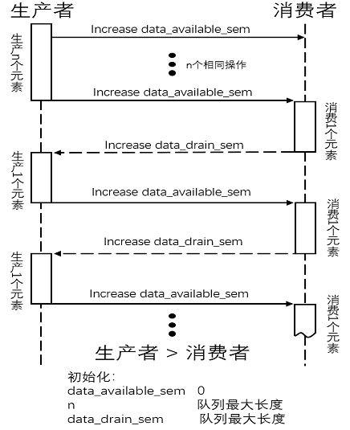

# 《如何在多个Thread任务间传递数据》  

##  1 本文档的目的及简介  

###  1.1 编写本文档的目的  

&emsp;&emsp;本文档将在介绍三种任务间通信场景(一对一、多对一、多对多)的基础上，对三种通信场景中所使用的数据传递方法、所涉及的问题、需要注意的事项进行详细的讨论，力争为用户系统且明了的介绍如何在VSF中的多任务环境中进行可靠便捷的数据传递。  

###  1.2 本文档解决哪些问题  

**阅读本文档您会获得以下问题的答案：**

- 如何实现两个任务间传递数据  
- 如何实现多个任务对一个任务传递数据  
- 如何实现多个任务间任务传递数据  
- 任务间传递数据应当注意哪些细节  
- 本文档所涉及的VSF系统中用于数据传递的IPC的语法和使用示例  

##  2 关于本文档的若干约定  

###  2.1 在阅读本文档之前    

&emsp;&emsp;本文档所介绍的内容是在使用VSF的Thread模式进行简单开发的基础上实现Thread任务间的数据传递，并且数据的传递过程中会涉及到任务的触发与同步，因此用户阅读本文档前应当掌握如何使用VSF的Thread模式进行开发以及如何触发与同步Thread任务。  

>- 若对VSF的Thread模式如何开发存有疑问，请阅读文档《VSF快速入门指南——使用Thread模式》。  
>- 若对VSF的Thread模式下的任务如何触发与同步存有疑问，请阅读文档《IPC——多任务如何进行触发和同步》。  
>- 用户阅读本文档时我们默认用户已掌握**VSF的Thread模式的开发方法**和**如何使用VSF内的IPC进行任务触发与同步**。  

###  2.2 阅读本文档用户需要具备的基础知识  

&emsp;&emsp;本文档所介绍的任务间数据传递基于VSF的Thread模式，VSF则是基于C语言，而这一切都是在嵌入式开发环境进行开发，因此阅读本文档的用户需要熟悉C语言编程以及嵌入式开发环境使用。  

>- VSF支持MDK、IAR，Eclipse+GCC等常见开发环境，用户熟悉其中之一即可。  
>- 用户阅读本文档时我们默认用户已经具备以上知识。

###  2.3 本文档涉及的部分关键名词  

|名词|解释及约定|备注|
|:--:|:--:|:--:|
|生产者|产生数据的任务||
|消费者|消耗数据的任务||
|ISR|中断服务程序||

##  3 两个任务之间如何传递数据  

###  3.1 如何传递单个数据  
**1) 如何交换单个数据**  

&emsp;&emsp;两个任务之间传递数据，最简单的方式是使用**静态变量**作为临时保存数据的介质，传递数据的时候一个任务在合适的位置写，一个任务在合适的地方读。两个任务对**静态变量**的操作示意如下：  

  

>- 图中的每个小方格都代表一个不会被打断的访问操作。
>- 这里使用的**静态变量**需要具有**天然原子性**。
>- 关于任务间通信使用**静态变量**需要注意的事项请阅读**《IPC——多任务间如何进行触发和同步》的4.2.1章节**。  

下面我们给出两个任务使用静态变量传递数据的示例代码：  

    static uint32_t cnt = 0;  /*定义静态变量并初始化为零*/
    
    declare_vsf_thread(user_thread_a_t)
    
    def_vsf_thread(user_thread_a_t, 1024,
    
        features_used(
            mem_sharable( )
            mem_nonsharable( )
        )
    
        def_params(
        )
    )
    
    declare_vsf_thread(user_thread_b_t)
    
    def_vsf_thread(user_thread_b_t, 1024,
    
        features_used(
            mem_sharable( )
            mem_nonsharable( )
        )
    
        def_params(
        )
    )
    
    void vsf_kernel_Communication_simple_demo(void)
    {
        {
            static NO_INIT user_thread_a_t __user_task_a;
            __user_task_a.on_terminate = NULL;
            init_vsf_thread(user_thread_a_t, &__user_task_a, vsf_prio_0);
        }
    
        {
            static NO_INIT user_thread_b_t __user_task_b;
            __user_task_b.on_terminate = NULL;
            init_vsf_thread(user_thread_b_t, &__user_task_b, vsf_prio_0);
        }
    }
    
    implement_vsf_thread(user_thread_a_t) 
    {
        while(1) {
            cnt++；                      /*改写cnt的值*/
            vsf_delay_ms(1000);
        }
    }
    
    implement_vsf_thread(user_thread_b_t) 
    {
        while(1) {
            printf("cnt:%d\r\n", cnt);  /*读取并打印cnt的值*/
            vsf_delay_ms(1000);
        }
    }
    
    int main(void)
    {
        ...
        /*初始化VSF的标志输入输出库*/
        vsf_stdio_init();
    
        /*启动任务*/
        vsf_kernel_Communication_simple_demo();  
        ...
        while(1) {
            ...
            vsf_delay_ms(1000);
        }
    }

>- 这里只对本文档着重介绍的部分进行注解，若读者对未注解的代码的语法及使用方式存有疑问请参考本文档2.1章节所述。

>- 在VSF环境下，由NO_INIT修饰的变量，不仅不能携带初始值，编译器也将不会对其进行清零操作。这样可以避免芯片启动时对不必要初始化的变量进行默认的清零操作（编译器一般默认会在初始化的过程中对ZI段内的变量进行默认清零操作），加快芯片启动速度。

>- Thread任务结束之后会通过一个函数指针成员(on\_terminate)调用用户对Thread任务进行"善后"的函数，例如，资源释放。对于这个函数指针有以下几点需要读者注意：
>>- 此函数指针不能为一个不确定值，不然易造成死机。因此，我们没有"善后"函数的时候，需要将其手动赋值为NULL，或者不使用NO_INIT修饰Thread实例，让编译器和芯片对其进行初始化。我们推荐读者使用第一种方法。
>>- 用户的"善后"函数内部不可以存在阻塞的代码。

**2) 如何保证通信的时效性**  

&emsp;&emsp;在两个任务通过**静态变量**进行数据传递的时候会存在一个新闻学上常见的问题——**时效性**，即消费者获得的数据也许是过时的。生产者只是知道它有了数据就写进**静态变量**这个介质，消费者只是知道需要数据了就从**静态变量**这个介质内读取，它们甚至互相都不知道自己通信的对象是谁。在这种情况下只要生产者与消费者的速率不匹配就会出现很多问题，比如导致**时效性问题**的原因——消费者的读取频率大于生产者的写入频率。  
&emsp;&emsp;如果需要保证两个任务之间传递的数据的**时效性**，就需要将两个任务进行"同步"，每次生产者产生了新的数据后通过IPC去通知消费者，消费者获得通知后再去获取**静态变量**中的数据，这样就可以解决**时效性**问题。根据以上思路我们使用触发器(trig)来改造上面的代码，修改后的代码如下：  

    /*需手动定义触发器(trig)依赖的宏*/
    #define SET     true   /*置位*/
    #define RESET   false  /*复位*/
    #define AUTO    true   /*自动复位*/
    #define MANUAL  false  /*手动复位*/
    
    static uint32_t cnt = 0;               /*定义静态变量并初始化为零*/
    static NO_INIT vsf_trig_t trig_start;  /*定义一个触发量*/
    
    declare_vsf_thread(user_thread_a_t)
    
    def_vsf_thread(user_thread_a_t, 1024,
    
        features_used(
            mem_sharable( )
            mem_nonsharable( )
        )
    
        def_params(
            vsf_trig_t *set_trig;
        )
    )
    
    declare_vsf_thread(user_thread_b_t)
    
    def_vsf_thread(user_thread_b_t, 1024,
    
        features_used(
            mem_sharable( )
            mem_nonsharable( )
        )
    
        def_params(
            vsf_trig_t *wait_trig;
        )
    )
    
    void vsf_kernel_Communication_simple_demo(void)
    {
        {
            static NO_INIT user_thread_a_t __user_task_a;
            __user_task_a.on_terminate = NULL;
            __user_task_a.param.set_trig = &trig_start;
            init_vsf_thread(user_thread_a_t, &__user_task_a, vsf_prio_0);
        }
    
        {
            static NO_INIT user_thread_b_t __user_task_b;
            __user_task_b.on_terminate = NULL;
            __user_task_b.param.wait_trig = &trig_start;
            init_vsf_thread(user_thread_b_t, &__user_task_b, vsf_prio_0);
        }
    }
    
    implement_vsf_thread(user_thread_a_t) 
    {
        while(1) {
            cnt++；                       /*改写cnt的值*/
            vsf_trig_set(this.set_trig);  /*置位目标触发量*/
            vsf_delay_ms(1000);
        }
    }
    
    implement_vsf_thread(user_thread_b_t) 
    {
        while(1) {
            vsf_trig_wait(this.wait_trig);  /*等待目标触发量*/
            printf("cnt:%d\r\n", cnt);      /*读取并打印cnt的值*/
            /*等待触发量的接口本身对任务B就是阻塞的(只对 
            使用此接口的任务有阻塞特性)，因此此处延时省去*/
        }
    }
    
    int main(void)
    {
        ...
        /*初始化VSF的标志输入输出库*/
        vsf_stdio_init();
    
        /*初始化trig_start初始状态为复位，自动复位*/
        vsf_trig_init(&trig_start, RESET, AUTO);
    
        /*启动任务*/
        vsf_kernel_Communication_simple_demo();  
        ...
        while(1) {
            ...
            vsf_delay_ms(1000);
        }
    }

>- 这里只对本文档着重介绍的部分进行注解，若读者对未注解的代码的语法及使用方式存有疑问请参考本文档2.1章节所述。
>- 若对修饰符NO_INIT或者xxx.on_terminate = NULL语句存有疑问，请参考本文档3.1章节第一小节内的说明。

###  3.2 如何传递数据流  

####  3.2.1 如何使用用户队列传递数据流  

&emsp;&emsp;上一小节我们介绍了如何稳妥的在任务间传递单个数据，显然单个数据的传递不能满足任务间大数据量通信的要求，现在我们将介绍两个任务间如何进行大量的数据传递——如何使用用户队列传递数据流。  
&emsp;&emsp;在此之前，我们需要先介绍一下VSF系统内的环形缓存宏模板—— ***vsf\_rng\_buf*** ，顾名思义，这是一个可以根据用户需求进行自定义队列类型的环形队列模板，它具有以下突出特性：  

- 不仅仅支持单个数据的出入队操作，还支持块数据的一次性出入队(peek接口也支持块数据操作)。  
- 在VSF系统内有多个由该模板生产的队列在同时工作的时候，这些队列会共享队列逻辑的维护代码，减少重复逻辑代码，进一步减少系统体积。  
- 数据拷贝则是根据用户使用的元素类型不同而用宏生成的，这样产生的代码在数据拷贝性能上最高。  

>关于环形缓存宏模板(vsf\_rng\_buf)，本文档只做简要介绍并只演示使用环形缓存宏模板生成的环形用户队列传递数据流的方法，对于环形缓存宏模板的详细特性(块数据操作、支持overload的宏接口、多种队列Buffer的初始化等)这里不做展开。有兴趣的用户请在VSF的utilities/template文件夹下寻找vsf\_queue.h文件，内有详细使用说明及示例。  

&emsp;&emsp;下面我们将介绍如何使用环形缓存宏模板定义一个环形用户队列，以及如何使用环形用户队列做简单的任务间数据流传递。  

**1) 使用环形缓存宏模板定义一个环形用户队列类型**  

    /*声明环形用户队列类型名称*/
    declare_vsf_rng_buf(user_queue_t)
    
    /*定义环形用户队列的元素类型*/
    def_vsf_rng_buf(user_queue_t, uint16_t)
    
    /*选择环形用户队列的保护方式*/
    implement_vsf_rng_buf(user_queue_t, uint16_t, NO_RNG_BUF_PROTECT)

**2) 使用环形用户队列类型定义一个环形用户队列**  

    static NO_INIT user_queue_t user_queue; 
    
    static NO_INIT vsf_sem_t data_available_sem;
    static NO_INIT vsf_sem_t data_drain_sem;

>- 两个传递数据的任务我们使用信号量(sem)进行触发与同步，因此定义两个信号量。
>- 在VSF环境下，由NO_INIT修饰的变量，不仅不能携带初始值，编译器也将不会对其进行清零操作。这样可以避免芯片启动时对不必要初始化的变量进行默认的清零操作（编译器一般默认会在初始化的过程中对ZI段内的变量进行默认清零操作），加快芯片启动速度。  

&emsp;&emsp;在初次使用信号量(sem)的前，我们先介绍一下什么是信号量。首先，我们可以理解为信号量就是一个可以触发任务线程的变量，因为它是变量，所以信号量是可以累加的，用户可以将信号量简单理解为带有触发计数功能的触发器(trig)。  
&emsp;&emsp;在我们使用触发器的时候，置位一次后，如果目标任务没有接受，那么无论触发多少次，最后目标任务只收到一次触发，于是第一次触发后的所有触发都被忽略了。而信号量就可以记录触发的次数，触发多少次，目标任务就会接收触发多少次，直到信号量归零，不会存在触发被忽略的情况。

**3) 定义任务类型以及创建任务函数**  

    declare_vsf_thread(user_thread_a_t)
    
    def_vsf_thread(user_thread_a_t, 1024,
    
        features_used(
            mem_sharable( )
            mem_nonsharable( )
        )
    
        def_params(
            vsf_sem_t    *post_sem;
            vsf_sem_t    *pend_sem;
            uint16_t      cnt;
            user_queue_t *queue_buffer;
        )
    )
    
    declare_vsf_thread(user_thread_b_t)
    
    def_vsf_thread(user_thread_b_t, 1024,
    
        features_used(
            mem_sharable( )
            mem_nonsharable( )
        )
    
        def_params(
            vsf_sem_t *post_sem;
            vsf_sem_t *pend_sem;
            uint16_t   cnt;
            user_queue_t *queue_buffer;
        )
    )
    
    void vsf_kernel_user_queue_simple_demo(void)
    {               
        {
            static NO_INIT user_thread_a_t __user_task_a;
            __user_task_a.on_terminate = NULL;
            __user_task_a.param.post_sem = &data_available_sem;
            __user_task_a.param.pend_sem = &data_drain_sem;
            __user_task_a.param.queue_buffer = &user_queue;
            __user_task_a.param.cnt          = 0;
            init_vsf_thread(user_thread_a_t, &__user_task_a, vsf_prio_0);
        }
    
        {
            static NO_INIT user_thread_b_t __user_task_b;
            __user_task_b.on_terminate = NULL;
            __user_task_b.param.post_sem = &data_drain_sem;
            __user_task_b.param.pend_sem = &data_available_sem;
            __user_task_b.param.queue_buffer = &user_queue;
            init_vsf_thread(user_thread_b_t, &__user_task_b, vsf_prio_1);
        }
    }


>若读者对修饰符NO_INIT或者xxx.on_terminate = NULL语句存有疑问，请参考本文档3.1章节第一小节内的说明。

**4) 使用环形用户队列传递两个任务间的数据流**  

```
implement_vsf_thread(user_thread_a_t) 
{
    while(1) {
        vsf_sem_pend(this.pend_sem);
        printf("In production...\r\n");

        /*如果入队成功进入if，否则进入else*/
        if(false != vsf_rng_buf_send(user_queue_t, this.queue_buffer, this.cnt)) {
            printf("Successfully sent a data to the user queue:      %d\r\n", this.cnt);
            this.cnt++;                   /*计数器自加*/
            vsf_sem_post(this.post_sem);  /*给传递数据的目标任务发送信号量*/
        } else {
            printf("Failed to send!\r\n");
            vsf_sem_post(this.pend_sem);  /*入队失败后将消耗的信号量补回*/
        }        
    }
}

implement_vsf_thread(user_thread_b_t) 
{
    while(1) {
        vsf_sem_pend(this.pend_sem);
        printf("In consumption...\r\n");

        /*如果出队成功进入if，否则进入else*/
        if(false != vsf_rng_buf_get(user_queue_t, this.queue_buffer, &this.cnt)) {
            printf("Successfully received a data from the user queue:%d\r\n\r\n", 
                                                                       this.cnt);
            vsf_sem_post(this.post_sem);  /*给传递数据的目标任务发送信号量*/
        } else {
            printf("Receive failure!\r\n\r\n");
            vsf_sem_post(this.pend_sem);  /*出队失败后将消耗的信号量补回*/
        }
    }
}

int main(void)
{
    ...
    /*初始化VSF的标志输入输出库*/
    vsf_stdio_init();

    vsf_sem_init(&data_available_sem, 0);

    /*将data_drain_sem定义为128的目的是使生产者可以先运行起来，数值大小与队列大小相关*/
    vsf_sem_init(&data_drain_sem, 128);

    /*初始化环形用户队列并指定队列大小为128*/
    vsf_rng_buf_init(user_queue_t, uint16_t, &user_queue, 128);

    /*启动任务*/
    vsf_kernel_user_queue_simple_demo();
    ...
    while(1) {
        ...
        vsf_delay_ms(1000);
    }
}

```
>- 这里需要**声明**的是：这里的示例是以环形缓存宏模板生成的用户队列为例，介绍如何使用用户自己的队列进行任务间的数据传递。可以看到Thread模式下对用户队列的接口调用与裸机并无差别。
>- 这里只对本文档着重介绍的部分进行注解，若读者对未注解的代码的语法及使用方式存有疑问请参考本文档2.1章节所述。

运行结果：  

>演示工程为FVP工程。  


####  3.2.2 如何使用消息队列传递数据流  

&emsp;&emsp;在VSF系统中进行任务间的数据流传递除了可以使用户自己的队列之外，还可以使用VSF系统提供的消息队列(vsf\_thread\_msg\_queue)。  

>- 消息队列是基于VSF中的通用队列管理模块(vsf\_eda\_queue)实现的，通用队列管理模块是什么以及如何使用通用队列管理模块将在下一章进行介绍。  
>- 这里例举出消息队列的接口：  
>>vsf\_err\_t vsf\_thread\_msg\_queue\_init(vsf\_list\_queue_t *pthis, uint\_fast16\_t max)
>>vsf\_err\_t vsf\_thread\_msg\_queue\_send(vsf\_eda\_queue\_t *pthis, void *node, int\_fast32\_t timeout)
>>vsf\_err\_t vsf\_thread\_msg\_queue\_recv(vsf\_eda\_queue\_t *pthis, void **node, int\_fast32\_t timeout)

&emsp;&emsp;在使用消息队列传递任务间数据之前，我们先要明确消息队列传递的是数据的指针(地址)，如果直接将某个静态变量的地址放入消息队列进行传递的话数据安全性得不到保证，原因就是其他的任务或者代码是有机会在任何时候修改这个静态变量的。因此我们需要专门分配一块内存用于存储我们的数据，并将这块内存交给消息队列进行发送。  
&emsp;&emsp;因为发送的数据每次都是固定的类型，所以我们需要每次分配相同大小的内存块即可。根据以上需求，我们决定使用内存池(vsf\_pool)配合消息队列进行任务间的数据流传递，示例如下：  

>关于内存池(vsf\_pool)，这里不做过多的介绍，只是演示如何配合消息队列进行任务间数据流传递。接口使用说明和示例将分别在本文档的6.2章节、附录1.1章节进行介绍。

**1) 定义用户内存池类型及实例**  
```
/*定义一个名为counter_t的拥有一个uint32_t类型变量的结构体类型*/
typedef struct counter_t {
    /*继承slist的类型*/
    implement(vsf_slist_node_t);
    uint32_t counter;
}counter_t;

/*用户内存池类型前置声明*/
declare_vsf_pool(user_pool_t)

/*定义用户内存池类型*/
def_vsf_pool(user_pool_t, counter_t)
    
/*实施用户内存池*/
implement_vsf_pool(user_pool_t, counter_t )

/*定义用户内存池实例*/
static vsf_pool_t user_pool;
```

>这里需要解释的是**为什么定义名为counter\_t的结构体类型需要继承vsf\_slist\_node\_t的类型**，因为消息队列本质上是通用队列管理模块管理的单向链表(slist)队列，如果我们需要使用消息队列发送一个counter\_t类型的指针，就需要counter\_t类型对消息队列的类型拥有"兼容性"。这部分将在本文档第4章节进行具体解释。

**2) 定义一个消息队列实例**  

    static vsf_msg_queue_t vsf_msg_queue;  
    
    static NO_INIT vsf_sem_t data_available_sem;
    static NO_INIT vsf_sem_t data_drain_sem;

>两个传递数据的任务我们使用信号量(sem)进行触发与同步，因此定义两个信号量。

**3) 定义任务类型并创建任务启动函数**  

    declare_vsf_thread(user_thread_a_t)
    
    def_vsf_thread(user_thread_a_t, 1024,
    
        features_used(
            mem_sharable( )
            mem_nonsharable( )
        )
    
        def_params(
            vsf_sem_t *post_sem;
            vsf_sem_t *pend_sem;
            counter_t *buffer;  /*用于接收分配的内存块*/
            uint32_t  cnt;      /*计数器*/
                                /*用于存储用户内存池的实例指针*/
            vsf_pool(user_pool_t) *user_pool_pointer;
        )
    )
    
    declare_vsf_thread(user_thread_b_t)
    
    def_vsf_thread(user_thread_b_t, 1024,
    
        features_used(
            mem_sharable( )
            mem_nonsharable( )
        )
    
        def_params(
            vsf_sem_t *post_sem;
            vsf_sem_t *pend_sem;
            counter_t *buffer;  /*用于接收分配的内存块*/
                                /*用于存储用户内存池的实例指针*/
            vsf_pool(user_pool_t) *user_pool_pointer;
        )
    )
    
    void vsf_kernel_msg_queue_simple_demo(void)
    {           
        {
            static NO_INIT user_thread_a_t __user_task_a;
            __user_task_a.on_terminate = NULL;
            __user_task_a.param.post_sem = &data_available_sem_a;
            __user_task_a.param.pend_sem = &data_drain_sem_a;
            __user_task_a.param.user_pool_pointer = &__user_pool;
            __user_task_a.param.cnt = 1;
            init_vsf_thread(user_thread_a_t, &__user_task_a, vsf_prio_0);
        }
    
        {
            static NO_INIT user_thread_b_t __user_task_b;
            __user_task_b.on_terminate = NULL;
            __user_task_b.param.post_sem = &data_drain_sem_a;
            __user_task_b.param.pend_sem = &data_available_sem_a;
            __user_task_b.param.user_pool_pointer = &__user_pool;
            init_vsf_thread(user_thread_b_t, &__user_task_b, vsf_prio_0);
        }
    
    }

>若读者对修饰符NO_INIT或者xxx.on_terminate = NULL语句存有疑问，请参考本文档3.1章节第一小节内的说明。

**3) 使用消息队列实现两任务间传递数据的逻辑**  

&emsp;&emsp;消息队列的出入队接口是支持"阻塞"的，当超时配置参数配置不同的时候，出入队接口的行为逻辑是不同的，我们将在下面进行分情况介绍。  

>"阻塞"：这里的阻塞只是对于调用支持"阻塞"的接口的任务来说的，即这个"阻塞"接口只会阻塞调用它的任务，不会影响其他任何代码的执行。

&emsp;&emsp;1.当消息队列的出入队接口的超时配置参数(n)配置为-1的时候，出入队接口是**"死等模式"**。下面我们将介绍这种模式下的出入队接口的使用方式：  

>**死等模式**：即出入队不成功则一直在原地尝试，直到出入队成功才会继续往下执行代码。需要强调的是这种模式下的出入队接口阻塞的只是调用它们的任务，完全不影响其他代码的运行。

```
implement_vsf_thread(user_thread_a_t) 
{
    while(1) {
        vsf_sem_pend(this.pend_sem);
        
        printf("Producing...\r\n");
        
        /*从用户内存池分配出一个内存块*/
        this.buffer = VSF_POOL_ALLOC(user_pool_t, this.user_pool_pointer);
        
        if(NULL == this.buffer) {
            printf("Alloc failure!\r\n");

            /*操作失败后，将消耗的信号量补回*/
            vsf_sem_post(this.pend_sem);
        } else {  /*如果内存块分配成功进入else*/

            /*将需要发送的数据交给内存块*/
            this.buffer->count = this.cnt;
                        
            /*使用消息队列发送内存块*/
            /*参数：消息队列实例的指针、需要发送的指针、超时配置*/
            vsf_thread_msg_enqueue(&vsf_msg_queue, this.buffer, -1);
            
            printf("Successfully sent data:     %d\r\n\r\n", this.buffer->count);

            /*计数器自加*/
            this.cnt++;
            vsf_sem_post(this.post_sem);
        }
    }
}

implement_vsf_thread(user_thread_b_t) 
{
    while(1) {
        vsf_sem_pend(this.pend_sem);
        
        printf("Consuming...\r\n");
        
        /*从消息队列内获取数据*/
        /*参数：消息队列实例的指针、用于接收指针的指针(void **)、超时配置*/
        vsf_thread_msg_dequeue(&vsf_msg_queue, &this.buffer, -1);
        
        printf("Successfully receiving data:%d\r\n\r\n", this.buffer->count);

        /*释放使用完毕的内存块*/
        VSF_POOL_FREE(user_pool_t, this.user_pool_pointer, this.buffer);
        vsf_sem_post(this.post_sem);
    }
}

int main(void)
{
    ...
    /*初始化VSF的标志输入输出库*/
    vsf_stdio_init();

    /*初始化信号量(sem)*/
    vsf_sem_init(&data_available_sem_a, 0);
    vsf_sem_init(&data_drain_sem_a, 3);

    /*初始化内存池*/
    VSF_POOL_PREPARE(user_pool_t, &__user_pool);
    
    /*初始化消息队列*/
    vsf_thread_msg_queue_init(&vsf_msg_queue, 3);
    
    /*任务启动*/
    vsf_kernel_msg_queue_simple_demo();
    ...
    while(1) {
        ...
        vsf_delay_ms(1000);
    }
}
```

>这里只对本文档着重介绍的部分进行注解，若读者对未注解的代码的语法及使用方式存有疑问请参考本文档2.1章节所述。

运行结果：  

>演示工程为FVP工程。


&emsp;&emsp;2.当消息队列的出入队接口的超时配置参数(n)配置为>0的时候，代表如果出入队接口第一次操作失败了，会再尝试n个tick的时间，如果在再次尝试的这段时间内成功了，就会立马返回GET事件，如果这段时间过去后还没有成功就返回超时事件并结束"阻塞"，用户可以根据返回的事件不同作出相应的操作。消息队列的出入队接口在这种模式下的使用方式示例如下：  

>在指定的时间(n个tick)内出入队接口依然是"阻塞"的，只不过这种模式下的出入队接口不再以成功操作作为结束"阻塞"的唯一条件。

```
implement_vsf_thread(user_thread_a_t) 
{
    vsf_sync_reason_t queue_reason;
    while(1) {
        vsf_sem_pend(this.pend_sem);
        printf("Producing...\r\n");
        
        /*从用户内存池分配出一个内存块*/
        this.buffer = VSF_POOL_ALLOC(user_pool_t, this.user_pool_pointer);
        
        if(NULL == this.buffer) {
            printf("Alloc failure!\r\n");

            /*操作失败后，将消耗的信号量补回*/
            vsf_sem_post(this.pend_sem);
        } else {  /*如果内存块分配成功进入else*/
            this.buffer->count = this.cnt;
            
                           /*使用消息队列发送内存块*/
                           /*参数：消息队列实例的指针、需要发送的指针、超时配置*/
            queue_reason = vsf_thread_msg_queue_send(&vsf_msg_queue, this.buffer, 100);
            
            /*如果在指定时间内操作成功进入if*/
            if(VSF_SYNC_GET ==queue_reason) {
                printf("Successfully sent data:     %d\r\n\r\n", this.buffer->count);
                this.cnt++;
                vsf_sem_post(this.post_sem);

            /*在指定时间内没有操作成功*/
            } else if(VSF_SYNC_TIMEOUT == queue_reason) {
                printf("Entry failure!\r\n\r\n");

                /*入队操作失败的时候将消耗的信号量补回*/
                vsf_sem_post(this.pend_sem);
            }
        }
    }
}

implement_vsf_thread(user_thread_b_t) 
{
    vsf_sync_reason_t queue_reason;
    while(1) {
        vsf_sem_pend(this.pend_sem);
        printf("Consuming...\r\n");

        /*从消息队列内获取数据*/
        /*参数：消息队列实例的指针、用于接收指针的指针(void **)、超时配置*/
        queue_reason = vsf_thread_msg_queue_recv(&vsf_msg_queue, &this.buffer, 100);
        
        /*如果在指定时间内操作成功进入if*/
        if(VSF_SYNC_GET == queue_reason) {
            printf("Successfully receiving data:%d\r\n\r\n", this.buffer->count);

            /*释放使用完毕的内存块*/
            VSF_POOL_FREE(user_pool_t, this.user_pool_pointer, this.buffer);
            vsf_sem_post(this.post_sem);

        /*在指定时间内没有操作成功*/
        } else if(VSF_SYNC_TIMEOUT == queue_reason) {
            printf("Entry failure!\r\n\r\n");

            /*出队操作失败的时候将消耗的信号量补回*/
            vsf_sem_post(this.pend_sem);
        }
    }
}
```

>- 这里只对本文档着重介绍的部分进行注解，若读者对未注解的代码的语法及使用方式存有疑问请参考本文档2.1章节所述。
>- 因为示例程序并不复杂，并且我们使用了信号量对任务进行了同步与触发，出入队并未出现失败的情况，运行结果与"死等模式"的时候一致，这里就不再重复放图。

###  3.3 使用队列传递任务间数据应当注意的问题  

&emsp;&emsp;在上面的小节中我们已经介绍了如何使用队列在两个任务之间传递数据(同优先级任务间)，可是我们并没有考虑实际运用中的会遇到的干扰——优先级、任务是否支持阻塞。这些都不是传递数据的队列所能控制的，但是却会实实在在的影响队列的运行，下面我们将探讨如何在不同的任务环境中使用队列高效稳妥的传递数据。

####  3.3.1 如何指定生产者与消费者的优先级     

**1) 生产者优先级大于消费者**  

&emsp;&emsp;因为优先级的不同，两个任务需要协调工作的时候就需要使用信号量(sem)进行触发，信号量同时还可以记录生产/消费了多少元素。这里假设的场景是触发生产者的信号量初始为和队列长度一样大，触发消费者的信号量初始为零，这样处理的目的是为了队列可以发挥最大的缓冲作用，并且在数据传递的开始就可以满足生产者的需求。但是我们可以根据图示看出因为生产者的优先级较高，只要消费者增加一个触发生产者的信号量，CPU就会立刻被生产者抢占，这样的结果就是通信开始队列放满之后，队列的缓冲作用完全消失了。



**2) 生产者优先级小于消费者**  

&emsp;&emsp;同样，因为优先级的不同，两个任务需要协调工作的时候就需要使用信号量(sem)进行触发，信号量同时还可以记录生产/消费了多少元素。这里也依然假设的场景是生产者的信号量(sem)初始为和队列长度一样大，触发消费者的信号量初始为零，这样处理的目的是为了队列可以发挥最大的缓冲作用，并且在数据传递的开始就可以满足生产者的需求。但是我们根据图示可以看到因为消费者的优先级比生产者高，生产者生产出一个元素后增加一个触发消费者的信号量后CPU立即被消费者抢占，导致队列的缓冲作用从任务运行开始就是完全失效的，甚至不如上一种情况(上一种情况中队列还发挥了一次缓冲作用)。


**3) 生产者优先级等于消费者**  

&emsp;&emsp;在优先级相同的情况下，我们仍然需要信号量(sem)来记录生产/消费了多少元素，并在队列为满或为空的时候阻塞任务，使任务不进行无意义的运行。根据下图我们可以看出，队列的缓冲作用得到了充分的发挥，可以看出任务的切换频率较以上两种情况有明显的降低，而我们知道系统进行任务切换的时候是需要时间与资源的，所以队列性能的充分发挥有助于整个系统获得最大的运行效率。


**4) 是否有解决方案使队列的使用不受优先级影响**  

&emsp;&emsp;通过以上三种情况的分析，我们可以看到队列的缓冲性能影响着任务的切换频率，而任务的切换频率则影响着系统的运行效率。所以，如果需要寻求一个较为通用的队列使用逻辑，我们应当从队列的缓冲性能如何在任何情况下都可以得到发挥入手。  
&emsp;&emsp;我们知道队列不能发挥最大缓冲性能的原因是在优先级不对等的多任务传递数据环境中一旦有一个触发高优先级任务的信号量(sem)增加，就会导致低优先级任务被抢占。针对这种情况，我们可以想办法在队列满或者队列空的情况下再使用触发器(trig)去触发通信对象，这样相当于使用触发器在队列的潜力没有被压榨干之前强制高优先级的通信对象不能被执行，于是每次都可以在队列被放满或者拿空后再切换任务，效果如下图，问题得到了解决。


####  3.3.2 生产者或消费者在需要得到及时执行的情况下如何使用队列  

**1) 生产者需要得到及时执行的情况下**  

&emsp;&emsp;这种情况下有一个典型的场景，便是串口中断处理程序接收数据后传递给消费者(ISR向普通Thread任务传递数据)。如果要保证队列发挥最大的性能，则还需要队列里的元素达到一定个数(threshold)才去触发消费者，消费者消费threshold个元素后停止。而threshold的取值显然不能太大，因为队列内存有过多的元素可能导致消费者被ISR过多的打断，造成任务频繁切换，同时threshold取值不能过小，频繁的唤醒消费者一样拉低系统效率。这种方法的示意如下图：  


**2) 消费者需要得到及时执行的情况下**  

&emsp;&emsp;这种情况下的场景可以理解上面所讨论的情况的反面，即生产者通过串口中断处理程序发送数据(普通Thread任务向ISR传递数据)。需要明确的是，这种情况成立的前提是生产者速率等于或者大于消费者，否者，消费者不需要全力工作或者直接不需要工作(ISR触发的频率很低或者直接不需要触发)。对于这种情况我们使用的方法与上面讨论的类似，不过方法是队列剩余元素小于一定个数(threshold)的时候消费者去触发生产者，生产者将队列放满停止。这里threshold的值显然也是需要取一个合适的值，原因类似上一种情况所讨论的。示意如下图：  


##  4 多个任务如何给一个任务传递数据  

###  4.1 vsf\_eda\_queue是什么  

&emsp;&emsp; ***vsf\_eda\_queue*** 是VSF系统提供的**通用队列管理模块**，它可以对普通的队列进行管理，实现一个队列多进一出，并且通用队列管理模块拥有一个特性—— ***os aware*** ，所以使用通用队列管理模块管理的队列可以利用VSF系统中的一些特性，以获得更高的效率。  

>os aware的意思是通用队列管理模块是知道系统存在的，这就给了通用队列管理模块使用VSF系统特性的可能。

###  4.2 如何使用通用队列管理模块管理用户队列   

&emsp;&emsp;在我们介绍完什么是通用队列管理模块之后，我们将展现如何将**队列类型**、**入队接口**、**出队接口**、**队列初始化接口**交给通用队列管理模块管理。下面我们以单向链表队列(vsf\_eda\_slist\_queue)为例，演示如何借助通用队列管理模块(vsf\_eda\_queue)获得一个"新的"高效队列——用户消息队列(vsf\_user\_msg\_queue)。  

>之所以说是"新的"高效队列，是因为最后获得的用户消息队列并不是一个真正意义新的独立队列，它只是通用队列管理模块管理单向链表队列的一种方法，只不过出现了新的对外接口，看起来是"新的"而已。

**1) 包含需要的头文件**  

&emsp;&emsp;根据我们使用的资源，我们需要在源文件中包含以下头文件：  

    #include "kernel/vsf_kernel_cfg.h"
    #include "./vsf_kernel_common.h"
    #include "./vsf_eda.h"
    
    /*用户消息队列的头文件，这里一并列出*/
    #include "./vsf_user_msg_queue.h"

**2) 用户消息队列的队列类型生成**  

&emsp;&emsp;用户消息队列的类型本质上是由通用队列管理模块的类型继承而来，只是在继承时我们需要在子类内加入被管理的队列的内部元素类型。比如，我们期望将单向链表队列交给通用队列管理模块管理，则新类型的获取应当如下操作：  

    typedf struct vsf_user_msg_queue_t {
            implement(vsf_eda_queue_t)      /*继承父类*/
            vsf_slist_queue_t queue;        /*添加单向链表队列类型到子类内*/
    }vsf_user_msg_queue_t;

**3) 入队接口的封装**  

&emsp;&emsp;在我们搞定用户消息队列的类型后，我们需要将单向链表队列的接口封装成通用队列管理模块需要的形式，使得通用队列管理模块可以操作单向链表队列的入队接口。示例如下：  

    static bool __vsf_eda_user_msg_queue_enqueue(vsf_eda_queue_t *pthis, void *node)
    {
        /*使用链表节点类型创建一个新节点并获得赋值*/
        __vsf_eda_list_node_wrapper *list_node = node;  
                                                        /*初始化新节点*/
        vsf_slist_init_node(__vsf_eda_list_node_wrapper, node, list_node);
                                                        /*将新节点入队到链表队列中*/
        vsf_slist_queue_enqueue(__vsf_eda_list_node_wrapper, node,
                                &((vsf_msg_queue_t *)pthis)->queue,
                                (__vsf_eda_list_node_wrapper *)node);
        return true;
    }

**4) 出队接口的封装**  

&emsp;&emsp;同样的，将单向链表队列的出队接口封装成通用队列管理模块需要的形式。示例如下：  

    static bool __vsf_eda_user_msg_queue_dequeue(vsf_eda_queue_t *pthis, void **node)
    {
        /*使用链表节点类型创建一个新节点*/
        __vsf_eda_list_node_wrapper *list_node;  
                                                 /*同新节点将元素出队*/
        vsf_slist_queue_dequeue(__vsf_eda_list_node_wrapper, node,
                                &((vsf_msg_queue_t *)pthis)->queue,
                                list_node);
        *node = list_node;                       /*将元素指针返回给参数指针*/
        return *node != NULL;
    }

**5) 消息队列初始化函数的创建**  

&emsp;&emsp;细心的读者应该已经发现，上文中封装后的入队与出队函数都是静态函数，原因是它们根本不需要跨文件使用，也不需要对用户层暴露，在消息队列初始化函数运行的时候就会被作为成员变量的值内化到用户消息队列的实例内。可以理解为上面的出入队接口都只是给通用队列管理函数使用的。示例如下：  

    vsf_err_t vsf_user_msg_queue_init(vsf_msg_queue_t *pthis, uint_fast16_t max)
    {
        /*将封装好的入队接口的函数指针赋予消息队列实例的成员变量*/
        pthis->use_as__vsf_queue_t.op.enqueue = __vsf_eda_user_msg_queue_enqueue;
    
        /*将封装好的出队接口的函数指针赋予消息队列实例的成员变量*/
        pthis->use_as__vsf_queue_t.op.dequeue = __vsf_eda_user_msg_queue_dequeue;
    
        /*使用链表队列的初始化接口初始化消息队列内的成员——链表队列*/
        vsf_slist_queue_init(&pthis->queue);
    
        /*使用通用队列的初始化接口初始化消息队列，并指定消息队列的大小*/
        return vsf_eda_queue_init(&pthis->use_as__vsf_queue_t, max);
    }

>消息队列的初始化接口不要提供给通用队列管理模块，用户可以直接使用。

步骤1、3、4、5均是消息队列源文件(vsf_user_msg_queue.c)内的代码，下面将继续展示消息队列头文件(vsf_user_msg_queue.h)内的操作。  

**6) 头文件内封装接口**  

&emsp;&emsp;封装后的出入队接口只提供给通用队列管理模块使用的话，那用户应当使用什么接口来操作最后获得的用户消息队列呢？显然我们应该的从管理者手中获得经过"处理"后的接口。事实上通用队列管理模块也为我们提供相应的接口，我们只需要进行封装就可以使用。示例如下：  

>不要忽略了头文件内使用源文件的函数需要外置声明。

```
/*包含头文件*/
#include "kernel/vsf_kernel_cfg.h"

/*封装接口，可见send、recv等接口都是由通用队列管理模块提供，不是直接使用用户封装的函数*/
#define vsf_user_msg_queue_send(__queue, __node, __timeout)            \
             vsf_eda_queue_send((vsf_eda_queue_t *)(__queue), (__node), (__timeout))

#define vsf_user_msg_queue_send_get_reason(__queue, __evt, __node)     \
             vsf_eda_queue_send_get_reason((vsf_eda_queue_t *)(__queue), (__evt), (__node))

#define vsf_user_msg_queue_recv(__queue, __node, __timeout)            \
             vsf_eda_queue_recv((vsf_eda_queue_t *)(__queue), (void **)(__node), (__timeout))

#define vsf_user_msg_queue_recv_get_reason(__queue, __evt, __node)     \
             vsf_eda_queue_recv_get_reason((vsf_eda_queue_t *)(__queue), (__evt), (void **)(__node))

extern vsf_err_t vsf_user_msg_queue_init(vsf_list_queue_t *pthis, uint_fast16_t max);
```

&emsp;&emsp;到这里，用户消息队列的创建已经结束。总的来说就是将拥有用户需要的类型的普通队列的接口按照通用队列管理模块的需要封装，再将封装好的接口提供给通用队列管理模块，然后我们再使用通用队列管理模块提供的接口即可。  

**7) 用户接口的封装**  

&emsp;&emsp;用户消息队列的创建完成后，我们就可以使用用户接口操作用户消息队列，但是一个入队或者出队的完整逻辑是由send与 ***send\_get\_reason*** 、 ***recv*** 与 ***recv\_get\_reason*** 组成的，因此如果读者依照以上方法使用通用队列管理模块管理了自己的用户队列，我们推荐读者按照以下方式封装出完整逻辑的出入队接口。  

>通过以下封装方式，用户可以更好的了解本文档3.2.2章节所描述的出入队接口参数：**超时配置**。

```
vsf_err_t vsf_user_msg_enqueue(vsf_eda_queue_t *pthis, void *node, int_fast32_t timeout)
{
    vsf_err_t queue_evt;
    vsf_sync_reason_t queue_reason = VSF_SYNC_GET;
    
    queue_evt = vsf_user_msg_queue_send(pthis, node, timeout);
        
    /*如果第一次操作失败便会进入if*/
    if(VSF_EVT_NONE != queue_evt) {
        while(1) {            
            queue_reason = vsf_user_msg_queue_send_get_reason(pthis, 

    /*此接口可以实现"阻塞"特性，并在获取到事件后退出"阻塞"*/        vsf_thread_wait(), 

                                                              node);
    /*超时配置为-1时，不会得到超时事件，所以只有操作成功才会执行break*/
    /*超时配置>0时，在时间范围内操作成功或者超时都会执行break*/
            if((VSF_SYNC_GET == queue_reason) || (VSF_SYNC_TIMEOUT == queue_reason)) {
                break;
            }
        }
    }
    return queue_reason;
}

vsf_err_t vsf_user_msg_dequeue(vsf_eda_queue_t *pthis, void **node_pointer, int_fast32_t timeout)
{
    vsf_err_t queue_evt;
    vsf_sync_reason_t queue_reason = VSF_SYNC_GET;
    
    queue_evt = vsf_user_msg_queue_recv(pthis, node_pointer, timeout);
        
    if(VSF_EVT_NONE != queue_evt) {
        while(1) {
            queue_reason = vsf_user_msg_queue_recv_get_reason(pthis, 
                                                              vsf_thread_wait(), 
                                                              node_pointer);
            if((VSF_SYNC_GET == queue_reason) || (VSF_SYNC_TIMEOUT == queue_reason)) {
                break;
            }
        }
    }
    return queue_reason;
}
```

>这里只对本文档着重介绍的部分进行注解，若读者对未注解的代码的语法及使用方式存有疑问请参考本文档2.1章节所述。

###  4.3 如何使用vsf\_thread\_msg\_queue实现多个任务向一个任务传递数据  

&emsp;&emsp;为了用户方便的了解如何实现多个任务向一个任务传递数据，本小节与前两小节解耦，不使用 ***vsf\_user\_msg\_queue*** 作为演示队列，我们依然使用本文档3.2.2章节所使用的 ***vsf\_thread\_msg\_queue*** 来演示相关逻辑。
&emsp;&emsp;多个任务使用 ***vsf\_thread\_msg\_queue*** 向一个任务传递数据的时候，关于 ***vsf\_thread\_msg\_queue*** 的准备工作、任务实例的定义、内存池的使用、任务启动函数的创建与请参考前文(参考本文档3.2.2章节)，这里不再赘述。这里我们只介绍多个任务如何使用 ***vsf\_thread\_msg\_queue*** 向一个任务传递数据的逻辑。  

>为了多个任务间的协同，我们使用了以下几个触发器(trig)实例：
>>data_available_trig_a  表示任务A生产了一个数据(初始化为复位，自动复位)
>>data_drain_trig_a      表示任务C消耗了任务A一个数据(初始化为置位，自动复位)
>>data_available_trig_b  表示任务B生产了一个数据(初始化为复位，自动复位)
>>data_drain_trig_b      表示任务C消耗了任务B一个数据(初始化为置位，自动复位)

&emsp;&emsp;相关的任务逻辑如下：  

>- 任务A实例内的成员变量cnt初始化为1。
>- 任务B实例内的成员变量cnt初始化为2。
>- 需要**强调**的是这里不再使用信号量(sem)，而使用触发器(trig)。

```
implement_vsf_thread(user_thread_a_t) 
{
    while(1) {
        vsf_trig_wait(&data_drain_trig_a);
        
        printf("Producing...\r\n");
        
        /*分配一个内存块*/
        this.buffer = VSF_POOL_ALLOC(user_pool_t, &__user_pool);
        
        if(NULL == this.buffer) {
            printf("Alloc failure!\r\n");

            /*操作失败后，将消耗的触发量补回*/
            vsf_trig_set(&data_drain_trig_a);
        } else {

            /*将计数器的值赋给内存块内的变量*/
            this.buffer->count = this.cnt;
            
            /*将内存块入队*/
            vsf_thread_msg_enqueue((vsf_eda_queue_t *)&vsf_msg_queue, this.buffer, -1);
            
            printf("task_a successfully sent data:     %d\r\n\r\n", this.buffer->count);
            this.cnt++;
            vsf_trig_set(&data_available_trig_a);
        }
    }
}

implement_vsf_thread(user_thread_b_t) 
{
    while(1) {
        vsf_trig_wait(&data_drain_trig_b);
        
        printf("Producing...\r\n");
        
        /*分配一个内存块*/
        this.buffer = VSF_POOL_ALLOC(user_pool_t, &__user_pool);
        
        if(NULL == this.buffer) {
            printf("Alloc failure!\r\n");

            /*操作失败后，将消耗的触发量补回*/
            vsf_trig_set(&data_drain_trig_b);
        } else {
            /*将计数器的值赋给内存块内的变量*/
            this.buffer->count = this.cnt;
            
            /*将内存块入队*/
            vsf_thread_msg_enqueue(&vsf_msg_queue, this.buffer, -1);
            
            printf("task_b successfully sent data:     %d\r\n\r\n", this.buffer->count);
            this.cnt++;
            vsf_trig_set(&data_available_trig_b);
        }
    }
}

implement_vsf_thread(user_thread_c_t) 
{
    vsf_sync_reason_t queue_reason;
    while(1) {
        vsf_trig_wait(&data_available_trig_a);
        
        printf("Consuming...\r\n");
        
        /*出队一个元素*/
        vsf_thread_msg_dequeue(&vsf_msg_queue, &this.buffer, -1);
        printf("task_c successfully receiving data:%d\r\n\r\n", this.buffer->count);

        /*释放使用完毕的内存*/
        VSF_POOL_FREE(user_pool_t, &__user_pool, this.buffer);
        vsf_trig_set(&data_drain_trig_a);
        
        vsf_trig_wait(&data_available_trig_b);
        
        /*出队一个元素*/
        vsf_thread_msg_dequeue(&vsf_msg_queue, &this.buffer, -1);
        printf("task_c successfully receiving data:%d\r\n\r\n", this.buffer->count);

        /*释放使用完毕的内存*/
        VSF_POOL_FREE(user_pool_t, &__user_pool, this.buffer);
        vsf_trig_set(&data_drain_trig_b);
    }
}

int main(void)
{
    ...
    /*初始化VSF的标志输入输出库*/
    vsf_stdio_init();

    /*初始化触发器*/
    vsf_trig_init(&data_available_trig_a, RESET, AUTO);
    vsf_trig_init(&data_drain_trig_a, SET, AUTO);
    vsf_trig_init(&data_available_trig_b, RESET, AUTO);
    vsf_trig_init(&data_drain_trig_b, SET, AUTO);

    /*初始化消息队列，队列大小设为20*/
    vsf_eda_msg_queue_init(&vsf_msg_queue, 20);
    
    /*启动任务*/
    vsf_kernel_msg_queue_simple_demo();
    ...
    while(1) {
        ...
        vsf_delay_ms(1000);
    }
}

```

>这里只对本文档着重介绍的部分进行注解，若读者对未注解的代码的语法及使用方式存有疑问请参考本文档2.1章节所述。

运行结果：  

>演示工程为FVP工程。  


###  4.4 使用vsf\_eda\_queue或者vsf\_user\_msg\_queue的注意事项有哪些  

**1) 关于vsf\_eda\_queue的注意事项**  

- 读者需要了解如何在VSF系统中进行类的继承，以便获得需要的类型。
- 普通队列的入队、出队、初始化都必须经过对应的封装才能与 ***vsf\_eda\_queue*** 对接。
-  ***vsf\_eda\_queue*** 是支持超时配置的，在封装 ***vsf\_eda\_queue*** 提供的接口时不能遗漏关于 ***xxx_get_reason*** 的接口。

**2) 关于vsf\_user\_msg\_queue的注意事项**  

-  ***vsf\_user\_msg\_queue*** 发送的是指针(地址)，不是变量实体。
-  ***vsf\_user\_msg\_queue*** 发送的地址最好来自分配的内存块，而不是某个静态变量的地址。因为传递静态变量的地址存在产生数据完整性的风险。
-  ***vsf\_user\_msg\_queue*** 是支持超时配置的，关于在发生超时后如何根据返回的事件决定下一步如何处理和如何在超时后再次尝试读者需要掌握。
-  ***vsf\_user\_msg\_queue*** 的队列类型需要对原有的普通队列类型进行兼容，因为使用的缓冲空间仍是原有普通队列的缓冲空间。

##  5 多个任务之间如何任意传递数据  

###  5.1 任意传递数据的方法有哪些  

####  5.1.1 使用vsf\_eda\_post\_evt\_msg  

&emsp;&emsp; ***vsf\_eda\_post\_evt\_msg*** 可以给指定的任务发送指定的事件，并在发送事件的同时携带一个无符号的指针(void *)，这给了用户向任意任务发送指定数据的权力，下面我们就将介绍，如何使用这一任务间传递数据的利器。  

&emsp;&emsp;首先， ***vsf\_eda\_post\_evt\_msg*** 是由 ***vsf\_eda\_post\_evt*** 衍生而来，为了使能 ***vsf\_eda\_post\_evt\_msg*** 接口，我们需要在 ***vsf\_kerenl\_cfg.h*** 内将相关宏做如下配置：  

    VSF_KERNEL_CFG_SUPPORT_EVT_MESSAGE    ENABLED

&emsp;&emsp;然后用户还需要定义自己的事件，例如我们需要定义事件 ***VSF\_EVT\_START*** ，则如下操作：   

    enum {
        VSF_EVT_START = VSF_EVT_USER + 1
    }vsf_user_evt_t;

>用户在定义自己的事件的时候需要注意的是，自定义的事件枚举大小必须在VSF_EVT_USER的基础上往后取值。

&emsp;&emsp;以上准备工作完成之后，我们就可以开始定义任务类型以及创建任务启动函数。  

    declare_vsf_thread(user_thread_a_t)
    
    def_vsf_thread(user_thread_a_t, 1024,
     
        features_used(
        	mem_sharable()
        	mem_nonsharable()
        )
    
        def_params(
        	vsf_thread_t *thread_obj;
            uint32_t     cnt;
        )
    )
    
    declare_vsf_thread(user_thread_b_t)
    
    def_vsf_thread(user_thread_b_t, 1024,
    
        features_used(
            mem_sharable( )
            mem_nonsharable( )
        )
    
        def_params(
            uint32_t *cnt_pointer;
        )
    )
    
    void vsf_kernel_post_evt_msg_simple_demo(void)
    {           
        /*定义一个vsf_thread_t类型的局部变量指针*/
        vsf_thread_t *target_thread;
        {
            static NO_INIT user_thread_b_t __user_task_b; 
            __user_task_b.on_terminate = NULL;
    
            target_thread = (vsf_thread_t *)&__user_task_b;  /*获取任务实例指针*/
            init_vsf_thread(user_thread_b_t, &__user_task_b, vsf_prio_0);
        }
    
    	{
        	static NO_INIT user_thread_a_t __user_task_a;
            __user_task_a.on_terminate = NULL;
    
            /*初始化实例的成员变量*/
            __user_task_a.param.cnt = 0;  
    
            /*将任务B的实例指针赋给任务A的成员变量*/
        	__user_task_a.param.thread_obj = target_thread;  
        	init_vsf_thread(user_thread_a_t, &__user_task_a, vsf_prio_0);
        }    
    }

>- 若读者对修饰符NO_INIT或者xxx.on_terminate = NULL语句存有疑问，请参考本文档3.1章节第一小节内的说明。
>- 这里只对本文档着重介绍的部分进行注解，若读者对未注解的代码的语法及使用方式存有疑问请参考本文档2.1章节所述。

&emsp;&emsp;现在我们可以开始着手实现使用 ***vsf\_eda\_post\_evt\_msg*** 进行任务间通信的逻辑了，实现方法如下：  

    implement_vsf_thread(user_thread_a_t) 
    {
        while(1) {
            this.cnt++;                                /*记数器自加*/
                                                       /*给指定的任务发送事件并夹带一个指针*/
            vsf_eda_post_evt_msg((vsf_eda_t *)this.thread_obj, VSF_EVT_START, &this.cnt);
            printf("task_a send an evt and pointer:   NO.%d\r\n", this.cnt);  /*打印log*/
            vsf_delay_ms(1000);                        /*一秒钟发送一次*/
        }
    }
    
    implement_vsf_thread(user_thread_b_t)
    {    
        while(1) {
            /*得到指定的事件后获取数据*/
            this.cnt_pointer = vsf_thread_wfem(VSF_EVT_START);
    
            /*打印log*/
            printf("task_b receive an evt and pointer:NO.%d\r\n", *this.cnt_pointer);
    
            /*vsf_thread_wfem对调用它的任务有阻塞效果，因此这里省去延时*/                        
        }
    }
    
    int main(void)
    {
        ...
        /*初始化VSF的标志输入输出库*/
        vsf_stdio_init();
    
        /*启动任务*/
        vsf_kernel_post_evt_msg_simple_demo();  
        ...
        while(1) {
            ...
            vsf_delay_ms(1000);
        }
    }

运行结果：  

>演示工程为FVP工程。


####  5.1.2 使用vsf\_eda\_post\_msg  

&emsp;&emsp;使用 ***vsf\_eda\_post\_msg*** 的方法与 ***vsf\_eda\_post\_evt\_msg*** 类似，可以理解为不可指定事件的 ***vsf\_eda\_post\_evt\_msg*** 接口。因为不需要我们自行定义事件，所以，我们可以直接开始定义任务类型及创建函数。  

>vsf\_eda\_post\_msg接口内固定发送的事件为VSF\_EVT\_MESSAGE。

    declare_vsf_thread(user_thread_a_t)
    
    def_vsf_thread(user_thread_a_t, 1024,
    
        features_used(
        	mem_sharable()
        	mem_nonsharable()
        )
    
        def_params(
        	vsf_thread_t *thread_obj;
            uint32_t     cnt;
        )
    )
    
    declare_vsf_thread(user_thread_b_t)
    
    def_vsf_thread(user_thread_b_t, 1024,
    
        features_used(
            mem_sharable( )
            mem_nonsharable( )
        )
    
        def_params(
            uint32_t *cnt_pointer;
        )
    )
    
    void vsf_kernel_post_msg_simple_demo(void)
    {           
        /*定义一个vsf_thread_t类型的局部变量指针*/
        vsf_thread_t *target_thread;
    
        {
            static NO_INIT user_thread_b_t __user_task_b;
            __user_task_b.on_terminate = NULL;
            target_thread = (vsf_thread_t *)&__user_task_b;  /*获取任务实例指针*/
            init_vsf_thread(user_thread_b_t, &__user_task_b, vsf_prio_0);
        }
    
        {
        	static NO_INIT user_thread_a_t __user_task_a;
            __user_task_a.on_terminate = NULL;
    
            /*初始化实例的成员变量*/
            __user_task_a.param.cnt = 0;  
    
            /*将任务B的实例指针赋给任务A的成员变量*/
    	    __user_task_a.param.thread_obj = target_thread;
    	    init_vsf_thread(user_thread_a_t, &__user_task_a, vsf_prio_0);
        }    
    }

>- 若读者对修饰符NO_INIT或者xxx.on_terminate = NULL语句存有疑问，请参考本文档3.1章节第一小节内的说明。
>- 这里只对本文档着重介绍的部分进行注解，若读者对未注解的代码的语法及使用方式存有疑问请参考本文档2.1章节所述。

    implement_vsf_thread(user_thread_a_t) 
    {
        while(1) {
            this.cnt++;          /*计数器自加*/
                                 /*给指定的任务发送数据*/
            vsf_eda_post_msg((vsf_eda_t *)this.thread_obj, &this.cnt);
                                 /*打印log*/
            printf("task_a send a msg:   NO.%d\r\n", this.cnt);
            vsf_delay_ms(1000);  /*一秒发送一次*/
        }
    }
    
    implement_vsf_thread(user_thread_b_t)
    {    
        while(1) {
    
            this.cnt_pointer = (uint32_t *)vsf_thread_wfm();
    
            /*打印log*/
            printf("task_b receive a msg:NO.%d\r\n\r\n", *this.cnt_pointer);
            
            /*vsf_thread_wfm对调用它的任务有阻塞效果，因此这里省去延时*/
        }
    }
    
    int main(void)
    {
         ...
         /*初始化VSF的标志输入输出库*/
         vsf_stdio_init();
    
         /*启动任务*/
         vsf_kernel_post_msg_simple_demo();  
         ...
         while(1) {
             ...
             vsf_delay_ms(1000);
         }
    }

运行结果如下：  

>演示工程为FVP工程。  


###  5.2 如何解除因为使用以上接口导致的任务间耦合  

&emsp;&emsp;从 ***post\_evt\_msg*** 和 ***post\_msg*** 的示例我们可以看出生产者是通过在任务启动时指定的任务实例指针来寻找消费者的，这无疑不利于形成**高内聚，低耦合**的代码，那么我们必须想方法来将产生的耦合解除。这里就需要提出一个概念——"名片"(NameCard)。

####  5.2.1 什么是NameCard  

&emsp;&emsp;顾名思义，名片是个人姓名与联络方式的载体，当我们需要联络某个人的时候我们可以通过名片获得这个人的联络方式。同理，我们如果给做数据传递的任务建立一个"名片"，上面记载了这个任务是谁，联系的方式是什么，那么我们在不需要对这个任务通信的时候就可以完全不理会这个任务，就像我们不需要联络某个人的时候我们不需要记得这个人的电话号码，当我们需要对这个任务进行通信的时候去查找"名片"就好了。

####  5.2.2 如何自定义及使用NameCard  

**1) 自定义任务"名片"**  

&emsp;&emsp;实际上，在程序中实现名片功能就是定义一个包含必要信息的结构体。例如，我们需要任务的名称，那么我们需要结构体中有一个**字符串成员变量**，用于保存任务的名称；我们需要对应任务的通信方式，根据上一小节的示例可知，我们需要结构体中有一个 ***vsf\_thread\_t*** **类型的指针变量**，用于保存任务实例的指针。于是乎，我们可以得到以下定义：  

    typedef struct {
        uint8_t      *task_name;  /*任务名称*/
        vsf_thread_t *task_obj;   /*任务实例指针*/
    }name_card_t;                 /*定义的结构体类型*/  

&emsp;&emsp;得到"名片"类型后，我们便可以开始给任务做名片了。  

    /*定义一个结构体数组，容量为10，即可存10个"名片"*/
    static name_card_t name_card[10];

>这里定义10个大小为示意，实际本文档的示例只会示意一个。用户应当根据自己实际需求定义数组大小，不然将无谓的增加查询"名片"的时间。

**2) 如何在任务通信中使用"名片"**  

&emsp;&emsp;我们以使用 ***vsf\_eda\_post\_msg*** 接口做任务间数据传递的任务为例，从任务类的定义以及任务启动函数的创建开始介绍。  
&emsp;&emsp;用户可以发现，下面的任务类型定义过程中已经不需要为任务B预留指针类型的成员变量了，同时任务启动函数中也不再需要将任务B的任务实例赋予任务A的成员变量，两个任务均直接与"名片"沟通。  

    declare_vsf_thread(user_thread_a_t)
    
    def_vsf_thread(user_thread_a_t, 1024,
    
        features_used(
        	mem_sharable()
        	mem_nonsharable()
        )
    
        def_params(  /*这里不再需要vsf_thread_t类型的指针*/
            uint32_t     cnt;
        )
    )
    
    declare_vsf_thread(user_thread_b_t)
    
    def_vsf_thread(user_thread_b_t, 1024,
    
        features_used(
            mem_sharable( )
            mem_nonsharable( )
        )
    
        def_params(
            uint32_t *cnt_pointer;
        )
    )
    
    void vsf_kernel_post_msg_simple_demo(void)
    {   
        {
        	static NO_INIT user_thread_a_t __user_task_a;
            __user_task_a.on_terminate = NULL;
            __user_task_a.param.cnt = 0;
    	    init_vsf_thread(user_thread_a_t, &__user_task_a, vsf_prio_0);
        }   
    
        /*关于任务B的信息直接交给"名片"即可，与任务A再无关系*/
        {
            static NO_INIT user_thread_b_t __user_task_b;
            __user_task_b.on_terminate = NULL;
    
            /*任务名称*/
            name_card[0].task_name = (uint8_t *)"__user_task_b";
    
            /*任务实例指针*/
            name_card[0].task_obj  = (vsf_thread_t *)&__user_task_b;
            init_vsf_thread(user_thread_b_t, &__user_task_b, vsf_prio_0);
        }
    }

>若读者对修饰符NO_INIT或者xxx.on_terminate = NULL语句存有疑问，请参考本文档3.1章节第一小节内的说明。

&emsp;&emsp;在任务中使用"名片"存在一个类似查表的过程，如果希望对任务B进行通信，则在名片中进行查找，找到即进行数据传递，如果找不到则不做操作。具体的逻辑及实现如下：  

    implement_vsf_thread(user_thread_a_t) 
    {
        uint8_t cnt;
        while(1) {
            for(cnt = 0; cnt < UBOUND(name_card); cnt++) {  /*存在多少"名片"即查询多少次*/
    
             /*比对期望的名称与"名片"中是否有相同的，如果存在则表示我们可以发送数据给期望的任务*/
                if(0 == strcmp("__user_task_b",(char *)name_card[cnt].task_name)) {
                    this.cnt++;                             
                    vsf_eda_post_msg((vsf_eda_t *)name_card[cnt].task_obj, &this.cnt);
                    printf("task_a send a msg:   NO.%d\r\n", this.cnt);
                    break;
                }
            }
            vsf_delay_ms(1000);
        }
    }
    
    implement_vsf_thread(user_thread_b_t)
    {    
        while(1) {
            this.cnt_pointer = (uint32_t *)vsf_thread_wfm();
            printf("task_b receive a msg:NO.%d\r\n\r\n", *this.cnt_pointer);
        }
    }
    
    int main(void)
    {
        ...
        /*初始化VSF的标志输入输出库*/
        vsf_stdio_init();
    
        /*启动任务*/
        vsf_kernel_post_msg_simple_demo();
        ...
        while(1) {
            ...
            vsf_delay_ms(1000);
        }
    }

最终的运行结果与本文档的5.1.2章节使用vsf\_eda\_post\_msg的示例一致，但是任务A、B之间最大限度的解除了耦合。  

##  6 本文档所涉及到的任务间传递数据的接口及使用方法  

###  6.1 关于信号量(sem)的语法与示例  

**1) 信号量(sem)的定义**  

&emsp;&emsp;在定义信号量的时候我们需要使用 ***vsf\_sem\_t*** 类，语法如下：  

    static NO_INIT vsf_sem_t <用户信号量名称>;

&emsp;&emsp; **<用户信号量名称>** 是用户期望的合法的C语言名称。  

&emsp;&emsp;如何我们希望定义一个名为 ***user\_sem*** 的用户信号量，则应当如下操作：  

    static NO_INIT vsf_sem_t user_sem;

>- 在VSF环境下，由NO_INIT修饰的变量，不仅不能携带初始值，编译器也将不会对其进行清零操作。这样可以避免芯片启动时对不必要初始化的变量进行默认的清零操作（编译器一般默认会在初始化的过程中对ZI段内的变量进行默认清零操作），加快芯片启动速度。  

**2) 信号量的初始化**  

&emsp;&emsp;在初始化信号量的时候我们需要用到 ***vsf\_sem\_init*** 接口，语法如下：  

    vsf_sem_init(<信号量实例指针>, <信号量初始个数>);

&emsp;&emsp; **<信号量实例指针>** 是已定义的需要初始化的用户信号量的地址。  
&emsp;&emsp; **<信号量初始个数>** 是指定被初始化的信号量的初始个数，取值范围为0~65535。例如，信号量 ***sem\_x*** 的初始值为5，那么这个 ***sem\_x*** 就可以在没有其他任务继续增加 ***sem\_x*** 值的情况下触发目标任务5次。  

&emsp;&emsp;如果我们需要将上面定义的 ***user\_sem*** 初始化为初始值为0，则应当如下操作：  

    vsf_sem_init(&user_sem, 0);

**3) 如何增加信号量的值**  

&emsp;&emsp;在增加信号量值的时候我们需要用到 ***vsf\_sem\_post*** 接口，语法如下：  

    vsf_sem_post(<信号量实例指针>);

&emsp;&emsp; **<信号量实例指针>** 是已定义并且初始化完成后的用户信号量的地址。  

&emsp;&emsp;如果我们需要将上面初始化完成的用户信号量 ***user\_sem*** 的值增加1，则应当如下操作：  

    vsf_sem_post(&user_sem);

**4) 如何获取信号量**  

&emsp;&emsp;在获取信号量的时候我们需要用到 ***vsf\_sem\_pend*** 接口，语法如下：  

    vsf_sem_pend(<信号量实例指针>);

&emsp;&emsp; **<信号量实例指针>** 是已定义并且初始化完成后的用户信号量的地址。  

&emsp;&emsp;如果我们希望等待用户信号量 ***user\_sem*** ，则应当如下操作：  

    vsf_sem_pend(&user_sem);

>vsf\_sem\_pend接口是"阻塞"的，即在等不到指定的信号量的时候，这个接口会(也只仅会)阻塞这个任务。  

###  6.2 关于vsf\_rng\_buf的语法与示例  

**1) 环形队列类型的定义**  

&emsp;&emsp; ***vsf\_rng\_buf*** 是一个环形缓存宏模板，因此在我们使用它之前，需要对它的一些基本特性进行定义。具体的项目及语法如下：  

```
/*声明环形用户队列类型名称*/
declare_vsf_rng_buf(<队列的类型名称>)

/*定义环形用户队列的元素类型*/
def_vsf_rng_buf(<队列的类型名称>, <队列的存放的元素的数据类型>)

/*选择环形用户队列的保护方式*/
implement_vsf_rng_buf(<队列的类型名称>, <队列的存放的元素的数据类型>, <队列使用的保护方式>)
```

&emsp;&emsp; **<队列的类型名称>** 合乎C语言标准的合法名称。  
&emsp;&emsp; **<队列的存放的元素的数据类型>** 我们期望队列内存放的数据的数据类型。  
&emsp;&emsp; **<队列使用的保护方式>** 我们希望的对队列的保护等级。  

&emsp;&emsp;如果我们希望定义一个队列，类型为 ***user\_queue\_t*** ，队列内存放的数据的数据类型为 ***uint16\_t*** ，队列的保护等级为 ***NO\_RNG\_BUF\_PROTECT*** 。则操作如下：  
```
declare_vsf_rng_buf(user_queue_t)

def_vsf_rng_buf(user_queue_t, uint16_t)

implement_vsf_rng_buf(user_queue_t, uint16_t, NO_RNG_BUF_PROTECT)
```

**2) 环形队列实例的定义及初始化**    

&emsp;&emsp;定义实例的语法如下：  

    static NO_INIT <队列的类型名称> <用户队列实例名称>;

&emsp;&emsp; **<队列的类型名称>** 是在队列定义的时候完成定义的队列类型。  
&emsp;&emsp; **<用户队列实例名称>** 是合乎C语言标准的合法名称。  

&emsp;&emsp;如果我们希望定义一个名为 ***user\_queue*** 的 ***user\_queue\_t*** 类型的队列实例。则如下操作：  

    static NO_INIT user_queue_t user_queue;

>- 在VSF环境下，由NO_INIT修饰的变量，不仅不能携带初始值，编译器也将不会对其进行清零操作。这样可以避免芯片启动时对不必要初始化的变量进行默认的清零操作（编译器一般默认会在初始化的过程中对ZI段内的变量进行默认清零操作），加快芯片启动速度。  

&emsp;&emsp;然后我们就可以使用队列实例进行队列的初始化，相关的接口及语法如下：  

>此环形缓存宏模板的初始化方式(主要是缓冲空间的获取差异)有两种，我们这里只介绍其中一种，也是我们推荐的一种。另一种初始化方式请读者在VSF的utilities/template文件夹下的vsf\_queue.h文件中进行了解，内有详细说明。

    vsf_rng_buf_init(<队列的类型名称>, 
                     <队列的存放的元素的数据类型>, 
                     <用户队列实例的指针>, 
                     <用户队列的最大长度>);

&emsp;&emsp; **<队列的类型名称>** 是在队列定义的时候完成定义的队列类型。  
&emsp;&emsp; **<队列的存放的元素的数据类型>** 我们期望队列内存放的数据的数据类型。  
&emsp;&emsp; **<用户队列实例的指针>** 定义完成的队列实例的指针。  
&emsp;&emsp; **<用户队列的最大长度>** 我们期望的队列最大长度。  

&emsp;&emsp;如果我们期望队列的类型为 ***user\_queue\_t*** ，队列内存放的数据类型为 ***uint16\_t*** ，使用 ***user\_queue*** 实例，队列的最大长度为128个元素。那么应当如下操作：  

    vsf_rng_buf_init(user_queue_t, uint16_t, &user_queue, 128);

**3) 入队操作**  

&emsp;&emsp;入队接口及相关语法如下：  

    vsf_rng_buf_send(<队列的类型名称>, <用户队列实例的指针>, <需要入队的数据>);

&emsp;&emsp;如果我们向 ***user\_queue\_t*** 类型的队列 ***user\_queue*** 内写入一个 ***uint16\_t*** 类型的数据num，则应当如下操作：  

    if(vsf_rng_buf_init(user_queue_t, &user_queue, num) != false) {
       ...
    } else {
       ...
    }

>入队接口的返回值为bool型，false代表失败，!false代表成功，在使用入队接口的时候一定要判断是否成功执行，防止数据发送或者获取失败影响到系统的健壮性。

**4) 出队操作**  

&emsp;&emsp;出队接口及相关语法如下：  

    vsf_rng_buf_get(<队列的类型名称>, <用户队列实例的指针>, <需要入队的数据>);

&emsp;&emsp;如果我们需要从user\_queue\_t类型的队列user\_queue内获取一个数据，放在变量num内，则应当如下操作：  

    if(vsf_rng_buf_get(user_queue_t, &user_queuer, &num) != false) {
        ...
    } else {
        ...
    }

>- 出队接口的返回值为bool型，false代表失败，!false代表成功，在使用出队接口的时候同样要判断是否成功执行。
>- 关于vsf\_rng\_buf的更多详细介绍(peek、块操作等)请用户阅读VSF的utilities/template文件夹下的vsf\_queue.h的使用说明进行了解，这里只对本文档涉及到的接口进行说明。

###  6.3 关于vsf\_pool的语法与示例  

**1) 如何定义用户内存池**  

&emsp;&emsp;在定义用户内存池之前我们首先需要确定用户内存池内的数据结构，这个数据结构也就是将来分配内存空间的时候这个内存空间内的数据结构。相关的语法如下：  
```
typedef struct <结构体名称> {
    <数据类型> <成员名称>;
}<结构体名称>;
```
&emsp;&emsp; **<结构体名称>** 必须是是符合C语言标准的合法名称，由用户根据实际情况自定义。  
&emsp;&emsp; **<数据类型>** 必须是是完成定义的类型。  
&emsp;&emsp; **<成员名称>** 必须是是符合C语言标准的合法名称，由用户根据实际情况自定义。  

&emsp;&emsp;如果我们希望定义一个数据类型名为 ***counter\_t*** ，这个类型内部拥有一个 ***uint32\_t*** 类型的名为counter的成员变量。则应当如下操作：  
```
typedef struct counter_t {
    uint32_t counter;
}counter_t;
```
&emsp;&emsp;然后，我们就可以使用定义好的数据类型来定义用户的内存池了，相关的项目及语法如下：  

```
/*用户内存池类型前置声明*/
declare_vsf_pool(<用户内存池类型名称>)

/*定义用户内存池类型*/
def_vsf_pool(<用户内存池类型名称>, <结构体名称>)
    
/*实施用户内存池*/
implement_vsf_pool(<用户内存池类型名称>, <结构体名称>)
```

&emsp;&emsp; **<用户内存池类型名称>**  必须是是符合C语言标准的合法名称，由用户根据实际情况自定义。  
&emsp;&emsp; **<结构体名称>**  是上面第一步定义好的数据结构。  

&emsp;&emsp;如果我们希望使用上面定义好的数据结构 ***counter\_t*** 定义一个名为 ***user\_pool\_t*** 的用户内存池类型。则应当如下操作：  

```
declare_vsf_pool(user_pool_t)

def_vsf_pool(user_pool_t, count_t)
    
implement_vsf_pool(user_pool_t, count_t )
```
**2) 如何定义用户内存池实例**  

&emsp;&emsp;在完成用户内存池的定义之后，我们就可以使用已定义的用户内存池类型进行用户内存池实例的定义。语法如下：  

```
static <用户内存池类型名称> <用户内存池实例名称>;
```

&emsp;&emsp; **<用户内存池类型名称>** 已完成定义的用户内存池类型。  
&emsp;&emsp; **<用户内存池实例名称>** 必须是是符合C语言标准的合法名称，由用户根据实际情况自定义。 

&emsp;&emsp;如果我们希望使用 ***user\_pool\_t*** 类型定义一个名为 ***user\_pool*** 的实例，则应当如下操作：  

```
static user_pool_t user_pool;
```

**3) 如何初始化用户内存池**  

&emsp;&emsp;VSF系统内关于初始化内存池的接口及语法如下：  

>同vsf\_queue一样，vsf\_pool也具有两种初始化方式(主要为内存空间的提供方式的差异)，我们这里只介绍本文档中使用的接口(也是我们推荐用户使用的方法)。如果读者希望了解另外的一种初始化方式，请在VSF的service/pool文件夹下找到vsf\_pool.h文件，其中有详细的使用说明。

```
VSF_POOL_PREPARE(<用户内存池类型名称>, <用户内存池实例指针>);
```

&emsp;&emsp; **<用户内存池类型名称>** 已完成定义的用户内存池类型。  
&emsp;&emsp; **<用户内存池实例指针>** 已完成定义的用户内存池实例的指针。  

&emsp;&emsp;如果我们需要将 ***user\_pool\_t*** 类型的用户内存池 ***user\_pool*** 初始化，则应当如下操作：  

```
VSF_POOL_PREPARE(user_pool_t, &__user_pool);
```
**4) 如何从用户内存池分配出一个内存块**  

&emsp;&emsp; ***vsf\_pool*** 的内存分配接口及语法如下：  

```
<用于接收内存空间的指针变量> = VSF_POOL_ALLOC(<用户内存池类型名称>, <用户内存池实例指针>);
```

&emsp;&emsp; **<用于接收内存空间的指针变量>** 的类型一般情况下是跟随内存池数据类型的，也就是 ***counter\_t*** ，以求做到类型匹配。  
&emsp;&emsp; **<用户内存池类型名称>** 已完成定义的用户内存池类型。  
&emsp;&emsp; **<用户内存池实例指针>** 已完成定义的用户内存池实例的指针。  

&emsp;&emsp;如果我们希望从上面初始化完毕的用户内存池中分配出一个内存块放入指针变量buffer中，则应当如下操作：  

```
buffer = VSF_POOL_ALLOC(user_pool_t, &user_pool);
```

**5) 如何向用户内存池释放一个内存块**  

&emsp;&emsp; ***vsf\_pool*** 的内存释放接口及语法如下：  

```
VSF_POOL_FREE(<用户内存池类型名称>, <用户内存池实例指针>, <需要释放的内存块>);
```

&emsp;&emsp; **<用户内存池类型名称>** 已完成定义的用户内存池类型。  
&emsp;&emsp; **<用户内存池实例指针>** 已完成定义的用户内存池实例的指针。 
&emsp;&emsp; **<需要释放的内存块>** 是由同一个用户内存池分配出的内存块。 

&emsp;&emsp;如果我们希望将上一步分配出的内存块释放回用户内存池，则应当如下操作：  

```
VSF_POOL_FREE(user_pool_t, &user_pool, buffer);
```

>关于vsf\_pool的独立功能示例请读者阅读本文档的7.1章节。

###  6.4 关于vsf\_eda\_post\_evt\_msg的语法与示例   

**1) 定义用户自己的事件**   

&emsp;&emsp; ***vsf\_eda\_post\_evt\_msg*** 接口发送的是一个事件与这个事件携带的一个无符号指针，那么我们在向接口提供数据之前需要先提供一个事件用于触发目标任务。我们在前面的的文档中提到过VSF是事件驱动型的系统，毫无疑问VSF系统也拥有它自己的若干个事件，为了不干扰VSF系统的正常运行，我们要求**用户定义的事件的值必须大于** ***VSF\_EVT\_USER*** 。所以，定义用户事件的语法如下：  

    enum {
        <用户事件> = VSF_EVT_USER + < n >
    }<用户事件类型>;

&emsp;&emsp; **<用户事件>** 是用户自定义的合乎C语言规范的事件名称。 
&emsp;&emsp; **< n >** 是在 ***VSF\_EVT\_USER*** 基础上往后递增的值大小，取值取决于用户定义多少事件。   
&emsp;&emsp; **<用户事件类型>** 符合C语言规范的类型名称。  

&emsp;&emsp;假如我们想定义一个拥有 ***VSF\_EVT\_START*** 事件、 ***VSF\_EVT\_END*** 事件的类型 ***vsf\_user\_evt\_t*** 类型，则应当如下操作：  

    enum {
        VSF_EVT_START = VSF_EVT_USER + 1,
        VSF_EVT_END   = VSF_EVT_USER + 2
    }vsf_user_evt_t;

**2) 发送事件与数据**  

&emsp;&emsp; ***vsf\_eda\_post\_evt\_msg*** 接口的功能是向指定任务发送一个事件与一个无符号的指针，根据这个功能我们可以得到三个要素：**指定的任务**、**事件**、**指针**。这里也就不难理解下面的语法了：  

    vsf_eda_post_evt_msg(<任务实例指针>, <事件>, <数据指针>);  

&emsp;&emsp; **<任务实例指针>** 是指目标任务的实例指针，如何获取其他任务的实例指针可以参考本文档5.1.1章节的示例。  
&emsp;&emsp; **<事件>** 便是我们上面定义的用户事件，显然取值范围是大于 ***VSF\_EVT\_USER*** 。  
&emsp;&emsp; **<数据指针>** 是用户希望传递的数据的指针，取值为非空。  

&emsp;&emsp;如果我们希望向任务A(实例为\_\_user\_task\_a)发送一个 ***VSF\_EVT\_START*** 事件，并将静态变量variable传递到任务A。则应当如下操作：  

    vsf_eda_post_evt_msg((vsf_eda_t *)&__user_task_a, VSF_EVT_START, &variable); 

**3) 获取数据指针**  

&emsp;&emsp;接收数据的接口是 ***vsf\_thread\_wfem*** ，本质上是在接收到指定的事件之后将这个事件携带的无符号指针取出。相关的语法如下：  

    <接收指针的变量> = vsf_thread_wfem(<指定的事件>);

&emsp;&emsp; **<接收指针的变量>** 是用来接收无符号指针的变量，通过指针我们可以获得这段地址上的数据。  
&emsp;&emsp; **<指定的事件>** 是我们指定的任务中需要等待的事件。  

&emsp;&emsp;如果我们需要在接收到 ***VSF\_EVT\_START*** 事件事件后获取其携带的无符号指针，则应当如下操作：  

    pointer = vsf_thread_wfem(VSF_EVT_START);

###  6.5 关于vsf\_eda\_post\_msg的语法与示例  

**1) 发送数据**  

&emsp;&emsp;在上文中我们说到 ***vsf\_eda\_post\_msg*** 接口是不能由用户指定事件的，因此我们在获得目标任务的实例指针之后，直接进行数据的发送即可。相关的语法如下：  

    vsf_eda_post_msg(<任务实例指针>, <数据指针>);

&emsp;&emsp; **<任务实例指针>** 是指目标任务的实例指针，如何获取其他任务的实例指针可以参考本文档5.1.1章节的示例。  
&emsp;&emsp; **<数据指针>** 是用户希望传递的数据的指针，取值为非空。  

&emsp;&emsp;如果我们希望向任务A(实例为\_\_user\_task\_a)传递一个静态变量variable。则应当如下操作：  

    vsf_eda_post_msg((vsf_eda_t *)&__user_task_a, &variable);

**2) 接收数据**  

&emsp;&emsp;这部分的原理本质上也是任务被事件触发后，获取事件所携带的无符号指针，但是触发事件是接口内部固定的，不需要用户指定。相关语法如下：  

    <接收指针的变量> = vsf_thread_wfm();

&emsp;&emsp; **<接收指针的变量>** 是用来接收无符号指针的变量，通过指针我们可以获得这段地址上的数据。  

&emsp;&emsp;如果我们需要在目标任务内等待数据的时候，我们直接使用变量接收指针即可：  

    pointer = vsf_thread_wfm(); 

##  附录  
###  附录1：关于vsf\_pool的使用  

####  1.1 什么是内存池   

&emsp;&emsp;顾名思义，内存池(vsf\_pool)是一个内存的"水池"。值得一提的是，整个内存池在我们对其进行初始化之后便按照我们定义的内存的类型划分成一个个相同的"内存块"，因此，我们向内存池请求内存或者释放内存不需要内存的切割或者合并操作。在标准的C语言库中有malloc接口，标准的C++库中有new接口，那么为什么我们还需要 ***vsf\_pool*** 呢？  
&emsp;&emsp;下面我们将介绍内存池突出的优点，也是对上面问题的回答：  

- 分配与释放内存的算法的时间复杂度是恒定的O(1)。
- 可以有效的避免内存碎片，尤其是VSF这种面向小资源MCU的系统更为需要。
- 使用内存池管理内存可以显著的提高内存管理的效率，进而提升系统的效率。  
- 在空闲内存充足的情况下，可以有效的避免内存分配失败的情况出现。

####  1.2 内存池使用示例  

**1) 内存池类型定义**  
```
/*定义内存的类型：用户需要指定结构体名称和结构体内的成员*/
typedef struct {
    uint8_t byte;
}byte_t;

/*声明内存池的类：用户需要指定一个用户内存池类型*/
declare_vsf_pool(user_pool_t)

/*定义内存池的类*/
def_vsf_pool(user_pool_t, byte_t)
    
/*实施内存池的类*/
implement_vsf_pool(user_pool_t, byte_t )
```

**2) 内存池实例定义**  

```
/*根据用户内存池类型定义一个内存池实例名为__user_pool*/
static NO_INIT vsf_pool(user_pool_t) __user_pool;
```

**3) 定义任务类型与创建任务启动函数**  

```
declare_vsf_thread(user_thread_a_t)

def_vsf_thread(user_thread_a_t, 1024,

    features_used(
        mem_sharable( )
        mem_nonsharable( )
    )
    
    def_params(
        byte_t *buffer;
        vsf_pool(user_pool_t) *pointer;
        uint8_t cnt;
    )
)

void vsf_kernel_pool_simple_demo(void)
{               
    static NO_INIT user_thread_a_t __user_task_a;
    __user_task_a.on_terminate = NULL;
    __user_task_a.param.pointer = &__user_pool;
    __user_task_a.param.cnt = 0;
    init_vsf_thread(user_thread_a_t, &__user_task_a, vsf_prio_0);
}
```

>若读者对修饰符NO_INIT或者xxx.on_terminate = NULL语句存有疑问，请参考本文档3.1章节第一小节内的说明。

**4) 如何使用内存池分配与释放内存**  

```
implement_vsf_thread(user_thread_a_t) 
{
    while(1) {  
        /*分配内存*/
        /*参数：用户内存池类型、用户内存池实例指针*/
        this.buffer = VSF_POOL_ALLOC(user_pool_t, this.pointer);
        if(NULL == this.buffer) {

            /*打印log*/
            printf("Alloc ERR!\r\n"); 
        } else {  /*如果分配成功进入else*/
            printf("Alloc succeeded!\r\n");
            this.cnt++;

            /*将分配的内存赋值*/
            this.buffer->byte = this.cnt;  

            /*使用分配的内存打印值*/
            printf("The value in the buffer:%d\r\n",this.buffer->byte);

            /*释放内存*/
            /*参数：用户内存池类型、用户内存池实例指针、需要释放的内存块*/
            VSF_POOL_FREE(user_pool_t, this.pointer, this.buffer);
            printf("Buffer is free!\r\n\r\n");
        }
        vsf_delay_ms(1000);
    }
}

int main(void) 
{
    ...
    /*初始化VSF的标志输入输出库*/
    vsf_stdio_init();

    /*初始化内存池*/
    /*参数：用户内存池类型、用户内存池实例指针*/
    VSF_POOL_PREPARE(user_pool_t, &__user_pool);
    
    /*启动任务*/
    vsf_kernel_pool_simple_demo();
    ...
    while(1) {
        ...
    }
}
```

>这里只是介绍如何简单的使用vsf\_pool进行内存块分配、使用、释放。有兴趣的读者可以在VSF工程的vsf/service/pool文件夹内找到vsf\_pool.h，内有详细的介绍及使用方法。

运行结果如下：  

>演示工程为FVP工程。


###  附录2：本文档所涉及的部分API列表  

|接口名称|函数原型|参数|参数类型|参数意义|参数取值范围|接口功能|
|:----:|:----:|:----:|:----:|:----:|:----:|:----:|
|vsf_sem_init|void vsf_sem_init(vsf_sem_t *psem, uint16_t cnt)|psem|vsf_sem_t *|信号量指针|vsf_sem_t类型非空指针|初始化信号量|
|||cnt|uint16_t|信号量初始值|0~65535||
|vsf_sem_post|void vsf_sem_post(vsf_sem_t *psem)|psem|vsf_sem_t *|信号量指针|vsf_sem_t类型非空指针|增加信号量的值|
|vsf_sem_pend|void vsf_sem_pend(vsf_sem_t *psem)|psem|vsf_sem_t *|信号量指针|vsf_sem_t类型非空指针|获取信号量|
|VSF_POOL_PREPARE|void vsf_pool_prepare(NAME, NAME *ptObj)|NAME|字符串|内存池类型|合法的C语言名称|初始化内存池|
|||ptObj|NAME *|内存池实例指针|NAME类型的非空指针||
|VSF_POOL_ALLOC|TYPE * vsf_pool_alloc(NAME, NAME *ptObj)|NAME|字符串|内存池类型|合法的C语言名称|向内存池申请一块内存|
|||ptObj|NAME *|内存池实例指针|NAME类型的非空指针||
|VSF_POOL_FREE|void vsf_pool_free(NAME, NAME * ptObj, TYPE * ptItem)|TYPE|字符串|内存池类型|合法的C语言名称|向内存池释放一块内存|
|||ptObj|NAME*|内存池实例指针|NAME类型的非空指针||
|||ptItem|TYPE *|需要释放的内存|TYPE 类型的非空指针||
|vsf_rng_buf_init|void vsf_rng_buf_init(NAME, TYPE, ADDR, ITEM_COUNT)|NAME|字符串|队列的类型|合法的C语言名称|初始化队列|
|||TYPE|字符串|数据结构|合法的C语言类型||
|||ADDR|NAME *|队列的实例指针|NAME类型的非空指针||
|||ITEM_COUNT|uint16_t|队列的长度|0~65535||
|vsf_rng_buf_send|void vsf_rng_buf_send(NAME, ADDR, ITEM)|NAME|字符串|队列的类型|合法的C语言名称|入队|
|||ADDR|NAME *|队列的实例指针|NAME类型的非空指针||
|||ITEM|TYPE|入队元素的类型|TYPE类型的变量||
|vsf_rng_buf_get|void vsf_rng_buf_get(NAME, ADDR, TYPE *ITEM)|NAME|字符串|队列的类型|合法的C语言名称|出队|
|||ADDR|NAME *|队列的实例指针|NAME类型的非空指针||
|||ITEM|TYPE*|接收元素的指针|TYPE类型的非空指针||
|vsf_thread_msg_queue_init|vsf_err_t vsf_thread_msg_queue_init(vsf_list_queue_t *pthis, uint_fast16_t max);|pthis|vsf_list_queue_t *|队列实例指针|vsf_list_queue_t类型的非空指针|队列初始化|
|||max|uint_fast16_t|队列长度|0~65535||
|vsf_thread_msg_enqueue|vsf_err_t vsf_thread_msg_enqueue(vsf_eda_queue_t *pthis, void *node, int_fast32_t timeout)|pthis|vsf_eda_queue_t *|队列实例指针|vsf_eda_queue_t类型的非空指针|入队|
|||node|void *|需要入队的指针|非空||
|||timeout|int_fast32_t|超时配置|0~2147483647||
|vsf_thread_msg_dequeue|vsf_err_t vsf_thread_msg_dequeue(vsf_eda_queue_t *pthis, void **node, int_fast32_t timeout)|pthis|vsf_eda_queue_t *|队列实例指针|vsf_eda_queue_t类型的非空指针|出队|
|||node|void **|获取指针的指针|非空||
|||timeout|int_fast32_t|超时配置|0~2147483647||
|vsf_eda_post_evt_msg|vsf_err_t vsf_eda_post_evt_msg(vsf_eda_t *pthis, vsf_evt_t evt, void *msg)|pthis|vsf_eda_t *|任务实例指针|vsf_eda_t类型的非空指针|向目标任务发送一个事件及指针|
|||evt|vsf_evt_t|事件|已定义的事件||
|||msg|void *|目标数据的指针|非空||
|vsf_thread_wfem|uintptr_t vsf_thread_wfem(vsf_evt_t evt);|evt|vsf_evt_t|事件|已定义的事件|等待指定的事件及获取事件携带的指针|
|vsf_eda_post_msg|vsf_err_t vsf_eda_post_msg(vsf_eda_t *pthis, void *msg)|pthis|vsf_eda_t *|任务实例指针|vsf_eda_t类型的非空指针|向目标任务发送一个指针|
|||msg|void *|目标数据的指针|非空||
|vsf_thread_wfm|uintptr_t vsf_thread_wfm(void)|无|无|无|无|获取一个事件携带指针|