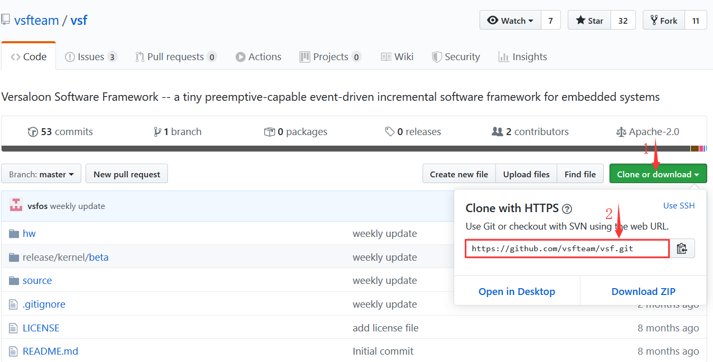
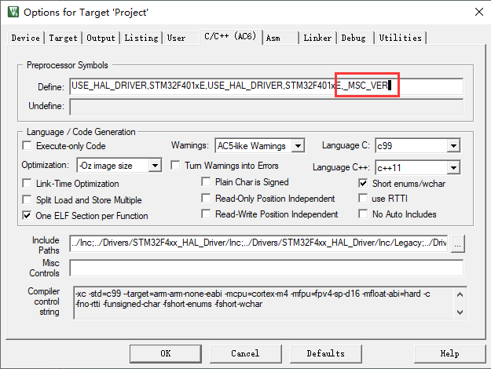
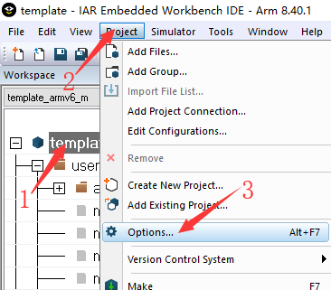
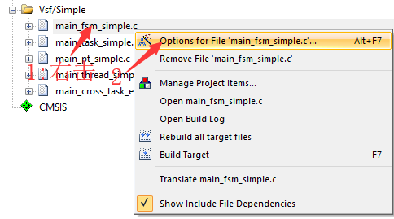
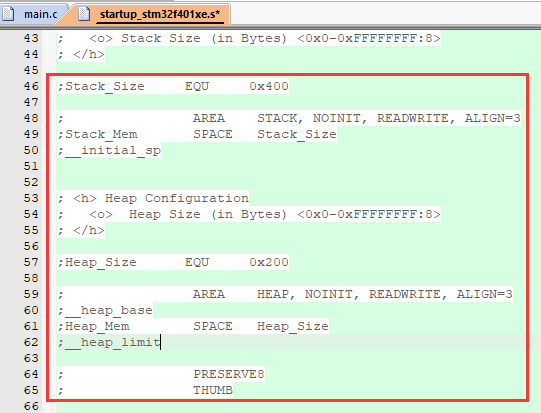
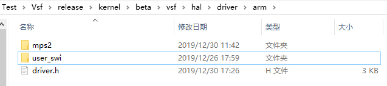
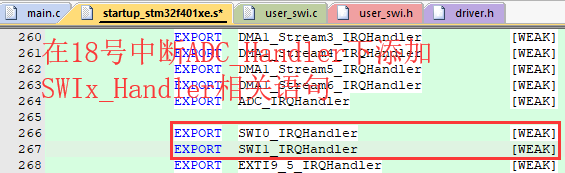
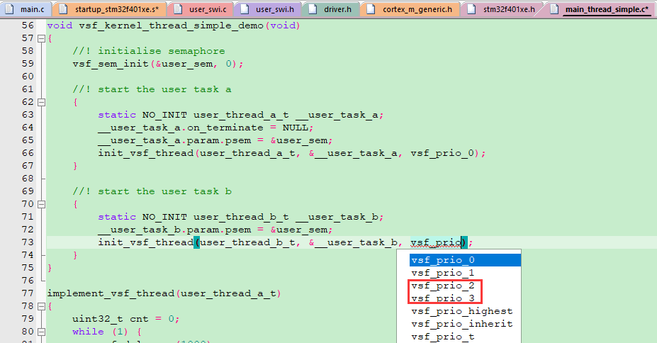

#  如何向STM32工程中移植VSF

##  1 本文的目的及简介  
###  1.1 编写本文档的目的  

&emsp;&emsp;本文档将在介绍如何通过[STM32CubeMX](https://www.st.com/zh/development-tools/stm32cubemx.html)获取一个裸机工程的基础上，详细演示如何添加并配置 ***Vsf\_kernel*** ，帮助您顺利迈出使用VSF系统的第一步。  

###  1.2 本文档解决哪些问题  

>**阅读本文档您将可以找到以下问题的答案：**
>- 如何通过STM32CubeMX获得一个用户所需要的工程
>- 移植Vsf\_kernel时需要添加哪些文件到工程内
>- 不同编译器中需要修改的编译选项有哪些
>- 工程和Vsf\_kernel中需要修改的代码有哪些
>- Vsf\_kernel中需要修改的配置有哪些

###  1.3 关于阅读本文档的若干约定  
####  1.3.1 在阅读本文档之前  

&emsp;&emsp;在开始之前我们假设您已经完成嵌入式开发环境(包括您所使用的芯片的支持包的下载)的搭建，并且已经将 ***STM32CubeMX*** 部署完毕，或者您已经拥有一个完整的工程。同时，我们假设您已拥有可以正常运行的搭载STM32系列MCU的硬件。  

>本文档介绍到的IDE软件有MDK与IAR，用户拥有其中一个软件的完整开发环境即可开始。

####  1.3.2 阅读本文档的读者需要具备的基本知识  

&emsp;&emsp;本文档所介绍的内容皆是基于常见的嵌入式C语言环境进行编写的，而且我们在移植过程中需要对编译器选项进行修改，因此我们需要用户有一定的C语言基础知识并熟悉嵌入式开发环境的使用。

>本文关于IDE的介绍内容有限，因此用户至少需要熟悉MDK、IAR其中之一的使用。

####  1.3.3 本文档涉及的部分关键名词  

|    名词    | 解释与约定  | 备注 |
| :--------: | ----------- | :--- |
| Vsf_Kernel | VSF系统内核 |      |

##  2 STM32工程的获取  

>如果读者已经拥有一个可以用于移植vsf\_kernel的STM32裸机工程，则可以跳过2.1章节，直接从本文档的2.2章节开始阅读。

###  2.1 如何基于STM32CubeMX创建一个裸机工程  
**1) 创建文件夹**  

&emsp;&emsp;首先我们需要创建一个文件夹，用来存放我们的所有文件。然后我们还需要在这个文件夹内创建两个子文件夹，一个用来存放裸机工程，另一个用来存放 ***Vsf\_kernel*** 相关文件。  
&emsp;&emsp;例如，我们创建一个名为 ***Test*** 的文件夹，并在其内部创建 ***Project*** 与 ***Vsf*** 两个子文件夹。操作完成后的文件夹目录如下：  

```
Test
  |__Project
  |__Vsf
```

**2) 新建工程并选择MCU型号**  

&emsp;&emsp;文件夹准备妥当之后，我们就可以开始创建新的STM32工程了，首先我们需要在 ***STM32CubeMX*** 中新建一个工程。具体操作如图所示：  


&emsp;&emsp;点击 ***New Project*** 后我们便可以进入到下一个的界面，在跳转后的界面中我们需要找到自己使用的MCU，最快捷的方法是搜索MCU型号的部分字段，输入几个字符后便可以在搜索框下面的索引中找到我们需要的型号，然后我们点击 ***MCUs/MPUs*** 中对应的芯片型号进行选定，MCU型号选定之后 ***Start Project*** 按钮便会高亮，我们点击它进入到下一个界面。具体操作如图所示：  


>作者这里使用的MCU型号为**STM32F401RET6U**。

**3) 配置ST官方库的时钟源**  

&emsp;&emsp;芯片选型完成后，我们需要对芯片内部的资源进行配置。首先，VSF系统的时间基准来自 ***SysTick*** ，因此我们建议将ST官方库的时钟来源配置为 ***TIM1*** 。完成之后我们点击 ***GPIO*** 进入GPIO配置界面。具体操作如图所示：  


**4) 配置GPIO及UART**  

&emsp;&emsp;进入GPIO配置界面之后我们可以开始对需要使用的IO口进行设定，在本文档中我们需要使用**LED**与**UART**，因此我们需要将对应的IO口配置成我们需要的模式及参数。例如，我们将配置驱动**LED**的IO配置为**高电平输出；推挽输出；下拉；高速模式**。具体操作操作如图所示：  

>- 如下图所示，点击IO口后选定IO口模式。
>- 作者使用的开发板的用户LED对应的IO口为PA5。


>IO口模式选定后会在GPIO Mode and Configuration这个窗口内弹出该IO口的具体配置选项(下图中外层红框所示范围)。用户点击(如图中箭头)其中一个配置选项就会展开全部配置选项(下图中内层红框所示范围)，用户根据需求修改即可。


&emsp;&emsp;**UART**对应的IO我们使用的PA9与PA10，**UART**的配置分为GPIO的配置与UART外设配置，GPIO的配置(选定为**USART_2XX**模式)与上面方法相同，这里不再赘述，下面介绍如何配置UART外设。具体操作如图所示：  

>- 因为IO口PA9、PA10是复用到UART2，因此，我们需要配置外设USART2。
>- 如下图，配置为异步通信。


**5) 配置时钟树**  

&emsp;&emsp;在完成上面的操作之后，我们需要点击 ***Clock Configuration*** 按钮进入时钟树配置界面，读者根据自己的需求进行配置即可。界面如下图：  


>读者需要**注意**时钟树配置完成后**HCLK**的值，这个值后面配置Vsf_Kernel时钟的时候会用到。

**6) 配置工程名称、路径及IDE类型**  

&emsp;&emsp;最后，我们需要填写工程的名称，设定工程生成的路径还有我们使用的IDE类型。具体操作如下图：  


>- 作者使用的IDE是MDK5，因此选择MDK-ARM V5。
>- 如果读者希望获得IAR工程，这里需要根据读者使用的IAR版本选择**EWARM V7**或**EWARM V8**。

**7) 生成工程**  

&emsp;&emsp;一切准备妥当之后，点击 ***GENERATE CODE*** 便可自动生成我们需要的裸机工程。如下图所示：  


**8) 测试由STM32CubeMX生成的工程**

&emsp;&emsp;首先，我们将生成的裸机工程复制到我们前文中创建的 ***Test/Project*** 文件夹内。操作完成的文件夹目录如下：  

```
Test
  |__Project
  |    |__Drivers
  |    |__Inc
  |    |__MDK-ARM
  |    |__Src
  |    |__.mxproject
  |    |__Project.ioc
  |__Vsf
```

&emsp;&emsp;然后，我们测试**LED**是否正常，首先，是将对IO口的操作封装成一个API：  

```
#define led_on()  HAL_GPIO_WritePin(GPIOA, GPIO_PIN_5, GPIO_PIN_SET)
#define led_off() HAL_GPIO_WritePin(GPIOA, GPIO_PIN_5, GPIO_PIN_RESET)
```

>作者使用的开发板的用户LED对应的IO口为PA5。

&emsp;&emsp;然后我们通过for循环使LED闪烁：  

```
int main(void)
{
    ...

    uint32_t cnt;

    while(1) {
        led_on();

        for(cnt = 0; cnt < 800000; cnt++) {
            NOP();
        }

        led_off();

        for(cnt = 0; cnt < 800000; cnt++) {
            NOP();
        }  
    }
}
```

>在工程没有问题的情况下，我们可以看到开发板上的用户LED以较快的频率闪烁。

&emsp;&emsp;最后，我们测试**UART**是否正常，我们直接使用串口的API进行测试： 

>测试UART的时候请读者确定硬件已接线并且接线正确。

```
int main(void)
{
    ...

    uint32_t cnt;

    while(1) {
        led_on();

        for(cnt = 0; cnt < 800000; cnt++) {
            NOP();
        }

        led_off();

        for(cnt = 0; cnt < 800000; cnt++) {
            NOP();
        }  

        HAL_UART_Transmit(&huart2, (uint8_t *)"Hello World!\r\n", 16, 1);
    }
}
```

&emsp;&emsp;在工程没有问题的情况下，我们可以看到开发板上的用户LED快速闪烁，并且可以在串口的上位机上看到打印的字符串。当裸机工程测试成功后我们就可以开始进行VSF系统移植了。

###  2.2 使用现有工程应当注意什么部分   
**1) 工程是否可以正常运行**  

&emsp;&emsp;当我们拥有一个现成的STM32工程，并准备将 ***Vsf\_kernel*** 移植到这个工程内的时候，我们首先需要确定这个工程是可以**正确编译(无报错、无警告)**，并且可以**正常运行(无死机、无异常)**的。

**2) LED使用的IO口及UART是否配置妥当**  

&emsp;&emsp;在我们确定已有的STM32工程是正常的情况下，我们需要检查用户LED和UART对应的IO口是否配置妥当，以便验证移植的效果。这里我们推荐读者按照2.1章节的第八小节对已有的裸机工程进行测试，以确保**STM32工程、用户LED、UART**均可正常运行。

##  3 移植 ***Vsf\_kernel*** 到STM32工程  
###  3.1 如何获取VSF系统  

&emsp;&emsp;VSF系统的源码及库文件托管在GitHub，读者可以根据地址[vsfteam/vsf](https://github.com/vsfteam/vsf)链接到相应的仓库。  

**1) 通过GIT拉取**  

&emsp;&emsp;读者如果可以熟练的使用Git，则可以复制以下链接将仓库内的内容通过Git全部克隆到本地。  



**2) 通过ZIP压缩包下载**  

&emsp;&emsp;读者在不使用Git的情况下，也可以使用下载ZIP压缩包的方式获取仓库内的所有内容，具体操作如下图：  


###  3.2 将对应用户芯片的库加入工程内  

&emsp;&emsp;在移植开始之前，我们需要将 ***vsf\_dev*** 内的所有文件都复制到前文中我们创建的 ***Test/Vsf*** 文件夹内。操作完成的文件夹目录如下：  

```
Test
  |__Project
  |    |__Drivers
  |    |__Inc
  |    |__MDK-ARM
  |    |__Src
  |    |__.mxproject
  |    |__Project.ioc
  |__Vsf
       |__hw
       |__release
       |__source
       |__.gitignore
       |__LICENSE
       |__README.md
```

**1) 如何选择芯片库**  

&emsp;&emsp;在目录 ***Test/Vsf/release/kernel/beta/vsf/kernel/lib*** 下有三个库(.a)文件：  

- vsf_kernel_armv6m_full_size.a(不支持浮点)
- vsf_kernel_armv7m_full_size.a(不支持浮点)
- vsf_kernel_armv7em_full_size.a(支持浮点)

&emsp;&emsp;它们分别适用于不同的Cortex-M内核，读者可以根据以下表格来选择适合自己MCU的库文件。  

| 内核型号          | armv6m_full_size.a | armv7m_full_size.a | armv7em_full_size.a |
| :---------------- | :----------------: | :----------------: | :-----------------: |
| Cortex M0         |         √          |                    |                     |
| Cortex M0+        |         √          |                    |                     |
| Cortex M1         |         √          |                    |                     |
| Cortex M3         |         √          |         √          |                     |
| Cortex M4         |         √          |         √          |                     |
| Cortex M4 + FPU * |         √          |         √          |          √          |
| Cortex M7         |         √          |         √          |                     |
| Cortex M7 + FPU * |         √          |         √          |          √          |

>*：在IAR环境下，带有FPU的芯片必须使用支持浮点的库(armv7em\_full\_size.a)。

**2) 如何加入芯片库**

&emsp;&emsp;确定好需要的库文件之后我们就可以开始着手进行芯片库的添加。第一步，我们需要打开裸机工程，在Project内新建一个Group ，并将这个New Group重命名为 ***Vsf/Kernel*** 。具体操作如下图：  


&emsp;&emsp;第二步，我们双击 ***Vsf/Kernel*** ，MDK会弹出如下图红框内的窗口，我们找到 ***Test/Vsf/release/kernel/beta/vsf/kernel/lib*** 文件夹下对应的库文件，双击对应的库文件即可完成添加。具体操作如下图：  


>作者使用的开发板搭载的MCU型号是STM32F401RET6U，其内核是Cortex M4，并且带有FPU。这里作者选择了针对性较强的armv7em_full_size.a文件。  

&emsp;&emsp;第三步，我们需要将添加进工程的芯片库文件的属性改为库文件。具体操作如下图：  


>在IAR环境下，添加芯片库的方法相同，这里不做重复演示。

###  3.3 将 ***Vsf/Kernel*** 的源文件加入工程内  

&emsp;&emsp; ***vsf\_kernel\_bsp.c*** 文件在 ***Test/Vsf/release/kernel/beta/vsf/kernel*** 文件夹下，我们需要将其添加到 ***Vsf/Kernel***内。 添加方式与加入芯片库文件的方式一致(不必更改文件属性)。  

###  3.4 修改开发环境的编译选项  

>- 我们推荐使用MDK的用户，使用 ***ARMCLANG*** 编译器。首先，它对开发者来说更加友好、快速、方便，另外一个原因是 ***ARMCC5*** 已经处在停止更新的边缘状态。
>- 我们同时推荐使用MDK的用户，保持下图中红框内的勾选，因为**非** ***MicroLib*** 的库尺寸较大，一般嵌入式应用不需要使用完整的 ***C Library*** 。


**1) MDK V5 + ARMCLANG**  

&emsp;&emsp;如果读者使用的开发环境是 ***MDK V5*** ，并且使用的编译器是 ***Use defalult compiler version 6*** ，则需要按照如下步骤进行修改：  

&emsp;&emsp;第一步，打开 ***Options for Target'Project'*** 窗口，并选中其中的 ***C/C++(AC6)*** 子窗口。  


&emsp;&emsp;第二步，在 ***Define*** 内添加以下语句，与已有内容用**英文逗号**隔开，具体操作如下图所示：  

    _MSC_VER 



&emsp;&emsp;第三步，在 ***Misc Controls*** 内添加以下语句。具体操作如下图所示：  

```
-fms-extensions -Wno-empty-body -Wno-microsoft-anon-tag -Wno-nonportable-include-path -Wno-tautological-constant-out-of-range-compare 
```


&emsp;&emsp;第四步，将 ***Language C*** 内的C标准改为 ***gnu11*** ；勾选 ***Link-Time Optimization*** ； 取消 ***Short enums/wchar*** 的勾选。具体操作如下图所示：  


&emsp;&emsp;第五步，在 ***Include Paths*** 内添加路径 ***../../vsf/release/kernel/beta/vsf*** 。这步完成之后依次点击两个窗口内 ***OK*** 按钮，确定修改内容即完成编译选项的修改。具体操作如下图所示：  

>添加**vsf.h**文件路径有以下两点必要：  
>>- 包含**vsf.h**头文件。
>>- **Vsf\_Kernel**内部包含头文件使用的是相对路径，而相对路径需要一个绝对路径作为"锚点"才能寻找到正确的位置。


**2) MDK V5 + ARMCC5**  

&emsp;&emsp;如果读者使用的开发环境是 ***MDK V5*** ，并且使用的编译器是 ***Use defalult compiler version 5*** ，则需要按照如下步骤进行修改：  

&emsp;&emsp;第一步，打开 ***Options for Target'Project'*** 窗口，并选中其中的 ***C/C++*** 子窗口。  


&emsp;&emsp;第二步，勾选 ***C/C++*** 子窗口中的以下选项：  


&emsp;&emsp;第三步，在 ***Misc Controls*** 内添加以下语句。具体操作如下图所示：  

```
--diag_suppress=951,64,1,381,111,177,188 --wchar32
```


&emsp;&emsp;第四步，在 ***Include Paths*** 内添加路径 ***../../vsf/release/kernel/beta/vsf*** 。这步完成之后点击 ***OK*** 按钮，确定修改内容即完成编译选项的修改。  

>这步操作与上一小节**MDK V5 + ARMCLANG**中的第五步完全相同，若读者存有疑问请参考上文。

&emsp;&emsp;**注意！！！：** ***Optimization*** 内的优化等级调为 ***Level 3 (-O3)*** 的时候，不可同时勾选 ***Optimizatin for Time*** ，这会触发 ***ARMCC5*** 的BUG。

**3) IAR EWARM V7/EWARM V8**  

&emsp;&emsp;如果读者使用的是IAR EWARM V7或者EWARM V8，则需要按照如下步骤进行修改：  

&emsp;&emsp;第一步，打开 ***Options for node "Project"*** 窗口。具体操作如下图所示：  

>**注意：**在打开该窗口之前需要选中工程(图中第一步骤)。



&emsp;&emsp;第二步，将 ***Library*** 配置为 ***Normal*** 。具体操作如下图所示：  


&emsp;&emsp;第三步，将以下语句添加到 ***Additional include directiories:(one per line)*** ,这个操作是为了包含 ***vsf.h*** 头文件。具体操作如下图所示：  

```
$PROJ_DIR$/../../vsf/release/kernel/beta/vsf
```


&emsp;&emsp;第四步，将以下语句添加到 ***Suppress these disgnostics:*** ，与已有内容用英文逗号隔开。具体操作如下图所示：  

```
pe301,pe128,pe381,Pe188,Pe1866,Pe064
```


&emsp;&emsp;第五步，勾选 ***Use command line options*** ，并将以下语句添加到 ***Command line options:(one per line)*** 。这步完成之后点击 ***OK*** 按钮，确定修改内容即完成编译选项的修改。具体操作如下图所示：  

```
--enum_is_int
```


###  3.5 添加 ***Vsf\_Kernel*** 的配置头文件到工程内  

&emsp;&emsp; ***Vsf\_Kernel*** 的配置头文件是 ***vsf\_usr\_cfg.h*** ，它在 ***Test/Vsf/release/kernel/beta/example/usrapp/template/app_cfg*** 文件夹下，我们需要将它复制到 ***Test/Project/Inc*** 文件夹下。  

> vsf\_usr\_cfg.h文件应当在MDK的搜索路径内，不过，因为Test/Project/Inc已经在MDK的搜索路径内，所以我们不需要进行手动添加。

###  3.6 代码及 ***Vsf\_Kernel*** 配置的修改  
**1) 冲突代码的处理**  

&emsp;&emsp; ***Vsf\_Kernel*** 内创建了 ***PendSV\_Handler()*** 和 ***SysTick\_Handler()*** 函数，因此读者需要屏蔽裸机工程中 ***Application/User*** Group内的 ***stm32f4xx\_it.c*** 文件中的这两个函数。  

**2) 标准输入输出的重定向**  

&emsp;&emsp;第一步，我们需要在工程中创建一个 ***New Group*** ，并重命名为 ***Vsf/Retarget*** 。  

>如何新建Group的上文已经介绍，这里不再赘述。  

&emsp;&emsp;第二步，添加 ***vsf\_stdio\_lib.a*** 文件到工程中的 ***Vsf/Retarget*** Group内，并修改文件属性为库文件。  

>- 此文件路径为Test/Vsf/release/kernel/beta/vsf/utilities/compiler/arm。  
>- 文件属性的修改方法上文中已经详细介绍，这里不再赘述。  

&emsp;&emsp;第三步，将 ***user\_retarget.c*** 复制到 ***Test/Project/Src*** 文件夹下，并添加到工程中的 ***Vsf/Retarget*** Group内。  

>此文件路径为Test/Vsf/release/kernel/beta/example/usrapp/template。  

&emsp;&emsp;第四步，将 ***user\_retarget.c*** 文件内的函数全部屏蔽，并根据我们使用的UART(USART2)在此文件中添加以下代码：  

```
#include "main.h"

extern UART_HandleTypeDef huart2;

void vsf_stdin_init(void)
{
}

void vsf_stdout_init(void)
{
}

char vsf_stdin_getchar(void)
{
    char chr;
    while (HAL_OK != HAL_UART_Receive(&huart2, (uint8_t *)&chr, 1, 100));
    return chr;
}

int vsf_stdout_putchar(char txchar)
{   
    if (txchar == 10) {
        vsf_stdout_putchar((char) 13);
    }

    while (HAL_OK != HAL_UART_Transmit(&huart2, (uint8_t *)&txchar, 1, 100));
    return (int)txchar;
}
```

>vsf\_stdout\_putchar函数内的if判断语句部分是为了兼容Linux系统下的回车——'\n'与Window系统下的回车——'\r'+'\n'，保证代码的通用性。

**3)  *Vsf\_Kernel* 时钟的配置**  

&emsp;&emsp;在 ***vsf\_usr\_cfg.h*** 文件内有一个宏 ***VSF\_SYSTIMER\_FREQ*** 用于配置 ***Vsf\_Kernel*** 的时钟。例如，作者创建的裸机工程时钟频率配置为84MHZ(也就是前文中提到的 ***HCLK*** 的值)，则VSF系统的时钟应当如下配置：  

```
#define VSF_SYSTIMER_FREQ               84000000ul
```

**4) *Vsf\_Kernel* 宏的配置**  

&emsp;&emsp;1.在 ***vsf\_usr\_cfg.h*** 文件内有一个宏 ***VSF\_KERNEL\_CFG\_DEPLOY\_IN\_LIB\_WITH\_FULL\_FEATURE\_SET*** ，在我们使用库文件的方式移植 ***Vsf\_Kernel*** 的时候此宏必须保持使能。  

>此宏默认使能，请读者确保其被使能，并且在已使能的情况下不要改动。

```
/*! \note please do not change the value of this macro!!!! */
#define VSF_KERNEL_CFG_DEPLOY_IN_LIB_WITH_FULL_FEATURE_SET      ENABLED
```

&emsp;&emsp;2.在 ***vsf\_usr\_cfg.h*** 文件内有一个关于VSF系统软件堆的宏—— ***VSF\_HEAP\_SIZE*** ，这个宏建议在一般情况下给值为**2048**(2k)，最小给值不宜小于512。  

```
#define VSF_HEAP_SIZE                   2048
```

>- 此宏的给值必须为8的倍数，单位为字节。
>- **当用户使用内存池(vsf\_pool)的时候，如果用户没有给内存池分配空间，则内存池会自动从vsf\_heap中按需申请空间。**

**5) 包含头文件**  

&emsp;&emsp;最后，我们需要在文件 ***main.c*** 内包含头文件 ***vsf.h*** 与 ***stdio.h*** 。  

>- vsf.h内包含了与VSF系统相关的必要组件。
>- stdio.h为标准输入输出库提供了必要信息。

###  3.7 测试VSF系统是否正确启动  

**1) 编译**  

&emsp;&emsp;到这里， ***Vsf\_Kernel*** 的移植已经完成，我们可以进行编译了。正常情况下，编译完成后整个工程应当无错误、无警告。

**2) LED与UART测试**  

&emsp;&emsp;当我们移植完 ***Vsf\_Kernel*** ，并重定向标准输入输出后，将main函数内的代码做如下修改：  

>测试UART的时候请读者确定硬件已接线并且接线正确。

```
int main(void)
{
    ...

    vsf_stdio_init();
  
    while (1)
    {
        led_on();
        vsf_delay_ms(500);
        
        led_off();
        vsf_delay_ms(500);
        
        printf("Hello World!\r\n");
    }
}
```

>这里可以看到，延时不再是for循环这种原地踏步的方式，而是VSF系统提供的系统延时。

&emsp;&emsp;以上代码修改完成之后再次编译即可下载到硬件中运行，运行效果与测试裸机工程的时候一致，只是延时更加的精准。

##  4 移植完成后的故障排除  

&emsp;&emsp;读者在进行移植后测试的时候，若发现程序不能正常运行，甚至编译无法通过，请参考本章节进行故障排除。  

###  4.1 编译无法通过  

**1)**编译后第一个错误：  

    ../../Vsf/release/kernel/beta/vsf/utilities/compiler/arm/vsf_stdio_lib.a(1): error: expected identifier or '('

&emsp;&emsp;问题原因： ***vsf\_stdio\_lib.a*** 文件未改属性。  
&emsp;&emsp;解决方法：将 ***vsf\_stdio\_lib.a*** 文件属性改为库文件。  

**2)**编译后第一个错误：  

    C:\Keil_v5\ARM\ARMCLANG\Bin\..\include\arm_acle.h(48): error: definition of builtin function '__wfi'

或

    ArmClang.exe: error: unable to execute command: Unable to convert command-line to UTF-16: 在多字节的目标代码页中，没有此 Unicode 字符可以映射到的字符。  (0x459)

&emsp;&emsp;问题原因：向 ***Define*** 添加 ***_MSC_VER*** 的时候未使用英文逗号或者错误的使用了中文逗号。  
&emsp;&emsp;解决方法：在 ***_MSC_VER*** 语句前添加一个英文逗号或者将错误的符号修改为英文符号。  

###  4.2 程序运行异常  

**1) LED常亮或者长灭，并且串口未打印任何字符**  

&emsp;&emsp;问题原因： ***user\_retarget.c*** 文件内的代码为修改或未修改妥当。  
&emsp;&emsp;解决方法：按照本文档的3.6章节第二小节检查 ***user\_retarget.c*** 文件。  

**2) LED亮灭的间隔与延时时间不符**  

&emsp;&emsp;问题原因： ***Vsf\_Kernel*** 的时钟频率未配置或者配置错误。  
&emsp;&emsp;解决方法：将 ***vsf\_usr\_cfg.h*** 文件内的宏 ***VSF_SYSTIMER_FREQ*** 正确配置。如何配置该宏请参考本文档3.6章节第四小节。  

##  5 测试VSF系统内的示例  

&emsp;&emsp;VSF在其文件夹下提供了一系列Demo，为读者演示各个功能模块的使用方法。本章节将为读者展现如何运行这些Demo。  

###  5.1 测试前的准备  

**1) 将时钟、LED驱动IO、UART的配置移动到独立文件内**  

&emsp;&emsp;第一步，在工程中建立两个新文件，命名为 ***hal\_cfg.h*** 与 ***hal\_cfg.c*** ，并保存到 ***Test/Project/Inc*** 文件夹下。  

&emsp;&emsp;第二步，将 ***main.c*** 文件中的**时钟配置函数、GPIO配置函数、USART2配置函数、Error\_Handler函数、huart2定义**移动到 ***hal\_cfg.c*** 文件中，并创建如下函数，将所有配置函数封装到一起。完成之后将 ***hal\_cfg.c*** 文件添加到工程的 ***Application/User*** Group内。  

```
void Hal_Cfg_Init(void)
{
    HAL_Init();

    SystemClock_Config();

    MX_GPIO_Init();
    
    MX_USART2_UART_Init();
}
```

&emsp;&emsp;第三步，在 ***hal\_cfg.h*** 文件中进行函数 ***Hal\_Cfg\_Init*** 的外部声明，并将**LED宏封装、huart2外部声明**放入此文件中，以便我们在其他文件中包含 ***hal\_cfg.h*** 文件后可以获得所需信息。此文件内容如下:  

```
#ifndef __HAL_CFG_H__
#define __HAL_CFG_H__

#include "main.h"

#define led_on()  HAL_GPIO_WritePin(GPIOA, GPIO_PIN_5, GPIO_PIN_SET)
#define led_off() HAL_GPIO_WritePin(GPIOA, GPIO_PIN_5, GPIO_PIN_RESET)

extern UART_HandleTypeDef huart2;

extern void Hal_Cfg_Init(void);

#endif
```

>配置代码移动之后，user\_retarget.c文件内的代码需要做如下修改：  
>>- 将main.h替换为hal\_cfg.h。
>>- 将语句"extern UART\_HandleTypeDef huart2;"删除。

&emsp;&emsp;上面两步操作完成之后， ***main.c*** 文件内的配置代码都已移除，只剩逻辑代码。效果如下：  

```
#include "hal_cfg.h"
#include "vsf.h"
#include "stdio.h"

int main(void)
{
    Hal_Cfg_Init();
    
    vsf_stdio_init();
  
    while (1)
    {
        led_on();
        vsf_delay_ms(500);
        
        led_off();
        vsf_delay_ms(500);
        
        printf("Hello World!\r\n");
    }
}
```

**2) 屏蔽Demo内的 *main.c* 函数**  

&emsp;&emsp;众所周知，一个工程中仅允许有一个main函数参加编译，而VSF的Demo中均是以main函数作为程序执行的入口，这样做的好处是Demo加入工程就可以运行，不过，在运行Demo的时候需要保证Demo内的main函数不参加编辑。
&emsp;&emsp;为了达到上面所说的效果，我们需要在在 ***vsf\_usr\_cfg.h*** 文件内手动加入如下语句：  

     #define VSF_PROJ_CFG_USE_CUBE    ENABLED

&emsp;&emsp;这个宏的作用是它使能之后所有Demo内的main函数全部不会参加编译，可见，加入并使能这个宏我们就可以达到上面的目的。    

**3) 新建一个工程Group并将Demo全部加入其中**  

&emsp;&emsp;新建一个工程Group并命名为 ***Vsf/Simple*** ，然后我们找到 ***Test/Vsf/release/kernel/beta/example/usrapp/template*** 文件夹下的Demo，将以下Demo加入 ***Vsf/Simple*** Group内。  

```
main_fsm_simple.c
main_task_simple.c
main_pt_simple.c
main_thread_simple.c
main_cross_task_example.c
```

>- 新建工程Group的方法在上文中已详细介绍，这里不再赘述。
>- 将文件加入工程Group的方法在上文中已经详细介绍，这里不再赘述。

**4) 屏蔽全部Demo**  

&emsp;&emsp;在工程中屏蔽文件的方法如下：  

&emsp;&emsp;第一步，打开 ***Options for File xxx*** 窗口。具体操作如下图：    



&emsp;&emsp;第二步，将 ***Include in Target Build*** 选项勾选取消，最后点击 ***OK*** 。具体操作如下图：    


&emsp;&emsp;第三步，将其余4个Demo文件都按一、二两步操作，全部屏蔽。

**5) 关于配置文件 *app\_cfg.h* **  

&emsp;&emsp; ***app_cfg.h*** 是移植完成后整个工程中最顶层的配置文件，此文件中包含了 ***vsf.h*** 文件。 
&emsp;&emsp; ***app_cfg.h*** 存在的意义是供用户存放与 ***Vsf\_Kernel*** 无关的工程配置，与 ***Vsf\_Kernel*** 有关的工程配置用户直接修改 ***vsf\_usr\_cfg.h*** 内的配置即可。  
&emsp;&emsp;上文中列举出的5个Demo均是直接包含了头文件 ***app\_cfg.h*** ，而不是 ***vsf.h*** ，因此，我们需要把 ***Test/Vsf/release/kernel/beta/example/usrapp/template/app_cfg*** 文件夹下的 ***app\_cfg.h*** 文件复制到 ***Test/Project/Inc*** 文件夹下。

###  5.2 测试Fsm例程  

**1) Fsm例程演示的内容**  

&emsp;&emsp;Fsm例程里面演示了main线程和状态机方式的任务通过信号量(sem)进行协作的操作，并在关键位置打印log方便观察。  

**2) 取消 *main\_fsm\_simple.c* 文件的屏蔽**  

&emsp;&emsp;第一步，打开 ***Options for File xxx*** 窗口。  

&emsp;&emsp;第二步，将 ***Include in Target Build*** 选项勾选上(需要点击两次，至'√'符号发灰)。  

>- 这里的两步操作与本文5.1章节的第五小节操作几乎一致，只是这里是将选项勾选上，而不是取消勾选。  
>- 这里的操作与上文已经介绍了方法，这里不再重复放图，若读者存有疑问请参考本文5.1章节的第五小节。

**3) 将Fsm例程文件内的任务启动函数在 *main.c* 文件中声明并调用**  

&emsp;&emsp;因为Fsm例程中的main函数被我们屏蔽，所以，我们需要将Fsm例程内的任务启动函数在 ***main.c*** 中调用，以启动任务。完成这步操作后的 ***main.c*** 文件内容如下：  

>例程中用printf接口打印log，为了避免干扰，while(1)循环中不再打印任何字符。

```
#include "hal_cfg.h"
#include "vsf.h"
#include "stdio.h"

extern void vsf_kernel_fsm_simple_demo(void);

int main(void)
{
    Hal_Cfg_Init();
    
    vsf_stdio_init();
  
    vsf_kernel_fsm_simple_demo();
    
    while (1)
    {
        led_on();
        vsf_delay_ms(500);
        
        led_off();
        vsf_delay_ms(500);
    }
}
```

**4) 编译并运行**  

&emsp;&emsp;完成上面两步操作之后我们就可以编译工程，编译完成后下载到硬件当中便可以通过硬件上的用户LED和UART上位机看到效果。UART打印效果如下：  

>关于UART，请读者确定硬件已接线并且接线正确。


###  5.3 测试Task例程  

**1) Task例程演示的内容**  

&emsp;&emsp;Task例程里面演示了main线程和使用switch切换状态的状态机任务通过信号量(sem)进行协作的操作，并在关键位置打印log方便观察。  

**2) 取消 *main\_task\_simple.c* 文件的屏蔽**  

&emsp;&emsp;相关方法已在上文中详细介绍，读者若存有疑问请参考文本5.2章节第一小节。  

>请保持其余4个Demo的屏蔽状态，即每一次编译工程只能有一个Demo参加。

**3) 将Task例程文件内的任务启动函数在 *main.c* 文件中声明并调用**  

&emsp;&emsp;因为Task例程中的main函数被我们屏蔽，所以，我们需要将Task例程内的任务启动函数在 ***main.c*** 中调用，以启动任务。完成这步操作后的 ***main.c*** 文件内容如下：  

>例程中用printf接口打印log，为了避免干扰，while(1)循环中不再打印任何字符。

```
#include "hal_cfg.h"
#include "vsf.h"
#include "stdio.h"

extern void vsf_kernel_task_simple_demo(void);

int main(void)
{
    Hal_Cfg_Init();
    
    vsf_stdio_init();
  
    vsf_kernel_task_simple_demo();
    
    while (1)
    {
        led_on();
        vsf_delay_ms(500);
        
        led_off();
        vsf_delay_ms(500);
    }
}
```

**4) 编译并运行**  

&emsp;&emsp;完成上面两步操作之后我们就可以编译工程，编译完成后下载到硬件当中便可以通过硬件上的用户LED和UART上位机看到效果。  

>- 关于UART，请读者确定硬件已接线并且接线正确。
>- 运行效果与5.2章节所示一致，这里不重复放图。

###  5.4 测试Pt例程  

**1) Pt例程演示的内容**  

&emsp;&emsp;Pt例程里面演示了main线程和Pt任务通过信号量(sem)进行协作的操作，并在关键位置打印log方便观察。  

**2) 取消 *main\_pt\_simple.c* 文件的屏蔽**  

&emsp;&emsp;相关方法已在上文中详细介绍，读者若存有疑问请参考文本5.2章节第一小节。  

>请保持其余4个Demo的屏蔽状态，即每一次编译工程只能有一个Demo参加。

**3) 将Pt例程文件内的任务启动函数在 *main.c* 文件中声明并调用**  

&emsp;&emsp;因为Pt例程中的main函数被我们屏蔽，所以，我们需要将Pt例程内的任务启动函数在 ***main.c*** 中调用，以启动任务。完成这步操作后的 ***main.c*** 文件内容如下：  

>例程中用printf接口打印log，为了避免干扰，while(1)循环中不再打印任何字符。

```
#include "hal_cfg.h"
#include "vsf.h"
#include "stdio.h"

extern void vsf_kernel_pt_simple_demo(void);

int main(void)
{
    Hal_Cfg_Init();
    
    vsf_stdio_init();
  
    vsf_kernel_pt_simple_demo();
    
    while (1)
    {
        led_on();
        vsf_delay_ms(500);
        
        led_off();
        vsf_delay_ms(500);
    }
}
```

**4) 编译并运行**  

&emsp;&emsp;完成上面两步操作之后我们就可以编译工程，编译完成后下载到硬件当中便可以通过硬件上的用户LED和UART上位机看到效果。  

>- 关于UART，请读者确定硬件已接线并且接线正确。
>- 运行效果与5.2章节所示一致，这里不重复放图。

###  5.5 测试Thread例程  

**1) Thread例程演示的内容**  

&emsp;&emsp;Thread例程里面演示了main线程和Thread任务通过信号量(sem)进行协作的操作，并在关键位置打印log方便观察。  

**2) 取消 *main\_thread\_simple.c* 文件的屏蔽**  

&emsp;&emsp;相关方法已在上文中详细介绍，读者若存有疑问请参考文本5.2章节第一小节。  

>请保持其余4个Demo的屏蔽状态，即每一次编译工程只能有一个Demo参加。

**3) 将Thread例程文件内的任务启动函数在 *main.c* 文件中声明并调用**  

&emsp;&emsp;因为Thread例程中的main函数被我们屏蔽，所以，我们需要将Thread例程内的任务启动函数在 ***main.c*** 中调用，以启动任务。完成这步操作后的 ***main.c*** 文件内容如下：  

>例程中用printf接口打印log，为了避免干扰，while(1)循环中不再打印任何字符。

```
#include "hal_cfg.h"
#include "vsf.h"
#include "stdio.h"

extern void vsf_kernel_thread_simple_demo(void);

int main(void)
{
    Hal_Cfg_Init();
    
    vsf_stdio_init();
  
    vsf_kernel_thread_simple_demo();
    
    while (1)
    {
        led_on();
        vsf_delay_ms(500);
        
        led_off();
        vsf_delay_ms(500);
    }
}
```

**4) 编译并运行**  

&emsp;&emsp;完成上面两步操作之后我们就可以编译工程，编译完成后下载到硬件当中便可以通过硬件上的用户LED和UART上位机看到效果。  

>- 关于UART，请读者确定硬件已接线并且接线正确。
>- 运行效果与5.2章节所示一致，这里不重复放图。

###  5.6 交叉调用测试  

**1) 交叉调用例程演示的内容**  

&emsp;&emsp;交叉调用例程里面演示了Pt任务调用多种不同任务(Task、Pt、Thread)，以及通过信号量(sem)进行协作的操作，并在关键位置打印log方便观察。  

&emsp;&emsp;本示例中的调用关系如下图：  


**2) 取消 *main\_cross\_task\_example.c* 文件的屏蔽**  

&emsp;&emsp;相关方法已在上文中详细介绍，读者若存有疑问请参考文本5.2章节第一小节。  

>请保持其余4个Demo的屏蔽状态，即每一次编译工程只能有一个Demo参加。

**3) 将交叉调用例程文件内的任务启动函数在 *main.c* 文件中声明并调用**  

&emsp;&emsp;因为交叉调用例程中的main函数被我们屏蔽，所以，我们需要将交叉调用例程内的任务启动函数在 ***main.c*** 中调用，以启动任务。完成这步操作后的 ***main.c*** 文件内容如下：  

>例程中用printf接口打印log，为了避免干扰，while(1)循环中不再打印任何字符。

```
#include "hal_cfg.h"
#include "vsf.h"
#include "stdio.h"

extern void vsf_kernel_cross_call_demo(void);

int main(void)
{
    Hal_Cfg_Init();
    
    vsf_stdio_init();
  
    vsf_kernel_cross_call_demo();
    
    while (1)
    {
        led_on();
        vsf_delay_ms(500);
        
        led_off();
        vsf_delay_ms(500);
    }
}
```

**4) 编译并运行**  

&emsp;&emsp;完成上面两步操作之后我们就可以编译工程，编译完成后下载到硬件当中便可以通过硬件上的用户LED和UART上位机看到效果。UART打印效果如下：    

>关于UART，请读者确定硬件已接线并且接线正确。


###  5.7 全功能测试  

&emsp;&emsp; ***Vsf\_Kernel*** 全功能测试的Demo文件是 ***main\_full\_feature\_demo.c*** ,文件所在路径同样是 ***Test/Vsf/release/kernel/beta/example/usrapp/template*** 。作为移植文档，这里不做过多介绍，有兴趣的读者可以自行测试。  

##  6 系统堆栈的配置
###  6.1 在MDK环境中  

**1) 修改启动文件的方法**  

&emsp;&emsp;打开 ***Application/MDK-ARM*** Group内的启动文件，即可修改**堆(Heap)栈(Stack)的大小**，修改完成后进行编译即可。具体操作如下图：  

 

>- 堆栈大小为**字节**。
>- 如果系统中不使用malloc，或者是只使用VSF系统提供的heap的时候，推荐读者把系统自带的heap设置为0x100即可。

**2) 修改分散加载文件的方法**  

>- 推荐熟悉使用scatter文件的读者使用本方法。  
>- 在FVP工程中修改堆栈推荐读者使用本方法。

&emsp;&emsp;第一步，打开 ***Options for Target*** 窗口，切换到 ***Linker*** 界面，然后取消 ***Use Memory Layout form Target Dialog*** 选项勾选，并点击 ***Edit*** 按钮打开 ***scatter*** 文件( ***Project.sct*** )，最后点击 ***OK*** 按钮保存设置。具体操作如下图：  

 

&emsp;&emsp;第二步，在 ***scatter*** 文件中加入对**堆栈**的定义，完成之后进行编译即可。具体操作如下图：  

>修改完成后可以在map文件中可以看到使用scatter文件分配的堆栈的详细信息。  

 

>如果系统中不使用malloc，或者是只使用VSF系统提供的heap的时候，推荐读者把系统自带的heap设置为0x100即可。

&emsp;&emsp;第三步，打开 ***Application/MDK-ARM*** Group内的启动文件，屏蔽下图红框中的语句。  

 
 

&emsp;&emsp;第四步，在启动文件的第72行 ***EXPORT  \_\_Vectors\_Size*** 语句下方，添加以下语句：  
   
    IMPORT  |Image$$ARM_LIB_STACK$$ZI$$Limit|

&emsp;&emsp;然后，将语句 ***\_\_Vectors       DCD  \_\_initial\_sp*** 中的 ***\_\_initial\_sp*** 修改为：    

    |Image$$ARM_LIB_STACK$$ZI$$Limit|

&emsp;&emsp;修改完成后这部分如下图：    

 

&emsp;&emsp;经过以上四个步骤，我们完成了使用 ***scatter*** 文件修改堆栈的操作。

>**关于堆栈在内存中的布局：**  
>>细心的读者应该已经发现上面的步骤中我们将**栈(Stack)**放在了**RAM**的头部，**堆(Heap)**放在了**RAM**尾部，将用户数据区夹在两者之间。这是一种类似"三明治"的结构，示意如下图：

 

>>RAM的分配为什么采用这种结构，从图中我们就可以看出一二：栈的生长方向是向下的，堆的生长方向是向上的。所以，这种结构下的RAM用户数据区是不存在被堆栈入侵的风险的，并且一旦堆栈发生了溢出，我们可以准确有效的检测到这种情况，降低了排除BUG的难度。

###  6.2 在IAR环境中  

&emsp;&emsp;第一步，打开 ***Options for node*** 窗口。具体操作如下图： 

 

&emsp;&emsp;第二步，勾选 ***Override default*** 选项，打开 ***Linker configuration file editor*** 窗口。具体操作如下图： 

 

&emsp;&emsp;第三步，在 ***Linker configuration file editor*** 窗口内选择 ***Stack/Heap Sizes*** ,并在切换后的界面内按需修改**堆(HEAP)栈(CSTACK)**，完成后进行编译即可。具体操作如下图： 

 
 

##  7 任务优先级(SWI)的扩展   
###  7.1 关于VSF系统的优先级系统  

**1) 优先级规则**  

|优先级|是否抢占|调度策略|
|:---:|:---:|:----|
|不同优先级|是|高优先级就绪任务会抢占低优先级任务|
|相同优先级|否|相同优先级的任务之间彼此不能抢占，没有时间片轮转机制。允许用户通过“禅让”机制实现同优先级任务之间用户自定义规则的合作式调度。|

>- **"禅让"**机制在VSF系统各个模式的快速入门文档中均有详细介绍，这里不做过多解释。
>- 加入对时间片轮转调度机制的支持会显著增大系统的资源占用，因此主打小资源的VSF系统不支持此功能。

**2) 优先级系统在Cortex-M系统中的实现方式**  

&emsp;&emsp;VSF优先级系统是建立在Cortex-M系统软件中断基础上的，即VSF系统中的高优先级抢占功能是直接使用NVIC硬件优先级系统实现的，VSF优先级系统中的每一个优先级都对应一个Cortex-M系统中的NVIC中断。

**3) 在Cortex-M系统中优先级系统的结构**  

 

###  7.2 如何扩展任务优先级(SWI)   

&emsp;&emsp;VSF系统中任务优先级默认只有两个——vsf\_prio\_0、vsf\_prio\_1，在实际的项目开发中，默认的两个任务优先级显然是不能满足需求的。在7.1章节我们简略介绍了VSF系统中优先级系统实现的原理，下面我们将向您介绍如何在VSF系统中扩展用户优先级。  

**1) 创建关于用户优先级(SWI)的文件**  

&emsp;&emsp;首先，我们需要在 ***Test/Vsf/release/kernel/beta/vsf/hal/driver/arm*** 文件夹下创建一个名为 ***user_swi*** 的新文件夹，并在此文件夹内创建名为 ***user_swi*** 的头文件(.h)和源文件(.c)。效果如下图：  

 

**2) 将创建的文件加入工程**  

&emsp;&emsp;在工程中创建名为 ***User/Swi*** 的Group，并将上一步创建的文件加入到此Group内。效果如下图：  

 

**3) 在创建的文件中添加代码**  

&emsp;&emsp;1.在 ***user_swi.h*** 文件中添加如下代码：  

```
#ifndef __USER_SWI_H__
#define __USER_SWI_H__

#include "hal/vsf_hal_cfg.h"
#include "hal/arch/vsf_arch.h"

typedef void vsf_swi_handler_t(void *p);


extern vsf_err_t vsf_drv_usr_swi_init( uint_fast8_t idx, 
                                vsf_arch_prio_t priority,
                                vsf_swi_handler_t *handler, 
                                void *param);
extern void vsf_drv_usr_swi_trigger(uint_fast8_t idx);
#endif
```

>**注意：**这个两个函数的名称及传入的参数是不可以更改的。

&emsp;&emsp;2.在 ***user_swi.c*** 文件中首先需要添加如下头文件：  

```
#include "stm32f401xe.h"
#include "../../driver.h"
#include "./user_swi.h"
```

&emsp;&emsp;3.将 ***Test/Vsf/release/kernel/beta/vsf/hal/driver/arm/mps2/common*** 文件夹中 ***\_\_common.c*** 文件内**除去头文件的全部代码**复制到 ***user\_swi.c*** 内。  

>代码复制完成之后，我们建议读者将代码中相关的宏、数组、结构等的名称进行修改。

**4) 添加四个宏**  

&emsp;&emsp;完成上面的步骤之后，我们需要在 ***Test/Vsf/release/kernel/beta/vsf/hal/driver*** 文件夹下的 ***driver.h*** 文件中添加如下四个宏：  
1.

    #define VSF_ARCH_PRT_BIT    4

&emsp;&emsp;此宏的取值等于宏  ***\_\_NVIC\_PRIO\_BITS***  的值，这个宏定义于芯片的头文件中，我们可以在在工程中搜索这个宏找到定义。  

>作者使用的芯片，头文件内\_\_NVIC\_PRIO\_BITS的值为4。

2.

    #define VSF_ARCH_PRI_NUM    16

&emsp;&emsp;此宏的值为2^VSF\_ARCH\_PRT\_BIT，因此为16。

>**注意：**此宏的值代表作者使用的芯片硬件层面支持的最大中断嵌套层数，VSF系统中默认的两个优先级占用了一个中断，那么作者最多还可以扩展15(16-1)个用户优先级(SWI)。

3.

    #define VSF_DEV_SWI_NUM     2

&emsp;&emsp;此宏的值为用户希望扩展的用户SWI的数量。

>作者这里扩展了两个用户SWI，因此，此宏的值为2。

4.

    #define VSF_DEV_SWI_LIST    11,12

&emsp;&emsp;此宏的值为中断向量表中我们使用的中断的偏移量，各个偏移量之间使用**英文逗号**隔开。  

>- 作者使用的是中断向量表中的第11、12号中断(即作者使用的是未启用的DMA中断)。
>- 建议用户优先使用中断向量表中的未启用的用户中断，而不是优先使用芯片的保留中断(Reserved)。因为很多芯片不支持触发芯片的保留中断，使用这种保留中断扩展用户优先级后会导致死机。

**5) 修改中断向量表**  

&emsp;&emsp;打开 ***Application/MDK-ARM*** Group内的启动文件，根据使用的中断的性质(未启用的用户中断/芯片的保留中断)的不同，选择下面两种方法的其中一个。  

&emsp;&emsp;**1.使用未启用的用户中断扩展用户优先级(SWI)的时候：**  
&emsp;&emsp;在中断向量表中使用 ***SWIx_IRQHandler*** (从0开始排序)覆盖我们使用的中断(DMA中断)的原有接口。效果如下图：  

 

  

 

&emsp;&emsp;**2.使用芯片保留中断(Reserved)扩展用户优先级(SWI)的时候：**  
&emsp;&emsp;在这种情况下，读者需要做一处覆盖，两处添加。作者这里根据自己使用的芯片(假设使用第19、20号保留中断)，做如下图演示：  

>SWIx_IRQHandler接口名称从0开始排序。

 

 

 

**6) 测试**  

&emsp;&emsp;完成第五小节后，我们就完成了用户优先级(SWI)的扩展。我们可以在启动任务的接口中看到扩展的优先级(vsf_prio_2、vsf_prio_3)，如下图：  

 

>建议读者这里使用扩展的优先级启动任务进行验证，确保扩展的用户优先级(SWI)可以正常工作。

##  附录  
###  1  ***Vsf\_Kernel*** 配置文件的详细介绍  

&emsp;&emsp; ***Vsf\_Kernel*** 的相关配置都可以在 ***vsf\_user\_cfg.h*** 内进行操作，下面将对该文件内的配置一一说明。  

**1) 断言配置**  

    #define ASSERT(...)         if (!(__VA_ARGS__)) {SAFE_ATOM_CODE() {while(1);}};

&emsp;&emsp;此宏配置了 ***Vsf\_Kernel*** 内断言的逻辑。  

>- 在开发阶段，为了能抓住不应该发生的情况，建议定义成如上所示。
>- 在代码的发布阶段(代码已经通过了可靠性测试的时候)，推荐读者将ASSERT定义成空，以节省代码空间，提升代码运行效率。

**2) *Vsf\_Kernel* 时钟配置**  

    #define VSF_SYSTIMER_FREQ               84000000ul

&emsp;&emsp;此宏配置了 ***Vsf\_Kernel*** 的时钟频率，需与硬件时钟配置数值保存一致。  

>上述配置表示Vsf\_Kernel时钟频率为84MHZ。

**3) *Vsf\_Kernel* 堆配置**  

    #define VSF_HEAP_SIZE                   4096

&emsp;&emsp;此宏配置了 ***Vsf\_Kernel*** 的堆大小。  

>上述配置表示Vsf\_Kernel的堆大小为4096字节。

**4) *Vsf\_Kernel* 全功能开启**  

    #define VSF_KERNEL_CFG_DEPLOY_IN_LIB_WITH_FULL_FEATURE_SET      ENABLED

&emsp;&emsp;使用 ***library*** 的方式移植 ***Vsf\_Kernel*** 的时候这个宏必须打开。 

>此宏默认使能，请读者不要改动。

**5) 事件池的最大个数配置**  

    #define VSF_OS_CFG_EVTQ_POOL_SIZE                         16

&emsp;&emsp;此宏配置的数值代表事件池可以容纳事件的最大个数。   

>当不定义此宏的时候(例如，vsf\_usr\_cfg.h文件内默认屏蔽这个宏)，事件池会自动从heap中申请空间，并记录池的最大使用情况。用户可以在应用完成稳定性测试后，通过池的统计数据来定义该宏。关于池统计模式的使用，请参考相关文档的描述。

**6) 抢占优先级的数量配置**  

    #define VSF_OS_CFG_PRIORITY_NUM                           2

&emsp;&emsp;此宏配置的数值代表 ***Vsf\_Kernel*** 中允许存在多少任务个优先级。  

>当不定义此宏的时候(例如，vsf\_usr\_cfg.h文件内默认屏蔽这个宏)，系统会自动提供当前环境下最大可用的任务优先级数，在没有加入用户优先级(SWI)的情况下，这个数值是2。如果手工定义这个数值，并超过当前系统所允许的最大值时，会有错误提示。

**7) 默认的EDA堆栈池大小**  

    #define VSF_OS_CFG_DEFAULT_TASK_FRAME_POOL_SIZE           16

&emsp;&emsp;此宏配置的数值代表 ***Vsf\_Kernel*** 中EDA的默认堆栈池大小。  

>- 取值范围：1-65535。
>- 此堆栈池是所有EDA共享的。

**8) main线程的堆栈大小**  

    #define VSF_OS_CFG_MAIN_STACK_SIZE              2048

&emsp;&emsp;当main函数被配置为线程的时候，此宏配置的数值代表main线程堆栈池大小。  

>取值范围：128-65536，值必须为8的整倍数。

**9) main函数的模式配置**  

    #define VSF_OS_CFG_MAIN_MODE                    VSF_OS_CFG_MAIN_MODE_THREAD

&emsp;&emsp;此宏配置的值代表main函数的运行模式。  

> VSF\_OS\_CFG\_MAIN\_MODE\_THREAD便是表示将main函数作为Thread线程。

###  2 关于VSF系统的常见疑问及解答  
####  2.1 与库相关的问题  

**1) 为什么 *vsf\_kernel* 选择用 *library* 的形式来部署？这样有什么好处？**  

- 每次重新编译工程的时候，库不需要重新编译，所以可以使用库节省开发时间。
- 由于库是预先编译好的，所以我们可以对库进行各种测试验证，所以可以认为库是比较可靠的。
- 在Cortex-M系列里，IAR可以提供多平台通用库，减少不同编译器之间的差异。

**2) 我如何定制和编译自己的 *vsf\_kernel library？* **  

- VSF提供了库的编译工程，工程位于 ***Test/Vsf/source/example/project*** 文件夹下。
- 推荐使用IAR来编译库，生成的库在 ***Test/Vsf/source/vsf/kernel/lib*** 文件夹下。

**3) VSF库名字的意义？(armv6m, armv7m, full_size等等)**  

-  ***armv6m*** 和 ***armv7m*** 等等是指cpu架构，不同的cpu架构通常是需要使用不同的库。
- full是指包含了所有特性的版本。
- size表示这个库是面向size优化的。

**4) 为什么 *armv6m* 的库可以在大部分STM32芯片中都能正常使用而 *armv7m* 却不行？**  

-  ***armv6m*** 包含的指令集是 ***armv7m*** 的子集。
-  ***armv7m*** 包含了部分不在 ***armv6m*** 里的指令，例如**CBNZ、CBZ、IT、SDIV、UDIV**。所以没法在 ***armv6m*** 架构的Cortex-M0/Cortex-M0+下使用。

####  2.2 与版权相关的问题  

**1) VSF是开源的么？如何获取源代码？**  

- VSF是以**Apache-2.0**协议开源的，目前托管在GitHub。读者可以根据仓库地址[vsfteam/vsf](https://github.com/vsfteam/vsf)获取源码。

####  2.3 与编码规范相关的问题  

**2) 用户需要遵守VSF的编码规范吗？**  

- 用户的代码不需要遵循VSF的编码规范，但是我们建议开发时一个文件内只使用一个规范，便于维护。

####  2.4 与Vsf\_kernel相关的问题  

**1) 看不懂 *Vsf\_kernel* 的源代码怎么办？**  

- 首先学会使用，使用不需要深入理解源码。
- Vsf\_kernel的源码实现使用了很多技巧，例如基于宏实现的PLOOC ，提高开发效率情况下也使得源码较难读懂。
- 宏可以通过预处理来把代码展开，直接阅读预处理后的代码。
- 参考 ***vsf\_kernel*** 的文档理解 ***vsf\_kernel*** 的架构，逐点慢慢理解代码。

**2) VSF支持哪些编译器？**  

- VSF大量使用C99的特性，所以编译支持C99的编译器即可(目前常见的C编译器都支持C99)。

**3) VSF是RTOS吗？**  

- VSF是基于事件驱动实现的系统。
- 通过包装层，可以实现类似RTOS的功能。

**4) VSF除了 *vsf\_thread* 以外的任务形式支持抢占吗？**  

- VSF支持基于中断优先级实现的抢占方式。

**5) VSF拥有类似时间片轮转调度的功能吗？**  

- VSF是小资源系统，因此不支持时间片轮转调度功能。同优先级下的任务通过**IPC**进行协作。